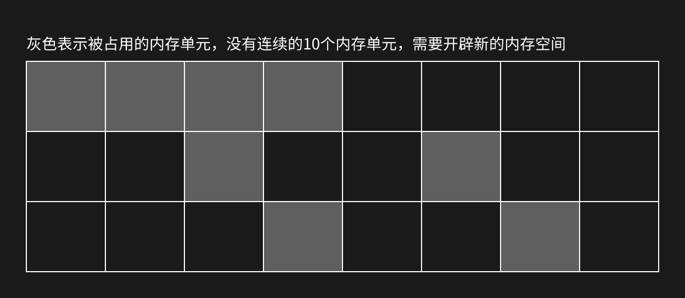
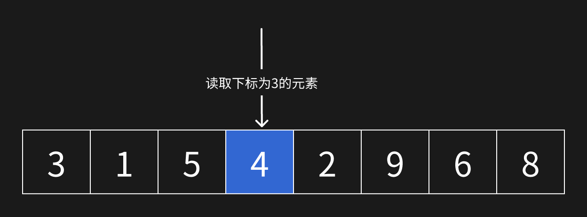
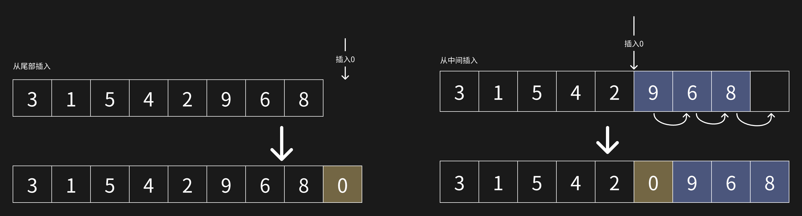
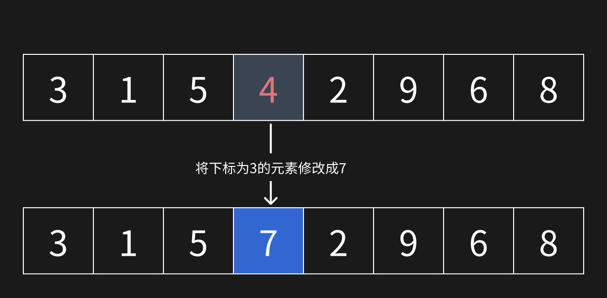
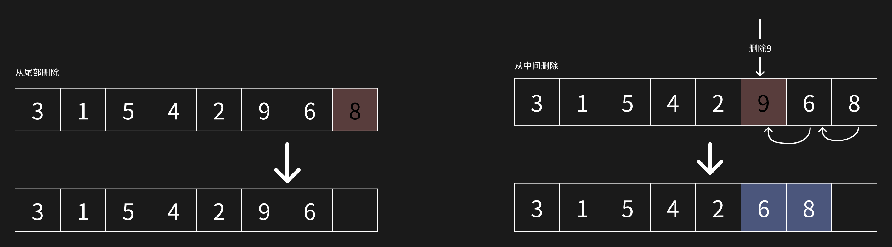

# 数组

数组是一个在内存中连续的存储结构，它是有限个相同类型数据的有序集合。

说它是连续的，是因为数组的每个元素在内存中必须要连续，假设一个数组的长度为 10，但是内存中没有长度为 10 的连续空间（即使有断断续续的 10 个内存单元），那么就需要重新开辟新的内存空间。

## 查

数组是一组有序集合，可以根据下标快速定位数组中的元素

## 增

插入元素分为从尾部插入或者是从中间插入。从尾部插入就直接在数组结尾新增一个元素，从中间插入则需要将元素插入到指定位置后，再将其后面的元素全部向后移。

当插入元素而数组长度不够时，数组就会自动扩容。扩容的方法是创建一个容量更大的新数组，并将数据从老数组中拷贝下来插入到新数组中。

## 改

修改元素与查询元素一致，根据下标就可以直接修改元素

## 删

删除元素与插入元素相反，当从数组中间删除一个元素时，其后面的元素都会向前移动。

数组的查询和修改都是直接根据下标来操作的，无需遍历，它的时间复杂度为 O(1)，但是插入和删除需要使其前面或者后面的元素前移或后移，它们的时间复杂度为 O(n)。因此数组比较适合读多写少的场景。
