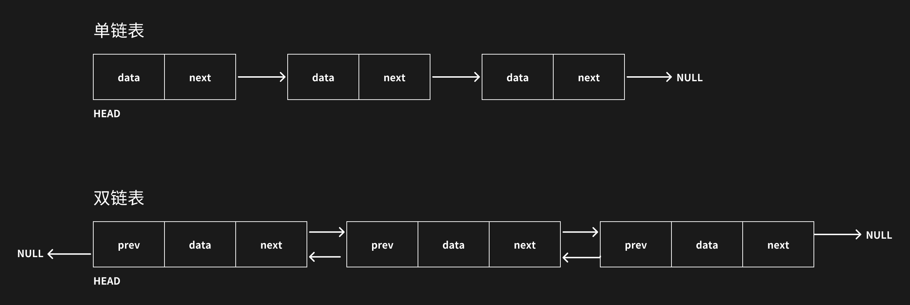
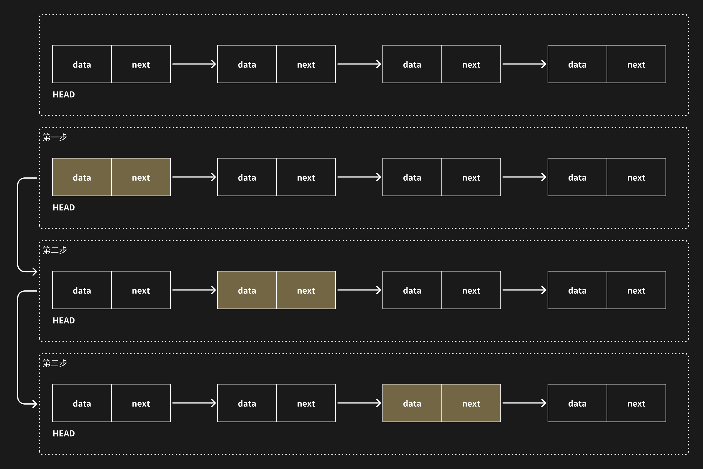
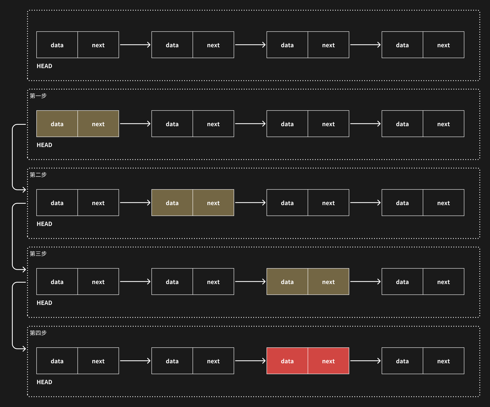
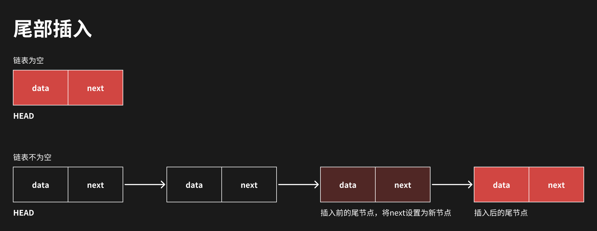
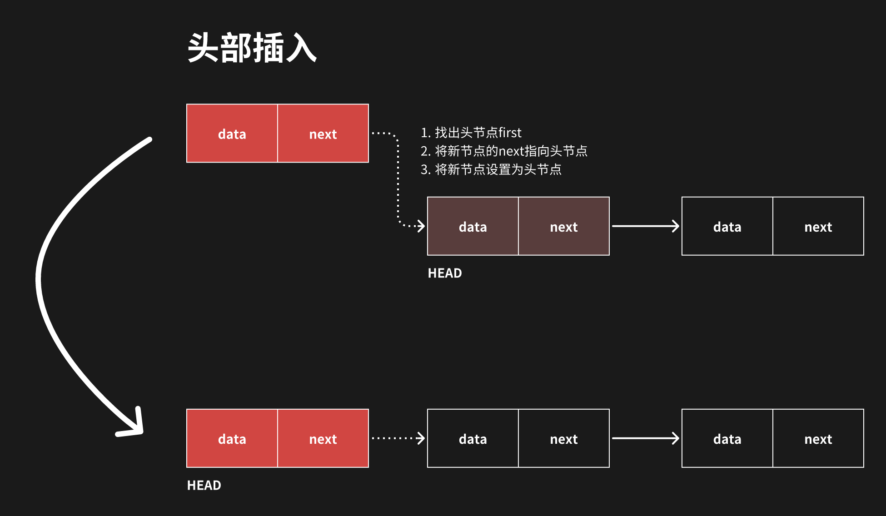
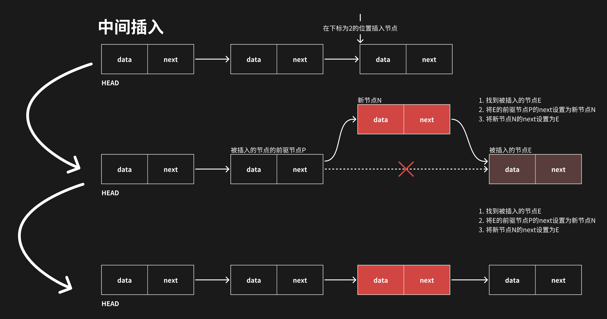
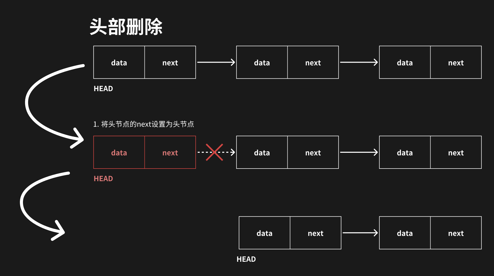
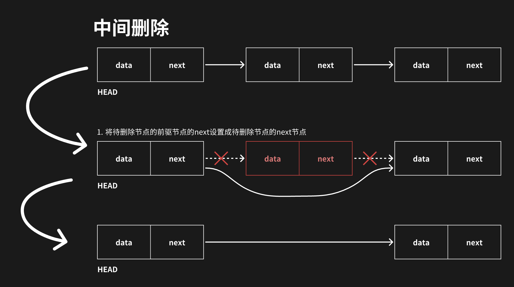

# 链表

链表是比数组稍微复杂点的数据结构，链表分为单链表和双链表。

- 单链表：节点只有后继节点，没有前驱节点，头节点没有前驱节点，尾结点没有后继节点
- 双链表：节点既有前驱节点又有后继节点，头节点没有前驱节点，尾节点没有后继节点

链表相对于数组的优势在于不需要连续的内存单元，链表的元素中记录了下一个元素的位置，直接可以访问到下一个元素。但是链表无法通过索引来访问，只能从头节点开始一个一个的遍历。

## 查

需要根据头节点一个一个的向下查找。例如给定一个单链表，需要查出第三个节点的元素

## 改

修改链表的元素，需要找到被修改的节点，然后直接将新数据设置给该节点的数据。如将给定链表的第三个节点的数据修改掉。

## 增

插入节点相对复杂点，插入可以是从尾部插入或者是从中间插入

- 尾部插入：如果链表为空，则新节点为头节点，否则将新节点设置为尾节点的 next 节点
- 中间插入：当插入的位置是头节点，那么将新节点作为头节点，新节点的 next 为插入位置的那个节点；否则将插入位置的节点的前驱节点的 next 设置为新节点，插入位置的节点作为新节点的后继节点

## 删

链表删除分为头部删除、中间删除和尾部删除，删除的本质就是将被删除节点的前驱节点指向被删除节点的后继节点。

链表的插入和删除不会导致节点的移动，比较适合插入和删除比较频繁的场景。但是链表的查找和修改都需要对链表进行遍历查找，而不像数组那样可以根据索引直接定位到元素。因此数组适合查找和修改场景。

::: warning 结论
链表适合插入和删除

数组适合查找和修改
:::
