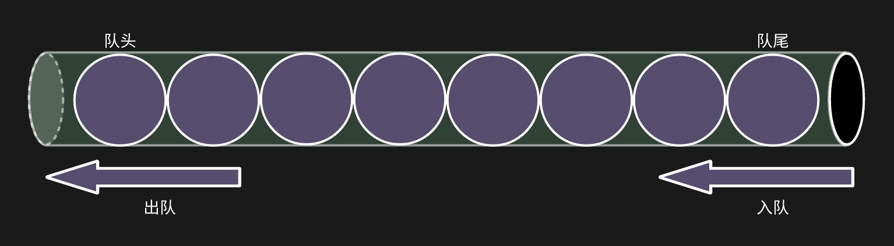
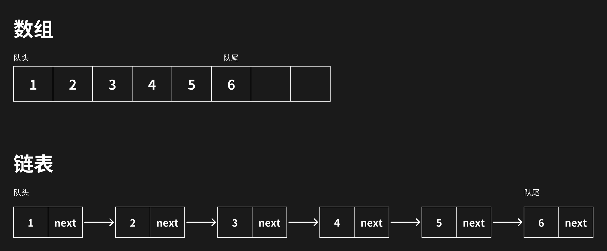
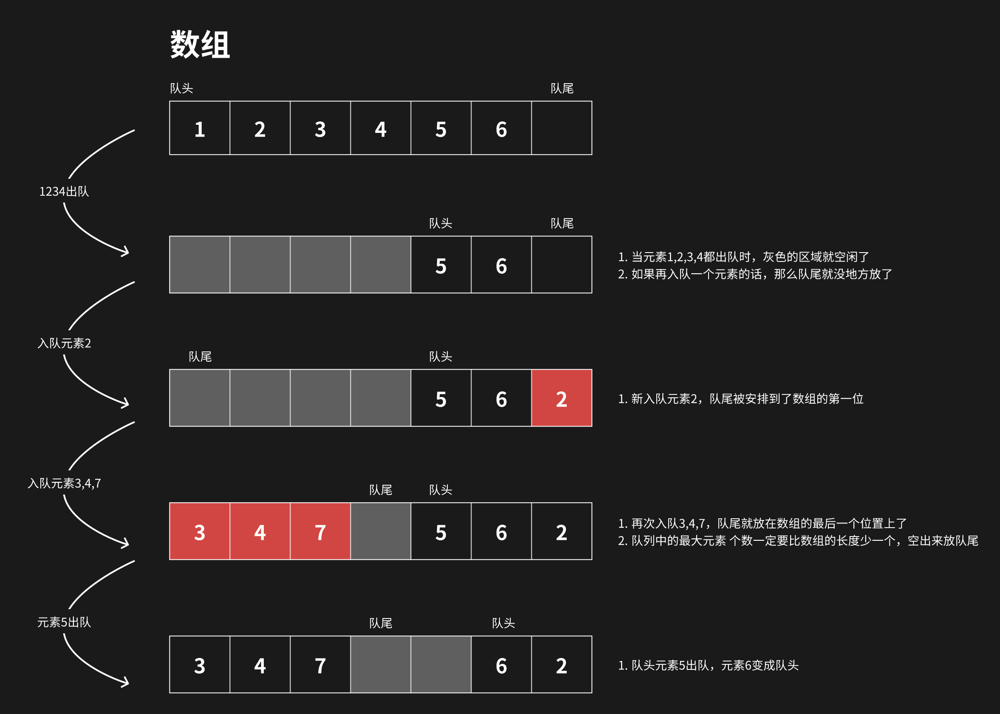

# 队列

队列是先进先出的数据结构，不同于栈的先进后出。队列就像是两端都有出口的水管。队列的出口端叫队头，入口端叫队尾。

队列也有数组和链表的实现方式，链表的实现方式与栈差不多，但是数组的实现方式略有差别

数组的实现方式不一样的地方在于，如果队列中的元素一直在出队，那么数组中的可用空间就越来越少，如果不扩容，那么数组就没法用了，但是扩容的话，那么就会有很多空闲不可用的空间。

可以利用出栈元素剩下的空间作为队尾，那么整个数组就被循环利用起来了。

