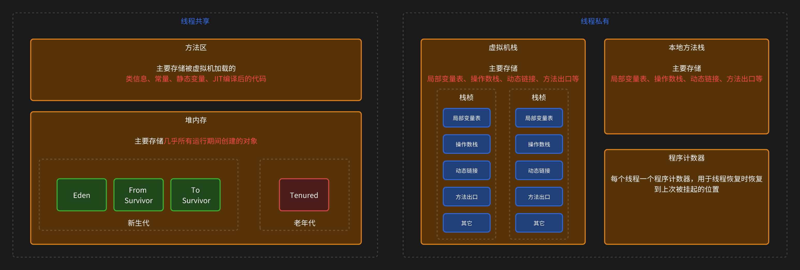

# JVM 内存管理

## JVM 内存结构

## 程序计数器

线程私有，永远不会内存溢出

## 虚拟机栈

线程私有，在方法执行时会创建一个栈桢，用于存放局部变量表、操作栈、动态链接和方法出口等信息

方法的调用就是 栈桢被压入和弹出的过程，一个虚拟机栈中每个栈桢占用的内存越小，则可以被压入的栈桢就越多。栈桢的内存大小称为宽度，被压入的栈桢数量称为深度。

## 本地方法栈

native 方法（JNI） 线程私有

## 堆内存

## 方法区

## 元空间

JDK1.8 新增
