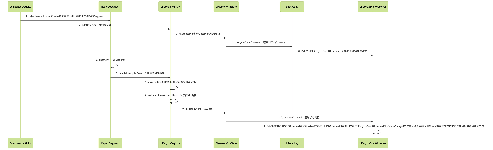
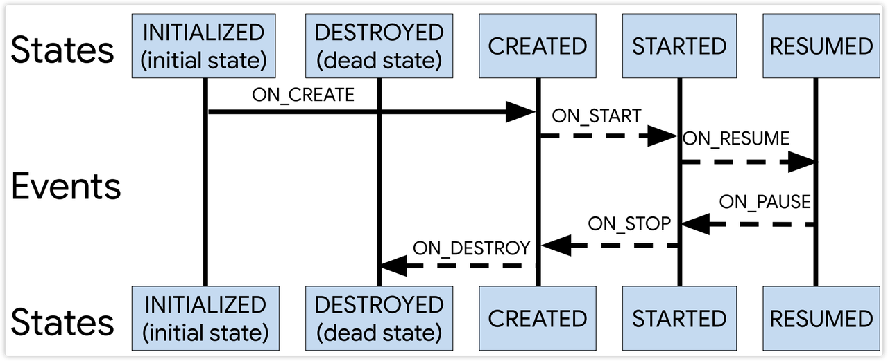

# Lifecycle

::: info 基于版本
lifecycle-2.4.0
:::

## 简介

Lifecycle 是一个可以感知 Activity/Fragment 生命周期的一个组件，方便我们对生命周期的监听并且与 Activity/Fragment 很好地解耦。

## 基本使用

- Lifecycle 有三种使用方式

1. 基于 LifecycleObserver 方法注解方式（从 2.4.0 版本开始废弃了）

```kotlin
lifecycle.addObserver(object : LifecycleObserver {
@OnLifecycleEvent(Lifecycle.Event.ON_CREATE)
    fun onCreate() {

    }
})
```

2. 基于 LifecycleEventObserver

```kotlin
lifecycle.addObserver(object : LifecycleEventObserver {
    override fun onStateChanged(source: LifecycleOwner, event: Lifecycle.Event) {

    }
})
```

3. 基于 DefaultLifecycleObserver

```kotlin
lifecycle.addObserver(object : DefaultLifecycleObserver {
    override fun onCreate(owner: LifecycleOwner) {
        super.onCreate(owner)
    }
})
```

::: info 方式对比
对于方式一，需要自己来写对应生命周期的注解方法，比较繁琐

对于方式二，需要强制实现 onStateChanged 方法，避免了方式一的繁琐，但是需要监听某个生命周期时需要判断 event，也比较繁琐

对于方式三，是在 2.4.0 版本废弃了方式一才加入的，DefaultLifecycleObserver 继承于 FullLifecycleObserver 做了默认实现，想监听哪个生命周期就重写哪个对应的方法，是最方便的一种方式
:::

## 源码分析

任何源码阅读技巧都是从使用入口作为切入点，分析 Lifecycle 的源码依然如此。

### Observer 添加流程

lifecycle.addObserver(observer)，lifecycle 即 getLifecycle，它是 ComponentActivity 中的方法，返回 Lifecycle 类型，实际上该方法是 LifecycleOwner 接口的方法，ComponentActivity 实现了 LifecycleOwnerer 接口。而 Lifecycle 是一个抽象类，用来添加和移除 LifecycleObserver 以及声明了 State 和 Event 这 2 个枚举。

其中涉及到了几个类，Lifecycle、LifecycleOnwer、LifecycleObserver、ComponentActivity，它们之间的关系如下：

```kotlin
class ComponentActivity : LifecycleOwner {
    private val mLifecycleRegistry: LifecycleRegistry
}

interface LifecycleOwner {
    fun getLifecycle(): Lifecycle
}

abstract class Lifecycle {
    abstract fun addObserver(observer: LifecycleObserver)
    abstract fun removeObserver(observer: LifecycleObserver)
    enum Event{}
    enum State{}
}

class LifecycleRegistry : Lifecycle {
    // addObserver和removeObserver真实实现的地方
}

// LifecycleObserver
interface LifecycleEventObserver : LifecycleObserver {}
private interface FullLifecycleObserver : LifecycleObserver {} // SDK内部使用，非公开
interface DefaultLifecycleObserver : FullLifecycleObserver {}
```

- Activity/Fragment 实现 LifecycleOwner，因此使用时是直接用 getLifecycle.addObserver(observer)
- getLifecycle()方法返回 Lifecycle 类型，它是一个抽象类，有一个唯一实现类 LifecycleRegistry
- 因此 getLIfecycle.addObserver(observer)最终调用到了 LifecycleRegistry.addObserver(observer)方法
- 在 addObserver 方法中根据 observer 包装出一个 ObserverWithState 对象，并根据 observer 获取对应的 observer 类型（自定义的 observer 实现的是哪个接口，即对应上面的三种方式），至此 observer 的注册流程就完成了

### Lifecycle 工作流程时序图



### 流程分析

1. 注入 ReportFragment 感知生命周期
   Activity 启动时执行到 ComponentActivity 的 onCreate 方法，执行 ReportFragment 的静态方法 injectNeededIn，利用 Fragment 来监听生命周期

```java
public static void injectIfNeededIn(Activity activity) {
    if (Build.VERSION.SDK_INT >= 29) {
        LifecycleCallbacks.registerIn(activity);
    }

    android.app.FragmentManager manager = activity.getFragmentManager();
    if (manager.findFragmentByTag(REPORT_FRAGMENT_TAG) == null) {
        manager.beginTransaction().add(new ReportFragment(), REPORT_FRAGMENT_TAG).commit();
        manager.executePendingTransactions();
    }
}
```

在 SDK29 以上，支持 Activity 直接注册生命周期的监听，而在 SDK29 以下则需要将 ReportFragment 添加到 Activity 中监听生命周期。

2. 添加 LifecycleObserver
   调用 getLIfecycle().addObserver(observer)，getLIfecycle 方法是接口 LifecycleOwner 的方法，返回 Lifecycle 类型，Lifecycle 是一个抽象类，addObserver 是该类中的抽象方法。LifecycleRegistry 是抽象类 Lifecycle 的唯一实现类，因此 addObserver 最终执行到 LifecycleRegistry 的 addObserver

```java
@Override
public void addObserver(@NonNull LifecycleObserver observer) {
    enforceMainThreadIfNeeded("addObserver");
    State initialState = mState == DESTROYED ? DESTROYED : INITIALIZED;
    ObserverWithState statefulObserver = new ObserverWithState(observer, initialState);
    ObserverWithState previous = mObserverMap.putIfAbsent(observer, statefulObserver);
    ... // 省略部分代码
    if (!isReentrance) {
        // we do sync only on the top level.
        sync();
    }
}
```

::: info
每次添加新的观察者时，都会将当前生命周期分发一遍。
如在生命周期为 RESUMED 时添加观察者，那么会触发 ON_CREATE、ON_START、ONRESUME 事件分发
:::

3. 构造 ObserverWithState 对象
   根据初始 State 和传进来的 observer 构造出一个 ObserverWithState 对象，在这个类的构造函数中根据 observer 来判断最终由哪个 LifecycleEventObserver 的实现类来通知生命周期状态变更，代码如下：

```java
static class ObserverWithState {
    State mState;
    LifecycleEventObserver mLifecycleObserver;

    ObserverWithState(LifecycleObserver observer, State initialState) {
        mLifecycleObserver = Lifecycling.lifecycleEventObserver(observer);
        mState = initialState;
    }

    void dispatchEvent(LifecycleOwner owner, Event event) {
        State newState = event.getTargetState();
        mState = min(mState, newState);
        mLifecycleObserver.onStateChanged(owner, event);
        mState = newState;
    }
}
```

这个类的职责很简单

- 获取通知状态变更的 LifecycleObserver
- 保存 LifecycleObserver 以及 State
- 事件分发

4. 获取 LifecycleEventObserver
   根据 observer 获取 LifecycleEventObserver，用于回调生命周期状态变化

```java
static LifecycleEventObserver lifecycleEventObserver(Object object) {
    // ① 自定义的LifecycleObserver是否实现了LifecycleEventObserver
    boolean isLifecycleEventObserver = object instanceof LifecycleEventObserver;
    // ② 自定义的LifecycleObserver是否实现了FullLifecycleObserver
    boolean isFullLifecycleObserver = object instanceof FullLifecycleObserver;

    // 同时实现了上面2个接口，那就使用FullLifecycleObserverAdapter来通知状态变更
    if (isLifecycleEventObserver && isFullLifecycleObserver) {
        return new FullLifecycleObserverAdapter((FullLifecycleObserver) object,
                (LifecycleEventObserver) object);
    }

    // 只实现了FullLifecycleObserver
    if (isFullLifecycleObserver) {
        return new FullLifecycleObserverAdapter((FullLifecycleObserver) object, null);
    }

    // 只实现了LifecycleEventObserver，就直接使用LifecycleEventObserver接口中的onStateChanged
    if (isLifecycleEventObserver) {
        return (LifecycleEventObserver) object;
    }

    final Class<?> klass = object.getClass();
    // 判断类型是APT生成类的类型还是反射类型
    int type = getObserverConstructorType(klass);
    if (type == GENERATED_CALLBACK) {
        List<Constructor<? extends GeneratedAdapter>> constructors =
                sClassToAdapters.get(klass);
        if (constructors.size() == 1) {
            GeneratedAdapter generatedAdapter = createGeneratedAdapter(
                    constructors.get(0), object);
            return new SingleGeneratedAdapterObserver(generatedAdapter);
        }
        GeneratedAdapter[] adapters = new GeneratedAdapter[constructors.size()];
        for (int i = 0; i < constructors.size(); i++) {
            adapters[i] = createGeneratedAdapter(constructors.get(i), object);
        }
        return new CompositeGeneratedAdaptersObserver(adapters);
    }
    // 反射的方式
    return new ReflectiveGenericLifecycleObserver(object);
}
```

以上代码可以把 LifecycleEventObserver 分为以下几种：

- LifecycleEventObserver：接口类型，本身就包含了 onStateChanged 方法，具体实现是在 addObserver 传进来的参数回调中，从 onStateChanged 的回调参数中获取生命周期状态
- FullLifecycleObserverAdapter：实现了 LifecycleEventObserver 接口的实现类，从 onStateChanged 中拿到生命周期状态后，判断状态 State 再调用对应的生命周期方法（实现了 FullLifecycleObserver）或者是 onStateChanged 方法（实现了 LifecycleEventObserver）
- SingleGeneratedAdapterObserver/CompositeGeneratedAdaptersObserver：通过 APT 生成的 GeneratedAdapter，调用其 callMethods 方法
- ReflectiveGenericLifecycleObserver：addObserver 的参数 LifecycleObserver 中使用注解方法时使用，通过反射的方式调用到注解方法

5. 生命周期事件分发
   当感知到生命周期变化时，在 Fragment 的生命周期函数中会分发事件。
   这里监听生命周期变化分为 SDK29 以上和以下两种情况，SDK29 以上直接通过 Activity 注册生命周期回调，SDK29 以下才是通过 ReportFragment 来监听。但是最终都会调用 dispatch 方法进行分发

```java
static void dispatch(@NonNull Activity activity, @NonNull Lifecycle.Event event) {
    if (activity instanceof LifecycleRegistryOwner) {
        ((LifecycleRegistryOwner) activity).getLifecycle().handleLifecycleEvent(event);
        return;
    }

    if (activity instanceof LifecycleOwner) {
        Lifecycle lifecycle = ((LifecycleOwner) activity).getLifecycle();
        if (lifecycle instanceof LifecycleRegistry) {
            ((LifecycleRegistry) lifecycle).handleLifecycleEvent(event);
        }
    }
}
```

6. 处理生命周期事件
   接着调用到了 LifecycleRegistry 中的 handleLifecycleEvent 方法中，此时根据事件 Event 获取到对应的状态 State,，然后进行保存。
   事件 Event 和状态 State 是抽象类 Lifecycle 中的枚举。

```java
public enum State {
    DESTROYED, INITIALIZED, CREATED, STARTED, RESUMED;
}

public enum Event {
    ON_CREATE, ON_START, ON_RESUME, ON_PAUSE, ON_STOP, ON_DESTROY, ON_ANY;
}
```

事件和状态的转换关系


事件和状态的对应关系
对应关系从上图也能看出，一种状态被多种箭头指向，指向的箭头表示的事件就是该状态对应的事件。
如：状态 CREATED 有两个箭头指向，分别是 ON_CREATE 和 ON_STOP，也就是事件 ON_CREATE 和事件 ON_STOP 对应状态 CREATED。

```java
public State getTargetState() {
    switch (this) {
        case ON_CREATE:
        case ON_STOP:
            return State.CREATED;
        case ON_START:
        case ON_PAUSE:
            return State.STARTED;
        case ON_RESUME:
            return State.RESUMED;
        case ON_DESTROY:
            return State.DESTROYED;
        case ON_ANY:
            break;
    }
    throw new IllegalArgumentException(this + " has no target state");
}
```

7. 根据事件获取对应的状态
   假设 ReportFragment 触发了生命周期的 onResume 方法，那么会分发一个 Event.ON_RESUME 事件，那么此时获取到的状态就是 State.RESUMED。

8. 状态变更

```java
private void sync() {
    LifecycleOwner lifecycleOwner = mLifecycleOwner.get();
    if (lifecycleOwner == null) {
        throw new IllegalStateException("LifecycleOwner of this LifecycleRegistry is already"
                + "garbage collected. It is too late to change lifecycle state.");
    }
    while (!isSynced()) {
        mNewEventOccurred = false;
        // no need to check eldest for nullability, because isSynced does it for us.
        if (mState.compareTo(mObserverMap.eldest().getValue().mState) < 0) {
            backwardPass(lifecycleOwner);
        }
        Map.Entry<LifecycleObserver, ObserverWithState> newest = mObserverMap.newest();
        if (!mNewEventOccurred && newest != null
                && mState.compareTo(newest.getValue().mState) > 0) {
            forwardPass(lifecycleOwner);
        }
    }
    mNewEventOccurred = false;
}

private void forwardPass(LifecycleOwner lifecycleOwner) {
    ...
    while (ascendingIterator.hasNext() && !mNewEventOccurred) {
        ...
        // observer.mState是缓存上一次生命周期的状态，mState是当前变更之后的状态
        while ((observer.mState.compareTo(mState) < 0 && !mNewEventOccurred && mObserverMap.contains(entry.getKey()))) {
            ...
            final Event event = Event.upFrom(observer.mState);
            ...
            observer.dispatchEvent(lifecycleOwner, event);
        }
    }
}
```

生命周期的变更必然会引起状态的变更，而状态的变更又分为进入页面的状态变更和离开页面的状态变更。这两种状态变更对应着源码中的 forwardPass 和 backwardPass。

上面时间和状态转换关系图中，箭头向右对应 forwardPass（前进），是页面进入前台的变化；箭头向左对应 backwardPass，是页面进入后台的变化。

假设页面走向前台，状态从 STARTED 变为 RESUMED，那对应执行的方法就是 forwardPass，forwardPass 方法中只保留了关键代码。

判断条件 observer.mState.compareTo(mState) < 0 中，observer.mState 是缓存上一次生命周期的状态，mState 是当前变更之后的状态。小于 0，说明状态上升过程中，上次的状态处于当前状态的左边（事件和状态转换图右箭头）。Enum 的 compareTo 方法中是根据 enum.ordinal 来判断的，ordinal 可以简单理解为声明枚举元素的先后序号。比如枚举元素 a - 枚举元素 b < 0，那说明枚举元素 a 比枚举元素 b 先声明。

方法 Event.upFrom(observer.mState)根据上次的状态获取状态上升后对应的事件 Event，然后分发出去。

```java
@Nullable
public static Event upFrom(@NonNull State state) {
    switch (state) {
        case INITIALIZED:
            return ON_CREATE;
        case CREATED:
            return ON_START;
        case STARTED:
            return ON_RESUME;
        default:
            return null;
    }
}
```

上面假设的场景界面走向前台，状态从 STARTED 变为 RESUMED，即传入 upFrom 的参数是 STARTED，得到的 Event 为 ON_RESUME，因此下一步会将事件 Event.ON_RESUME 分发出去。

状态的变更有 upFrom/upTo/downFrom/downTo，可以和【事件和状态转换图】对照着看
upFrom：看右箭头，from 即从 xx 过来，因此是返回箭头尾部不带箭头方向的事件（即箭头方向左边）
upTo：看右箭头，to 即去 xx，因此是返回箭头头部带箭头方向的事件（即箭头方向右边）
downFrom：看左箭头，from 即从 xx 过来，因此是返回箭头尾部不带箭头方向的事件（即箭头方向右边）
downTo：看左箭头，to 即去 xx，因此是返回箭头头部带箭头方向的事件（即箭头方向的左边）

9. 分发事件
   获取到了事件 Event 后，就要将事件分发出去了。调用到了 observer.dispatchEvent(lifecycleObserver, event)，这个 observer 对象就是 ObserverWithState 类型

```java
void dispatchEvent(LifecycleOwner owner, Event event) {
    State newState = event.getTargetState();
    mState = min(mState, newState);
    mLifecycleObserver.onStateChanged(owner, event);
    mState = newState;
}
```

10. 通知状态变更
    mLifecycleObserver.onStateChanged(owner, event)中的 mLifecycleObserver 就是第 4 步中从 Lifecycling 中获取到了各种 LifecycleEventObserver 类型的实现类。其对应第 4 步中的几种分类：

- LifecycleEventObserver
- FullLifecycleObserverAdapter、
- SingleGeneratedAdapterObserver/CompositeGeneratedAdaptersObserver
- ReflectiveGenericLifecycleObserver

11. 生命周期函数回调

- LifecycleEventObserver：最简单的一种情况，直接调用到了 addObserver 方法传入的参数的接口回调 onStateChanged 方法中
- FullLifecycleObserverAdapter：在 1）的基础上根据 onStateChanged 的 event 进行判断，直接回调对应的生命周期方法
- SingleGeneratedAdapterObserver/CompositeGeneratedAdaptersObserver：最复杂的一种情况，调用到 GeneratedAdapter 的 callMethods 方法，GeneratedAdapter 是通过 javapoet 生成的，在 lifecycle-compiler 依赖的 writer.kt 中（没有深入研究）
- ReflectiveGenericLifecycleObserver：直接继承 LifecycleObserver 使用反射方法方式的观察者

在构造 ReflectiveGenericLifecycleObserver 对象时就使用反射获取带有 OnLifecycleEvent 注解的方法并检查其参数合法性，最后封装成 CallbackInfo 保存到 map 中。

```java
ReflectiveGenericLifecycleObserver(Object wrapped) {
    mWrapped = wrapped; // addObserver传入的LifecycleObserver
    // 获取注解方法、校验参数、封装CallbackInfo后返回mInfo
    mInfo = ClassesInfoCache.sInstance.getInfo(mWrapped.getClass());
}

@Override
public void onStateChanged(@NonNull LifecycleOwner source, @NonNull Event event) {
    mInfo.invokeCallbacks(source, event, mWrapped);
}
void invokeCallbacks(LifecycleOwner source, Lifecycle.Event event, Object target) {
    invokeMethodsForEvent(mEventToHandlers.get(event), source, event, target);
    invokeMethodsForEvent(mEventToHandlers.get(Lifecycle.Event.ON_ANY), source, event, target);
}
```

mInfo.invokeCallbacks 中调用到 invokeMethodsForEvent，然后调用到 MethodReference.invokeCallback。从 invokeCallbacks 中可以看出，每次生命周期事件发送后都会再发送一次 ON_ANY 事件。

```java
void invokeCallback(LifecycleOwner source, Lifecycle.Event event, Object target) {
    //noinspection TryWithIdenticalCatches
    try {
        switch (mCallType) {
            case CALL_TYPE_NO_ARG:
                mMethod.invoke(target); // 无参注解方法
                break;
            case CALL_TYPE_PROVIDER:
                mMethod.invoke(target, source); // 一个参数注解方法，参数只能是LifecycleOwner
                break;
            case CALL_TYPE_PROVIDER_WITH_EVENT:
                mMethod.invoke(target, source, event); // 两个参数注解方法，第一个参数只能是LifecycleOwner，第二个参数只能是Lifecycle.Event
                break;
        }
    } catch (InvocationTargetException e) {
        throw new RuntimeException("Failed to call observer method", e.getCause());
    } catch (IllegalAccessException e) {
        throw new RuntimeException(e);
    }
}
```

整个流程最后一步就是通过反射调用注解方法，mMethod 就是自己写的注解方法，target 即注解方法对应的 LifecycleObserver 类，source 就是对应的 LifecycleOwner，event 就是要分发的事件。通过 mCallType 的类型可以看出，注解方法最多只能有 2 个参数（无参/一个参数/两个参数），而且类型是固定的。

## 问答

::: info 1. Lifecycle 的作用，解决了什么问题
Lifecycle 是一个可以感知组件（Activity/Fragment）生命周期的一个组件，以一种无侵入式的方式来感知生命周期，达到解耦的目的。

在 Lifecycle 之前，如果需要对一个 Sdk 进入页面时初始化，退出页面时销毁，只能在 Activity/Fragment 的 onCreate 中初始化，在 onDestroy 中销毁，这种侵入式的调用耦合太重。而 Lifecycle 的出现就解决了这一问题，无需侵入只需在 LifecycleObserver 中根据回调的生命周期来对 Sdk 进行初始化和销毁。
:::

::: info 2. Lifecycle 是怎么感知生命周期的
通过给 Activiy/Fragment 添加 LifecycleObserver 观察者，在生命周期发生变更的时候使用反射（LifecycleObserver）或者直接调用观察者中的方法
:::
