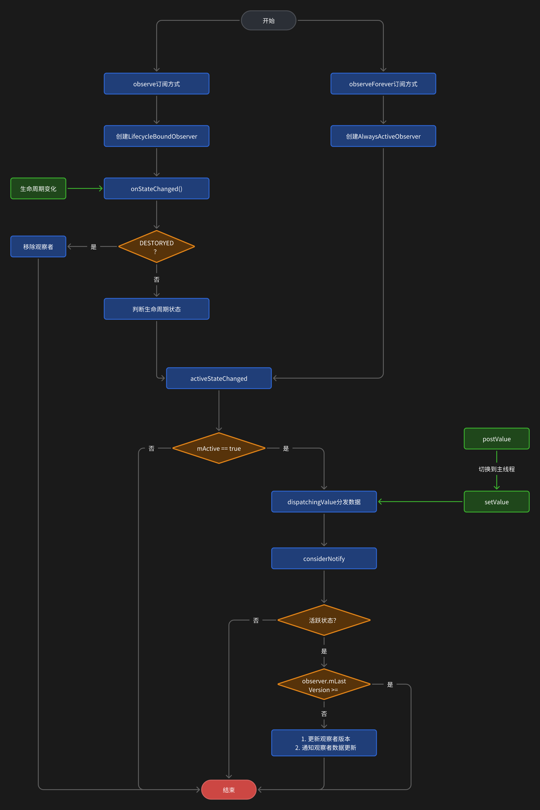
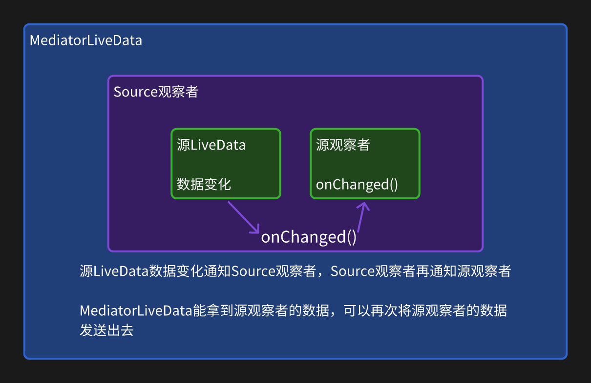
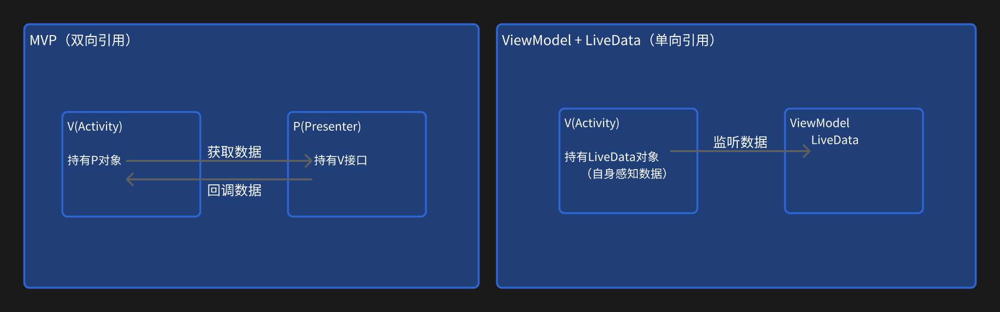

# LiveData

## 简介

LiveData 是一种可观察的数据存储器类。与常规的可观察类不同，LiveData 具有生命周期感知能力，意指它遵循其他应用组件（如 activity、fragment）的生命周期。这种感知能力可确保 LiveData 仅更新处于活跃生命周期状态的应用组件观察者。

Activity/Fragment/View 几乎可以随时被销毁，因此对这些组件之一的任何引用都可能导致泄漏或 NullPointerException。

LiveData 旨在实现观察者模式，允许视图控制器（Activity/Fragment）和 UI 数据源（通常是 ViewModel）之间的通信。使用 LiveData，这种通信更安全：由于其生命周期感知，只有当数据处于活动状态时，视图才会接收数据。

简而言之，优势在于您无需手动取消 View 和 ViewModel 之间的订阅。

## 基本使用

一般结合 ViewModel 使用，在 ViewModel 中获取到事件或状态，通过 LiveData 分发到 UI 控制层。

```kotlin
class LiveDataViewModel : ViewModel {
    val liveData by lazy { MutableLiveData<String>() }

    // 发送数据
    // liveData.setValue(value) 主线程
    // liveData.postValue(value) 子线程
}

class MainActivity : AppCompatActivity() {
    private val viewModel by lazy { ViewModelProvider(this)[LiveDataViewModel::class.java] }

    override fun onCreate(savedInstanceState: Bundle?) {
        super.onCreate(savedInstanceState)
        setContentView(R.layout.activity_main)
        // 和生命周期相关
        viewModel.myLiveData.observe(this) {
            println("接收数据：$it")
        }
        // 和生命周期无关
        viewModel.myLiveData.observeForever {
        }
    }
}
```

## 源码分析

### observe

```java
@MainThread
public void observe(@NonNull LifecycleOwner owner, @NonNull Observer<? super T> observer) {
    assertMainThread("observe");
    if (owner.getLifecycle().getCurrentState() == DESTROYED) {
        // 如果页面已销毁则不处理
        return;
    }
    LifecycleBoundObserver wrapper = new LifecycleBoundObserver(owner, observer);
    ObserverWrapper existing = mObservers.putIfAbsent(observer, wrapper);
    if (existing != null && !existing.isAttachedTo(owner)) {
        throw new IllegalArgumentException("Cannot add the same observer"
                + " with different lifecycles");
    }
    if (existing != null) {
        // 缓存里有证明绑定过就不重复绑定了
        return;
    }
    owner.getLifecycle().addObserver(wrapper);
}
```

observe 的方式与生命周期相关，LifecycleBoundObserver 实现了 LifecycleEventObserver 接口，然后通过 owner.getLifecycle().addObserver(wrapper)完成了生命周期的绑定。

LifecycleBoundObserver 继承自 ObserverWrapper，ObserverWrapper 保存了 LiveData 的观察者 mObserver、是否需要分发数据的活跃状态 mActive 以及一个版本号 mLastVersion。

- mObserver：观察者对象，LiveData.setValue 的时候通知观察者
- mActive：状态是否活跃，如果是活跃状态就可以分发数据
- mLastVersion：版本号，每个 LiveData 有一个版本号 mVersion，每个观察者也有一个版本号 mLastVersion，当观察者的版本号大于等于 LiveData 的版本号时才分发数据，分发完数据后将 mVersion 更新到 mLastVersion 中，保证每条数据只被消费一次

同时 ObserverWrapper 中也提供了几个方法

- Abstract boolean shouldBeActive()：决定 ObserverWrapper 中 mActive 的值，并且决定要要不要分发数据。observe 中该返回值与生命周期相关，在 STARTED 和 RESUMED 才返回 true，其它状态都返回 false，即页面活跃状态才返回 true。而在 observeForever 中与生命周期无关，一直返回 true，也就是不管生命周期怎样都会分发数据
- boolean isAttachedTo(LifecycleOwner owner)：判断当前观察者是否绑定到当前页面的，避免同一个观察者在不同的页面使用
- detachObserver()：移除生命周期观察者，只在 LifecycleBoundObserver 中重写了
- activeStateChanged(boolean newActive)：计算有效观察者数量以及当 mActive 为 true 时调用数据分发方法。在有效观察者不为 0 时回调 onActive 方法，为 0 时调用 onInactive 方法，这 2 个方法在自定义 LiveData 的时候能用到

当生命周期发生变化时，会回调 onStateChanged 方法，然后会进行移除观察者或者数据分发。

```java
// LifecycleBoundObserver.java
@Override
public void onStateChanged(@NonNull LifecycleOwner source, @NonNull Lifecycle.Event event) {
    Lifecycle.State currentState = mOwner.getLifecycle().getCurrentState();
    if (currentState == DESTROYED) {
        removeObserver(mObserver);
        return;
    }
    Lifecycle.State prevState = null;
    while (prevState != currentState) {
        prevState = currentState;
        activeStateChanged(shouldBeActive());
        currentState = mOwner.getLifecycle().getCurrentState();
    }
}
```

### observeForever

```java
@MainThread
public void observeForever(@NonNull Observer<? super T> observer) {
    assertMainThread("observeForever");
    AlwaysActiveObserver wrapper = new AlwaysActiveObserver(observer);
    ObserverWrapper existing = mObservers.putIfAbsent(observer, wrapper);
    if (existing instanceof LiveData.LifecycleBoundObserver) {
        throw new IllegalArgumentException("Cannot add the same observer"
                + " with different lifecycles");
    }
    if (existing != null) {
        return;
    }
    wrapper.activeStateChanged(true);
}
```

observeForever 与生命周期无关，创建了一个 AlwaysActiveObserver 保存观察者，同样是继承自 ObserverWrapper，不同的是该观察者一直保存 mActive 活跃状态。绑定了观察者之后直接调用了 activeStateChanged 方法进行数据分发。
因为 observeForever 与生命周期无关，因此需要手动移除观察者，避免内存泄漏

数据分发通过 setValue 或者 postValue 触发。

### 数据分发

#### setValue

主线程中触发，首先将 LiveData 的版本进行自增然后将分发的数据保存到 mData 中，mData 永远都是最新的一个数据。接着调用 dispatchingValue(null)进行数据分发。

```java
@MainThread
protected void setValue(T value) {
    assertMainThread("setValue");
    mVersion++;
    mData = value;
    dispatchingValue(null);
}
```

#### postValue

子线程中触发，因为是异步分发的，所以使用 mPendingData == NOT_SET 来保证多次 postValue 也不会堆积多个任务到主线程去（具体思路看注释）。

```java
protected void postValue(T value) {
    boolean postTask; // 是否需要发任务到主线程消费
    synchronized (mDataLock) { // 使用同步锁保证数据线程安全
        // 第一次肯定是NOT_SET，postTask为true，直到主线程中消费完了再次恢复为NOT_SET
        postTask = mPendingData == NOT_SET;
        // 将待分发的值保存起来，使主线程可访问
        mPendingData = value;
    }
    if (!postTask) { // 上一个任务没消费完，这个任务直接取消。只讲数据更新，因此每次分发的数据都是最新的
        return;
    }
    // 使用handler讲任务发送到主线程消费
    ArchTaskExecutor.getInstance().postToMainThread(mPostValueRunnable);
}

private final Runnable mPostValueRunnable = new Runnable() {
    @SuppressWarnings("unchecked")
    @Override
    public void run() {
        Object newValue;
        synchronized (mDataLock) {
            newValue = mPendingData;
            mPendingData = NOT_SET;
        }
        setValue((T) newValue);
    }
};
```

postValue 最终还是调用了 setValue 来分发数据，最终都是调用 dispatchingValue 方法进行分发。

```java
void dispatchingValue(@Nullable ObserverWrapper initiator) {
    // 是否正在分发数据，上一个数据没有分发完成就return，本次分发无效
    if (mDispatchingValue) {
        // 设置为true，以便于下面的do-while循环可以再次循环分发这次被return的数据
        mDispatchInvalidated = true;
        return;
    }
    mDispatchingValue = true; // 开始分发
    do {
        mDispatchInvalidated = false;
        if (initiator != null) {
            // 在ObserverWrapper中调用的dispatchingValue方法走到这里
            considerNotify(initiator);
            initiator = null;
        } else {
            for (Iterator<Map.Entry<Observer<? super T>, ObserverWrapper>> iterator =
                    mObservers.iteratorWithAdditions(); iterator.hasNext(); ) {
                // setValue中调用的走到这里，遍历所有的观察者进行分发
                considerNotify(iterator.next().getValue());
                if (mDispatchInvalidated) {
                    break;
                }
            }
        }
    } while (mDispatchInvalidated);
    mDispatchingValue = false; // 结束分发
}

private void considerNotify(ObserverWrapper observer) {
    if (!observer.mActive) { // 观察者不处于活跃状态，不分发数据
        return;
    }

    // 再次获取最新的状态，可能状态更新了还没有同步到mActive中，这里再次获取下最新的状态
    if (!observer.shouldBeActive()) {
        // 观察者不处于活跃状态，最终计算出活跃观察者数量，调用onActive方法或者onInactive方法，不会分发数据
        observer.activeStateChanged(false);
        return;
    }
    // 观察者的版本大于等于LiveData的版本，说明该数据已经分发过了不再重复分发
    if (observer.mLastVersion >= mVersion) {
        return;
    }
    // 刷新版本并通知观察者
    observer.mLastVersion = mVersion;
    observer.mObserver.onChanged((T) mData);
}
```

不管是 setValue、postValue，最终都会到 dispatchingValue 方法中分发数据，在分发前通过观察者的变量 mActive 和方法 shouldBeActive()判断是否活跃状态，是活跃状态才进行分发。

- observe：和生命周期相关，只有在状态为 STARTED 和 RESUMED 的活跃状态才分发
- observeForever：和生命周期无关，shouldBeActive()一直返回 true，因此 mActive 也是 true，有消息就分发，但只会分发最新的一条

### 流程图



## 扩展 LiveData

LiveData 中有 onActive 和 onInactive 方法来监听是否有活跃的观察者，在需要计算活跃观察者的时候可以扩展 LiveData。

- onActive：有活跃观察者，观察者数量从 0 变成 1
- onInactive：没有活跃观察者，观察者数量从 1 变成 0

```kotlin
class MyLiveData : MutableLiveData<String>() {
    /**
     * 有有效观察者时触发，无 ->有
     */
    override fun onActive() {
        super.onActive()
        println("live_data : active , $this ")
    }

    /**
     * 没有有效观察者时触发，有 ->无
     */
    override fun onInactive() {
        super.onInactive()
        println("live_data : inactive , $this ")
    }
}
```

## MediatorLiveData

中介者 LiveData，可以添加其它的 LiveData 以观察其 LiveData 的数据变化，并且可以让其它的 LiveData 监听本身的数据变化。通过 addSource 方法添加 LiveData 和观察者。

```java
public <S> void addSource(@NonNull LiveData<S> source, @NonNull Observer<? super S> onChanged) {
    if (source == null) {
        throw new NullPointerException("source cannot be null");
    }
    // 将LiveData和Observer构造出一个Source，Source也是一个Observer观察者
    Source<S> e = new Source<>(source, onChanged);
    Source<?> existing = mSources.putIfAbsent(source, e);
    if (existing != null && existing.mObserver != onChanged) {
        throw new IllegalArgumentException(
                "This source was already added with the different observer");
    }
    if (existing != null) {
        return;
    }
    if (hasActiveObservers()) {
        // 如果有活跃的观察者，就将构造出来的Source观察者添加到source这个LiveData上
        e.plug();
    }
}

private static class Source<V> implements Observer<V> {
    final LiveData<V> mLiveData;
    final Observer<? super V> mObserver;
    int mVersion = START_VERSION;

    Source(LiveData<V> liveData, final Observer<? super V> observer) {
        mLiveData = liveData;
        mObserver = observer;
    }

    void plug() {
        // 注册观察者
        mLiveData.observeForever(this);
    }

    void unplug() {
        // 移除观察者
        mLiveData.removeObserver(this);
    }

    @Override
    public void onChanged(@Nullable V v) {
        if (mVersion != mLiveData.getVersion()) {
            mVersion = mLiveData.getVersion();
            // 添加进来的source发生变化（addSource第一个参数），就通知onChanged观察者（addSource第二个参数）
            mObserver.onChanged(v);
        }
    }
}
```

当添加的 LiveData（下称源 LiveData）发生变化时，会通知对应的观察者（下称源观察者）。

将源 LiveData 和源观察者构造出一个 Source 对象，Source 本身也是一个 Observer，然后判断是否有活跃的观察者，如果有活跃的观察者，就调用 plug 方法把构造的 Source 注册到源 LiveData 上。

- addSource 的源 LiveData 以及源观察者，它们是一一对应的，源 LiveData 发生变化会通知源观察者
- 判断有没有活跃的观察者，这个活跃的观察者是指 MediatorLiveData 的活跃观察者
- 如果有活跃观察者，就调用 plugin 方法将 Source 注册到源 LiveData 上
- 因此源 LiveData 变化时会回调 Source 的 onChanged 方法
- 在 Source 的 onChanged 方法中调用了源观察者的 onChanged 方法



MediatorLiveData 还重写了 onActive 和 onInactive 方法用于注册所有观察者以及移除所有观察者。

::: tip 提示
MediatorLiveData 注册观察者也是用的 observeForever，与生命周期无关
:::

## 转换数据流

map 和 switchMap 是 LiveData 包下 Transformations 类的静态函数，但是在后续较新的 LiveData 版本，该类使用 Kotlin 重写了，静态函数改为了同名的扩展函数。用于对数据流进行转换，都是基于 MediatorLiveData 实现。

### map

将 X 类型的数据通过 transform 方法转换成 Y 类型的数据，然后再通过 MediatorLiveData 发送，再返回该 MediatorLiveData 对象，可以通过 MediatorLiveData.observe 获取到转换后的值。
例如：

```kotlin
// 示例
val newLiveData = livedata.map {
    "hello world $it"
}
newLiveData.observe(this) {
    // 拿到map中hello world $it的值
}
```

```kotlin
// map源码
@JvmName("map")
@MainThread
@CheckResult
fun <X, Y> LiveData<X>.map(
    transform: (@JvmSuppressWildcards X) -> (@JvmSuppressWildcards Y)
): LiveData<Y> {
    val result = MediatorLiveData<Y>()
    result.addSource(this) { x -> result.value = transform(x) }
    return result
}
```

### switchMap

将 X 类型的数据通过 transform 方法转换成 Y 类型的数据，并生成一个新的 LiveData 对象。想要拿到新 LiveData 对象变化的值，就需要将新 LiveData 添加到 MediatorLiveData 中，当新 LiveData 对象的值发生变化时，再通过 MediatorLiveData 发送出去并返回 MediatorLiveData 对象，可以通过 MediatorLiveData.observe 获取到转换后的值。

```kotlin
// 示例
val newLiveData = viewModel.myLiveData.switchMap {
    // 这里和map不同，需要构造一个新的LiveData对象
    MutableLiveData("hello world $it")
}
newLiveData.observe(this) {
    // 拿到switchMap中hello world $it的值
}
```

```kotlin
// switchMap源码
@JvmName("switchMap")
@MainThread
@CheckResult
fun <X, Y> LiveData<X>.switchMap(
    transform: (@JvmSuppressWildcards X) -> (@JvmSuppressWildcards LiveData<Y>)?
): LiveData<Y> {
    val result = MediatorLiveData<Y>()
    result.addSource(this, object : Observer<X> {
        var liveData: LiveData<Y>? = null

        override fun onChanged(value: X) {
            val newLiveData = transform(value)
            if (liveData === newLiveData) {
                return
            }
            if (liveData != null) {
                result.removeSource(liveData!!)
            }
            liveData = newLiveData
            if (liveData != null) {
                result.addSource(liveData!!) { y -> result.setValue(y) }
            }
        }
    })
    return result
}
```

::: tip 提示
转换数据流不推荐使用 LiveData，而应该使用 Kotlin Flow。因为 LiveData 处理数据流能力有限并且是在主线程中处理的。
:::

## 粘性事件&数据倒灌

- 粘性事件：先发送数据后注册观察者，后注册的观察者依然能收到先发送的数据。
- 数据倒灌：先发送数据后注册观察者，后注册的观察者收到先发送的数据，再次注册一个新的观察者（或屏幕旋转），新的观察者收到了之前先发送数据的值。

::: tip 个人思考
从另一个角度来说，粘性事件和数据倒灌都是因为添加新的观察者的时候会触发生命周期变化的 onStateChanged 方法，然后在此方法里面最终会调用到 dispatchingValue 方法，在分发时判断观察者的版本 mLastVersion 和 LiveData 的版本 mVersion 的大小决定是否需要分发，所以他们本质上都是同一种原因导致的。因此个人觉得他们也属于同一种问题。
:::

解决办法有网上盛传的反射版本法、SingleLiveEvent、事件包装器、UnPeekLiveData

## 问答

::: info 1. LiveData 被设计出来是解决什么问题的
LiveData 一般与 ViewModel 结合使用，以一种观察者模式来监听数据变化去驱动 UI 刷新，UI 层只需要持有 LiveData 的引用就可以监听到数据，而 ViewModel 中无需去持有 UI 层的引用。
一个典型的例子就是 MVP，P 相当于 ViewModel，V 层有一个接口被 P 持有，P 层获取到数据后通过接口回调到 V 层。这样的话，V 层持有了 P 的引用，P 层又持有了 V 的引用，它们互相引用了。
而 LiveData 就去掉了 ViewModel 对 V 层的引用，只有 V 对 ViewModel 中的 LiveData 的单项引用。

:::

::: info 2. LiveData 的优势是什么

- 自动刷新数据：遵循观察者模式，有数据变化时自动更新 UI
- 避免内存泄漏：能感知生命周期，观察者在页面销毁时自动移除
- 页面销毁不会崩溃：能感知生命周期，页面销毁时不会再接收到 LiveData 事件
- 配置变更：如屏幕旋转重建 Activity 后，会立即接收到最新可用的数据
  :::

::: info 3. LiveData 为什么不会内存泄漏
添加观察者时需要传入 LifecycleOwner，在其内部创建了一个生命周期观察者 LifecycleBoundObserver，然后与传入的 LifecycleOwner 绑定，这样就可以感知其生命周期。LiveData 的观察者是一个匿名内部类，在感知到生命周期状态为 DESTROYED 时会自动移除观察者。
如果是使用 observeForever 这种不能感知生命周期的方式，而在页面生命周期为 DESTROYED 时没有手动移除观察者就会导致内存泄漏。
:::

::: info 4. setValue 和 postValue 有什么区别
setValue 只能在主线程中使用，而 postValue 没有可以在主线程或子线程中使用。但是 postValue 会有一个切换到主线程的操作过程，如果是在主线程的话，还是推荐直接使用 setValue，只有在子线程才去使用 postValue。
:::

::: info 5. 设置相同的值，观察者会重复收到吗
会，在进行值分发时只判断了生命周期是否活跃状态和版本号，并没有判断值是否相同。如果需要只有在值不同的情况下才被观察者收到，可以使用 LiveData 的扩展函数 distinctUntilChanged
liveData.distinctUntilChanged.observe(this) {}
:::

::: info 6. 连续调用 postValue 会怎么样
因为 postValue 是一个异步操作，多次 postValue 可能上一次还没有被消费完，这一次的 postValue 只会去刷新 mPendingData 值而不会再次提交任务到主线程中去分发事件，因此多次 postValue 只会把最新的值分发出去。LiveData 被设计出来的本意就是驱动 UI 刷新，只有发送最新的值才有意义，省去中间值的分发是一种优化。
:::
