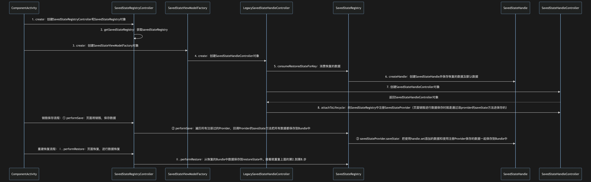

# SavedStateHandle

::: info 📌
基于 androidx.savedstate:savedstate:1.2.0，分析过程以 Activity 为例。
:::

## 简介

SavedStateHandle 用于页面被系统回收存储和恢复数据，是对 onSaveInstanceState 和 onRestoreInstanceState 的封装。保存时通过 Bundle 的方式将数据序列化到本地，恢复时再序列化出来。

与 ViewModel 不同，ViewModel 能恢复屏幕旋转导致的 Activity 重建的数据，而不能恢复被系统回收时的数据。

## 基本使用

```kotlin
class JetpackViewModel(private val handle: SavedStateHandle) : ViewModel() {
    // 添加数据
    fun addData(key: String, value: String) {
        handle.set(key, value)
    }

    // 获取所有数据
    fun getAllData(): String {
        val map = mutableMapOf<String, String>()
        handle.keys().forEach {
            if (handle.contains(it)) {
                val value = handle.get<String>(it)
                map[it] = value!!
            }
        }
        return map.toString()
    }
}

class JetpackActivity : AppCompatActivity() {
    private val viewModel by lazy { ViewModelProvider(this)[MyViewModel::class.java] }

    override fun onCreate(savedInstanceState: Bundle?) {
        super.onCreate(savedInstanceState)
        setContentView(R.layout.activity_jetpack)

        findViewById<Button>(R.id.btn_add).setOnClickListener {
            // 添加一个随机key的数据到SavedStateHandle中
            val random = Random.nextInt()
            viewModel.addData("KEY_$random", "VALUE_$random")
        }

        findViewById<Button>(R.id.btn_get).setOnClickListener {
            // 获取保存的所有数据
            val allData = viewModel.getAllData()
            Log.e("all_data", "click data = $allData")
        }

        // 页面重建时获取保存的数据
        val allData = viewModel.getAllData()
        Log.e("all_data", "data = $allData")
    }
}
```

要使用 SavedStateHandle，需要在 ViewModel 的构造函数中增加参数 SavedStateHandle，初始化 ViewModel 的时候内部会自动创建 SavedStateHandle 对象，无需手动创建再传给 ViewModel。

SavedStateHandle 除了提供了 set 方法保存数据外，还提供了 setSavedStateProvider 方法保存 Bundle 格式的数据。但是它们有一些区别：

| set                                                                | setSavedStateProvider                                                      |
| ------------------------------------------------------------------ | -------------------------------------------------------------------------- |
| 设置 key 为字符串，value 是可序列化的类型，如 String、Parceable 等 | 设置 key 为字符串，value 是 SavedStateRegistry.SavedStateProvider 接口类型 |
| 直接保存到 regular 中，可以直接通过 get(key)获取到                 | 将 provider 保存到 savedStateProviders 中，无法直接获取到保存的值          |
| 保存的是可序列化类型，如 String、Parceable 等                      | 保存的是 Bundle 类型                                                       |

::: info 提示
如果是 AndroidViewModel，必须要填参数 Application 和 SavedStateHandle 才可以使用 SavedStateHandle
:::

## 源码分析

### 流程大纲

<strong>设置数据时：</strong>

1. handle.set 需要创建 SavedStateHandle
2. SavedStateHandle 的创建在 LegacySavedStateHandleController.create 静态方法中

设置值的时候只需要 SavedStateHandle 对象就够了

<strong>系统销毁保存数据时：</strong>

1. SavedStateRegistryController.performSave(outState)，需要创建 SavedStateRegistryController 对象
2. 保存时遍历 components，是 SafeIterableMap<String, SavedStateProvider>()类型的，因此在保存数据之前会往这个 Map 中保存 SavedStateProvider
3. SavedStateProvider 在 SavedStateRegistry.registerSavedStateProvider 中被添加，因此需要创建一个 SavedStateRegistry 对象
4. SavedStateRegistry 对象从 SavedStateHandleController.attachToLifecycle 参数中传递，需要创建一个 SavedStateHandleController 对象，在 LegacySavedStateHandleController.create 静态方法中创建 SavedStateHandle 的时候被创建
5. SavedStateRegistry 对象在 ComponentActivity.getSavedStateRegistry 中获取，从 mSavedStateRegistryController.getSavedStateRegistry()获取，SavedStateRegistryController 在 1 中创建

<strong>恢复数据时：</strong>

恢复数据需要的对象也是上面这几种，只不过是重新创建了，对象值不一样。

因此整个流程涉及到以下几个类对象的创建：

- SavedStateHandle：数据真正保存和获取的地方，SavedStateRegistry 中的数据最终也会被保存到这里
- SavedStateHandleController：SavedStateHandle 控制类，向 SavedStateRegistry 注册 SavedStateProvider
- SavedStateRegistryController：SavedStateRegistry 控制类
- SavedStateRegistry：注册及保存 SavedStateProvider，数据的保存和恢复

### 流程时序图



### SavedStateHandle 创建

SavedStateHandle 是在创建 ViewModel 的时候创建的，源码在 SavedStateViewModelFactory.create 中。

```kotlin
// SavedStateViewModelFactory.kt
fun <T : ViewModel> create(key: String, modelClass: Class<T>): T {
    val controller = LegacySavedStateHandleController.create(
        savedStateRegistry, lifecycle, key, defaultArgs
    )
    val viewModel: T = if (isAndroidViewModel && application != null) {
        newInstance(modelClass, constructor, application!!, controller.handle)
    } else {
        newInstance(modelClass, constructor, controller.handle)
    }
    return viewModel
}
```

调用 LegacySavedStateHandleController 的静态方法 create 创建一个 SavedStateHandleController 对象，在 create 方法中创建了一个 SavedStateHandle 对象。

```java
// LegacySavedStateHandleController.java
static SavedStateHandleController create(SavedStateRegistry registry, Lifecycle lifecycle,
        String key, Bundle defaultArgs) {
    // 消费恢复的数据
    Bundle restoredState = registry.consumeRestoredStateForKey(key);
    SavedStateHandle handle = SavedStateHandle.createHandle(restoredState, defaultArgs);
    SavedStateHandleController controller = new SavedStateHandleController(key, handle);
    controller.attachToLifecycle(registry, lifecycle);
    tryToAddRecreator(registry, lifecycle);
    return controller;
}
```

1. 根据 key 找出从 performRestore 中恢复的数据（如果有）
2. 根据 1.中恢复的数据和默认数据（getIntent().getExtras）构造出 SavedStateHandle，并把数据保存到 regular 的 Map 中
3. 创建 SavedStateHandleController 对象
4. 向 SavedStateRegistry 中注册 SavedStateProvider，页面销毁时会执行到该 Provider 的 saveState 方法进行数据保存

### 数据保存

当页面旋转等情况导致的页面销毁并不会触发数据保存，只有在被系统回收的情况下才会触发。SavedStateHandle 的数据保存是基于 onSaveInstanceState 的封装，因此是从 ComponentActivity.onSaveInstanceState 开始执行。

```java
// ComponentActivity.java
@CallSuper
@Override
protected void onSaveInstanceState(@NonNull Bundle outState) {
    Lifecycle lifecycle = getLifecycle();
    if (lifecycle instanceof LifecycleRegistry) {
        ((LifecycleRegistry) lifecycle).setCurrentState(Lifecycle.State.CREATED);
    }
    super.onSaveInstanceState(outState);
    mSavedStateRegistryController.performSave(outState);
}

// SavedStateRegistryController.kt
fun performSave(outBundle: Bundle) {
    savedStateRegistry.performSave(outBundle)
}

// SavedStateRegistry.kt
@MainThread
@Suppress("INACCESSIBLE_TYPE")
fun performSave(outBundle: Bundle) {
    val components = Bundle()
    if (restoredState != null) {
        components.putAll(restoredState)
    }
    val it: Iterator<Map.Entry<String, SavedStateProvider>> =
        this.components.iteratorWithAdditions()
    while (it.hasNext()) {
        val (key, value) = it.next()
        components.putBundle(key, value.saveState())
    }
    if (!components.isEmpty) {
        outBundle.putBundle(SAVED_COMPONENTS_KEY, components)
    }
}
```

最终执行到 SavedStateRegistry 的 performSave 方法，this.components 是一个 SavedStateProvider 的 Map 集合，遍历所有已经注册的 SavedStateProvider，回调其 saveState 方法将所有的数据保存下来。

在创建 SavedStateHandle 的时候，向 SavedStateRegistry 中注册了一个 SavedStateProvider，遍历所有 SavedStateProvider 时会触发该 SavedStateProvider 的 saveState 方法。

```java
// 创建SavedStateHandle
SavedStateHandle handle = SavedStateHandle.createHandle(restoredState, defaultArgs);
SavedStateHandleController controller = new SavedStateHandleController(key, handle);
controller.attachToLifecycle(registry, lifecycle);

void attachToLifecycle(SavedStateRegistry registry, Lifecycle lifecycle) {
    // 注册SavedStateProvider
    registry.registerSavedStateProvider(mKey, mHandle.savedStateProvider());
}
```

注册的 SavedStateProvider 是 SavedStateHandle 中的 savedStateProvider 对象。

```kotlin
// SavedStateHandle.kt
private val savedStateProvider = SavedStateRegistry.SavedStateProvider {
    val map = savedStateProviders.toMap()
    for ((key, value) in map) {
        val savedState = value.saveState()
        set(key, savedState)
    }
    val keySet: Set<String> = regular.keys
    val keys: ArrayList<String> = ArrayList(keySet.size)
    val value: ArrayList<Any?> = ArrayList(keys.size)
    for (key in keySet) {
        keys.add(key)
        value.add(regular[key])
    }
    bundleOf(KEYS to keys, VALUES to value)
}

@MainThread
operator fun <T> set(key: String, value: T?) {
    val mutableLiveData = liveDatas[key] as? MutableLiveData<T?>?
    if (mutableLiveData != null) {
        mutableLiveData.setValue(value)
    } else {
        regular[key] = value
    }
    flows[key]?.value = value
}
```

savedStateProviders 是在使用 SavedStateHandle.setSavedStateProvider 自己设置的 SavedStateProvider 进行保存的数据，通过遍历 savedStateProviders 将使用过程中的数据保存到 regular 中，接着遍历 regular，取出 key 和 value 保存到 Bundle 中。
regular 中的数据包括：

1. 使用 SavedStateHandle.set(key: String, value: T?)保存的数据
2. 使用 SavedStateHandle.setSavedStateProvider(key: String, provider: SavedStateRegistry.SavedStateProvider)保存的数据
3. 页面创建时，恢复出来的数据 + getIntent().getExtras()的默认数据

### 数据恢复

恢复的数据在 onCreate 方法的 Bundle 中，同样的是执行到了 SavedStateRegistryController.performRestore，然后到 SavedStateRegistry.performRestore，接着从 Bundle 中取出要恢复的数据保存到 restoredState 变量中。取出和保存使用的 KEY 都是 androidx.lifecycle.BundlableSavedStateRegistry.key。

页面重启后，所有的对象都要重新创建，需要重新创建 SavedStateHandle 对象，在创建 SavedStateHandle 对之前，先调用 registry.consumeRestoredStateForKey(key)方法取出上一步恢复并保存到 restoredState 的数据，同步到 SavedStateHandle 中（因为只有把数据同步过来了才可以使用 SavedStateHandle.get 方法获取到恢复出来的数据）。

后续流程就与 SavedStateHandle 的创建流程一致。

SavedStateHandle 创建流程基于 [ViewModel](./ViewModel.md)

## 问答

::: info 1. SavedStateHandle 与 ViewModel 的区别，各解决了什么问题

ViewModel 相对于 Activity 的生命周期略长，可以在因配置发生变化时导致的页面重建将状态恢复，ViewModel 保存在 ViewModelStore 中，页面销毁重建时将 ViewModelStore 进行了恢复，因此 ViewModel 也可以恢复，避免了需要保存的状态比较多时，使用 onSaveInstanceState 比较繁琐的麻烦。但系统回收的情况下 ViewModel 无法恢复。

SavedStateHandle 正好弥补了这个问题，它可以保存因配置变更和系统回收两种情况下导致回收的数据。它基于 onSaveInstanceState 实现，因为这两种情况都会回调到 onSaveInstance。
:::

::: info 2. SavedStateHandle 相对于传统的 onSaveInstanceState 方法的优势是什么
在有许多零散的状态需要保存时，需要将各个状态先保存到一个变量中，然后在 onSaveInstanceState 中将此变量中的数据解析出来进行保存。必须重写 onSaveInstanceState 方法对所有状态进行统一保存。

SavedStateHandle 可以对状态进行实时保存，在需要保存状态时只需要调用 SavedStateHandle.set(key ,value)就可以保存，无需重写 onSaveInstanceState 方法对所有状态进行统一保存。
:::

::: info 3. ViewModel 相对于传统的 onSaveInstanceState 方法的优势是什么
都能保存因配置变更导致的销毁重建的数据，但是 onSaveInstanceState 通过 Bundle 保存，只能保存简单的小数据量的数据。而 ViewModel 可以保存复杂的大数据量的数据（如大对象）。
:::

::: info 4. SavedStateHandle 为什么要结合 ViewModel
SavedStateHandle 是 ViewModel 的一个功能增强，onSaveInstanceState 使用 Bundle 保存状态只能保存小量的数据，对于大对象等数据就无能为力。因此 ViewModel 就产生了。

ViewModel 能保证 Activity 重建时对象不销毁，因此也能保证 ViewModel 中的数据不销毁。但是 ViewModel 无法感应到系统回收。而 SavedStateHandle 是基于 onSaveInstanceState 的封装，能感知到系统回收。弥补了 ViewModel 无法感知系统回收的缺陷。
:::
