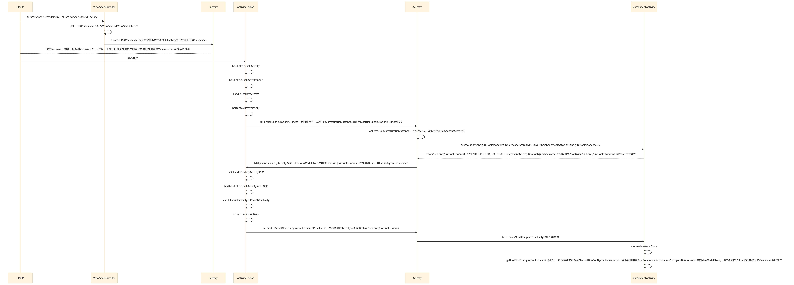
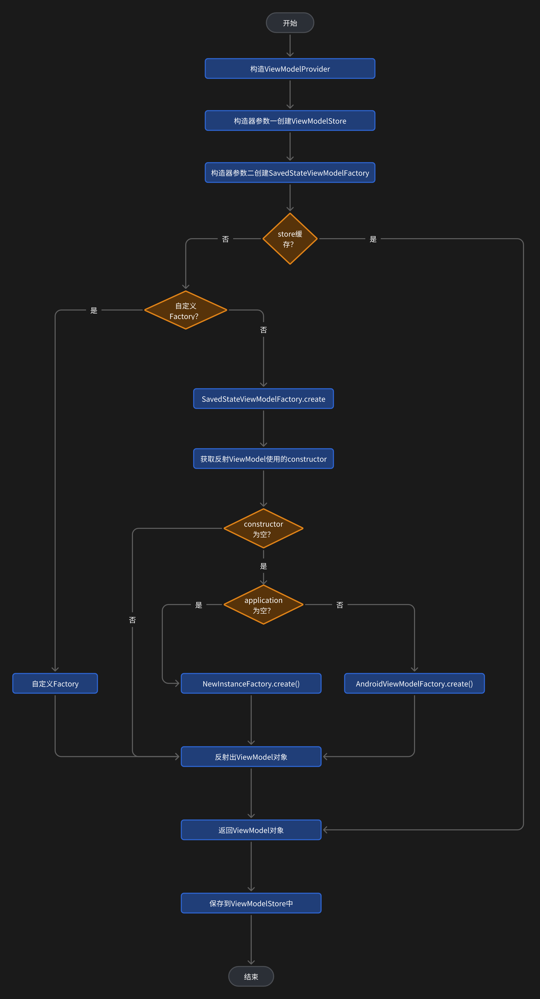
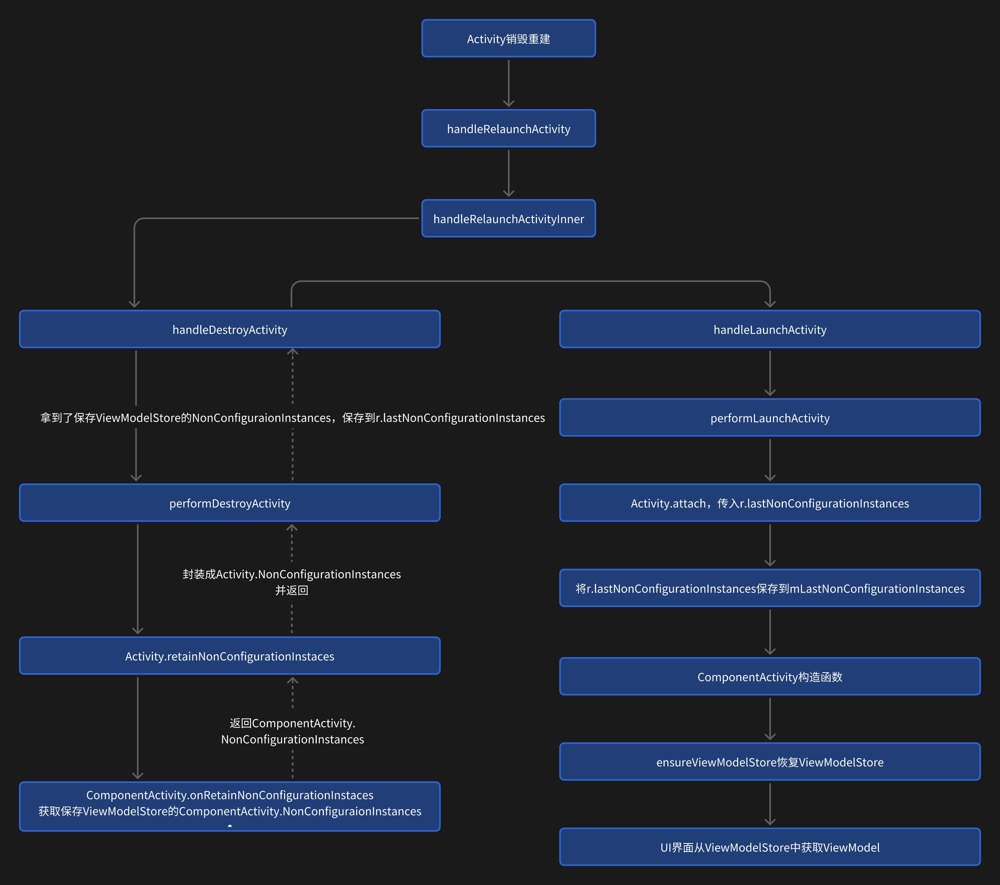

# ViewModel

## 简介

ViewModel 类旨在以注重生命周期的方式存储和管理界面相关数据。ViewModel 类让数据可在发生屏幕旋转等配置更改后继续留存。如界面因配置发生变更销毁重建时需要对页面数据进行恢复。

::: info 📌
配置变更一般指屏幕旋转、切换黑暗模式、更改系统语言/字体/主题、屏幕大小改变等
:::

## 基本使用

### 创建 ViewModel 类

ViewModel 和其它的类有点不一样，不能随意的在构造方法上加自己想加的参数，因为在构建时对构造方法的方法签名有严格的限制，创建方式基本无外乎以下几种方式。

```kotlin
// 1. 没有参数的ViewModel
class JetpackViewModel : ViewModel()

// 2. 带有一个SavedStateHandle参数的ViewModel
class JetpackViewModel(val stateHandle: SavedStateHandle) : ViewModel()

// 3. 带有Application的AndroidViewModel
class JetpackViewModel(val app: Application) : AndroidViewModel(app)

// 4. 带有Application和SavedStateHandle两个参数的AndroidViewModel
class JetpackViewModel(val app: Application, stateHandle: SavedStateHandle) : AndroidViewModel(app)
```

::: info 📌
如果要自定义传参的话，需要自定义 Factory
:::

### 自定义参数 ViewModel

自定义 ViewModel 构造函数的参数的话，那就不能使用系统提供的 Factory 来创建了，因为系统的 Factory 会对其构造函数进行检查，无法随意指定参数。那就需要自定义 Factory 来创建 ViewModel 对象了。

```kotlin
// 自定义String类型的参数
class JetpackViewModel(val test: String) : ViewModel()
class JetpackViewModelFactory : ViewModelProvider.Factory {
    override fun <T : ViewModel> create(modelClass: Class<T>): T {
        return JetpackViewModel("12345678") as T
    }
}
private val viewModel by lazy {
    ViewModelProvider(this, JetpackViewModelFactory()).get(
        JetpackViewModel::class.java
    )
}
```

### 获取 ViewModel 实例

官方提供了 ViewModelProvider 类来创建并获取一个 ViewModel 对象，而不能直接使用 new JetpackViewModel 的方式，不然这样仅仅只是创建了一个 ViewModel 对象而不具备 ViewModel 的特性了。

```kotlin
private val viewModel by lazy {ViewModelProvider(this).get(JetpackViewModel::class.java)}
```

### 使用场景

一般把获取数据等操作放在 ViewModel 中，以便 ViewModel 能够更好地去管理其数据在 Activity 因配置变更时页面重启也不会丢失，一般情况下与 LiveData 结合使用。

在 UI 控制器中获取到了 ViewModel 对象，假设 ViewModel 中有一个 loadUser 的方法，ViewModel 获取到数据后通过 LiveData 把数据发送数据，ViewModel 对象在 UI 控制器中去订阅此 LiveData，从而拿到数据。

```kotlin
class JetpackViewModel : ViewModel() {
    val liveData = MutableLiveData<String>()

    fun loadUser() {
        // 获取用户信息
        liveData.value = "user"
    }
}

class ViewModelActivity : AppcompatActivity() {
    private val viewModel by lazy { ViewModelProvider(this).get(JetpackViewModel::class.java) }
    override fun onCreate(savedInstanceState: Bundle?) {
        super.onCreate(savedInstanceState)
        viewModel.liveData.observe(this) {
            // 接收ViewModel中的LiveData发送的数据
        }
    }
}
```

## 源码分析

### 基本原理

ViewModel 的生命周期长于 Activity，在页面创建时创建一个 ViewModel 实例并保存到 ViewModelStore 中，当页面因配置变更导致重启时，在启动新 Activity 之前，ActivityThread 会读取到当前的 ViewModelStore 并保存到 ActivityClientRecord 的 mLastNonConfigurationInstances 中。在 attach 新 Activity 时将这个 ActivityClientRecord 传入，同时取出 ActivityClientRecord 中保存的 mLastNonConfigurationInstances 保存到 Activity 的成员变量中以备使用。在真正启动新 Activity 时，取出 mLastNonConfigurationInstances 中的 ViewModelStore 进行恢复。

工作原理时序图


### Factory 创建

ViewModel 创建需要使用 ViewModelProvider 来创建，使用 ViewModelProvider 来创建，其内部可以创建默认的 ViewModelStore 以及 Factory。

以在 Activity 中 ViewModelProvider(this).get(JectpackViewModel::class.java)为例来分析流程。首先构造一个 ViewModelProvider 对象。

```kotlin
// ViewModelProvider.kt
public open class ViewModelProvider @JvmOverloads constructor(
    private val store: ViewModelStore,
    private val factory: Factory,
    private val defaultCreationExtras: CreationExtras = CreationExtras.Empty,
) {
    public constructor(
        owner: ViewModelStoreOwner
    ) : this(owner.viewModelStore, defaultFactory(owner), defaultCreationExtras(owner))

    public constructor(owner: ViewModelStoreOwner, factory: Factory) : this(
        owner.viewModelStore,
        factory,
        defaultCreationExtras(owner)
    )
}
```

ViewModelProvider 有三个构造方法，一般使用只有一个参数 ViewModelStoreOwner 的这个构造方法。它调用了三个参数的构造方法，并且提供后面 2 个参数的默认值。

::: info 📌
ViewModelStoreOwner 是一个接口，接口内只有一个变量 viewModelStore，ComponentActivity 实现了该接口，返回创建的 mViewModelStore，用于在其它地方需要使用 ViewModelStore 对象时能获取到。
:::

1. 第一个参数 viewModelStore

   ComponentActivity 重写了接口 ViewModelStoreOwner 的属性 viewModelStore，创建并返回一个 ViewModelStore 对象，用于后面创建 ViewModel 时存储起来。

```java
// ComponentActivity
@NonNull
@Override
public ViewModelStore getViewModelStore() {
    if (getApplication() == null) {
        throw new IllegalStateException("Your activity is not yet attached to the "
                + "Application instance. You can't request ViewModel before onCreate call.");
    }
    ensureViewModelStore();
    return mViewModelStore;
}

@SuppressWarnings("WeakerAccess") /* synthetic access */
void ensureViewModelStore() {
    if (mViewModelStore == null) {
        NonConfigurationInstances nc = (NonConfigurationInstances) getLastNonConfigurationInstance();
        if (nc != null) {
            // Restore the ViewModelStore from NonConfigurationInstances
            mViewModelStore = nc.viewModelStore;
        }
        if (mViewModelStore == null) {
            mViewModelStore = new ViewModelStore();
        }
    }
}
```

2. 第二个参数 defaultFactory

   第二个参数 defaultFactory 提供了一个默认的 Factory 用于创建 ViewModel。

```kotlin
// ViewMOdelProvider.kt
public companion object {
    internal fun defaultFactory(owner: ViewModelStoreOwner): Factory =
        if (owner is HasDefaultViewModelProviderFactory)
            owner.defaultViewModelProviderFactory else instance
}
```

defaultFactory 方法中判断 owner 是否是 HasDefaultViewModelProviderFactory 类型，如果是的话就返回 owner.defaultViewModelProviderFactory，否则就返回 instance，instance 是 NewInstanceFactory 类型。

查看 ComponentActivity 的继承关系可以知道，ComponentActivity 正好实现了 HasDefaultViewModelProviderFactory 接口，因此是返回了 owner.defaultViewModelProviderFactory。

ComponentActivity 实现了 HasDefaultViewModelProviderFactory 接口，重写了 defaultViewModelProviderFactory 属性，创建了一个默认工厂 SavedStateViewModelFactory。

```java
// ComponentActivity.java
@NonNull
@Override
public ViewModelProvider.Factory getDefaultViewModelProviderFactory() {
    if (getApplication() == null) {
        throw new IllegalStateException("Your activity is not yet attached to the "
                + "Application instance. You can't request ViewModel before onCreate call.");
    }
    if (mDefaultFactory == null) {
        mDefaultFactory = new SavedStateViewModelFactory(
                getApplication(),
                this,
                getIntent() != null ? getIntent().getExtras() : null);
    }
    return mDefaultFactory;
}
```

3. 第三个参数 defaultCreationExtras

   第三个参数与第二个参数类似，因此返回 owner.defaultViewModelCreationExtras，而 ComponentActivity 没有重写此属性，使用了一个默认的值 CreationExtras.Empty

```kotlin
// ViewMOdelProvider.kt
internal fun defaultCreationExtras(owner: ViewModelStoreOwner): CreationExtras {
    return if (owner is HasDefaultViewModelProviderFactory) {
        owner.defaultViewModelCreationExtras
    } else CreationExtras.Empty
}
```

### ViewModel 创建

构造完 ViewMOdelProvider 后，get 方法用来创建 ViewModel 对象。

```kotlin
// ViewMOdelProvider.kt
internal const val DEFAULT_KEY = "androidx.lifecycle.ViewModelProvider.DefaultKey"

@MainThread
public open operator fun <T : ViewModel> get(modelClass: Class<T>): T {
    val canonicalName = modelClass.canonicalName
        ?: throw IllegalArgumentException("Local and anonymous classes can not be ViewModels")
    return get("$DEFAULT_KEY:$canonicalName", modelClass)
}

@Suppress("UNCHECKED_CAST")
@MainThread
public open operator fun <T : ViewModel> get(key: String, modelClass: Class<T>): T {
    val viewModel = store[key]
    if (modelClass.isInstance(viewModel)) {
        return viewModel as T
    } else {}
    return try {
        factory.create(modelClass, extras)
    } catch (e: AbstractMethodError) {
        factory.create(modelClass)
    }.also { store.put(key, it) }
}
```

在第一个 get 方法中，使用 DEFAULT_KEY 和自定义 ViewModel 的全限定类名拼接成一个 key，用于存储 ViewMode 的 key，接着调用了两个参数的 get 重载方法。

1. 从 store 中根据拼接的 key 查询 ViewModel，如果查询出来的结果是指定的 ViewModel 类型，那就使用缓存的 ViewModel 直接返回
2. 如果第一步不成立（没有缓存或不是 ViewModel 类型），那就使用 factory.create(modelClass, extras)创建
3. 两个参数的 create 方法创建失败，那就使用一个参数的 create 方法创建
4. 不管是那种创建方式，最终都保存到 store 中

<strong>Factory.create</strong>

从 ViewModelProvider 的构造方法的第二个参数中知道，这个 factory 就是 SavedStateViewModelFactory，即接下来调用到了 SavedStateViewModelFactory 的 create 方法。

```kotlin
// SavedStateViewModelFactory.kt
class SavedStateViewModelFactory : ViewModelProvider.OnRequeryFactory, ViewModelProvider.Factory {
    override fun <T : ViewModel> create(modelClass: Class<T>, extras: CreationExtras): T {
            // 用于校验是否是从ViewModelProvider中调用的，extras在ViewModelProvider中就添加了VIEW_MODEL_KEY
            val key = extras[ViewModelProvider.NewInstanceFactory.VIEW_MODEL_KEY] ?: throw IllegalStateException(
                    "VIEW_MODEL_KEY must always be provided by ViewModelProvider")
        // ViewModelProvider中没有添加SAVED_STATE_RE和GISTRY_OWNER_KEYVIEW_MODEL_STORE_OWNER_KEY，因此走到了else
        return if (extras[SAVED_STATE_REGISTRY_OWNER_KEY] != null && extras[VIEW_MODEL_STORE_OWNER_KEY] != null) {
             // ... 省略代码
        } else {
            val viewModel = if (lifecycle != null) {
                create(key, modelClass) // 执行到了这里
            } else {
            }
            viewModel
        }
    }

    fun <T : ViewModel> create(key: String, modelClass: Class<T>): T {
        val lifecycle = lifecycle
        // 是否是继承了AndroidViewModel
        val isAndroidViewModel = AndroidViewModel::class.java.isAssignableFrom(modelClass)
        val constructor: Constructor<T>? = if (isAndroidViewModel && application != null) {
            // 是AndroidViewModel并且application不为空就使用两个参数签名的构造方法
            findMatchingConstructor(modelClass, ANDROID_VIEWMODEL_SIGNATURE)
        } else {
            // 否则使用一个参数签名的构造方法
            findMatchingConstructor(modelClass, VIEWMODEL_SIGNATURE)
        }
        // doesn't need SavedStateHandle
        constructor ?: return if (application != null) factory.create(modelClass) else instance.create(modelClass)
        val controller = LegacySavedStateHandleController.create(savedStateRegistry!!, lifecycle, key, defaultArgs)
        val viewModel: T = if (isAndroidViewModel && application != null) {
            // 反射创建ViewModel
            newInstance(modelClass, constructor, application!!, controller.handle)
        } else {
            newInstance(modelClass, constructor, controller.handle)
        }
        viewModel.setTagIfAbsent(
            AbstractSavedStateViewModelFactory.TAG_SAVED_STATE_HANDLE_CONTROLLER, controller
        )
        return viewModel
    }
}
```

上面方法的作用很简单，判断 ViewModel 的类型和构造方法的参数签名，不同的类型和不同的参数签名就有不同的创建流程。

1. 是继承自 AndroidViewModel 并且 application 不为空（一般都不为空），就使用两个参数的构造方法（Application 和 SavedStateHandle）
2. 否则使用一个参数的构造方法（SavedStateHandle）
3. 使用 modelClass 的构造方法与上面两种构造方法进行对比，如果不一样，那么 constructor 就为 null
4. 如果 constructor 为 null，那就判断 application 是否为 null（一般不为 null，因此执行 factory.create）
5. 如果 constructor 不为 null，那就使用反射创建 ViewModel
   如果使用了自定义的 Factory，那么就不会使用 defaultFactory，只执行到自定义 Factory 的 create 方法

create 方法首先判断是否是从 ViewModelProvider 中调用的，如果不是的话就直接抛出异常。因此执行到了重载方法 `create(key: String, modelClass: Class<T>)`。然后根据 modelClass 的类型拿到一个 constructor 对象。

```kotlin
// SavedStateViewModelFactory.kt
internal fun <T> findMatchingConstructor(modelClass: Class<T>, signature: List<Class<*>>): Constructor<T>? {
    for (constructor in modelClass.constructors) {
        val parameterTypes = constructor.parameterTypes.toList()
        if (signature == parameterTypes) {
            @Suppress("UNCHECKED_CAST")
            return constructor as Constructor<T>
        }
        if (signature.size == parameterTypes.size && parameterTypes.containsAll(signature)) {
            throw UnsupportedOperationException(
                "Class ${modelClass.simpleName} must have parameters in the proper " +
                    "order: $signature"
            )
        }
    }
    return null
}
```

首先遍历 modelClass 的所有构造方法，然后把每个构造方法的方法签名与传进来的方法签名进行对比，如果一致则返回该构造方法，否则返回 null。
方法签名：可以理解为方法参数的类型，如 fun test(a: String)，那么它对应的方法签名为 java.lang.String
signature 即传进来的两种类型：ANDROID_VIEWMODEL_SIGNATURE 和 VIEWMODEL_SIGNATURE

```kotlin
private val ANDROID_VIEWMODEL_SIGNATURE = listOf<Class<*>>(
    Application::class.java,
    SavedStateHandle::class.java
)

private val VIEWMODEL_SIGNATURE = listOf<Class<*>>(SavedStateHandle::class.java)
```

由于例子中的 JetpackViewModel 不是继承自 AndroidViewModel，也没有参数 SavedStateHandle，因此返回的 constructor 为 null。根据 constructor 是否为空又分为两种不同的创建路径。

<strong>constructor 为空</strong>

```kotlin
// SavedStateViewModelFactory.kt
constructor ?: return if (application != null) factory.create(modelClass) else instance.create(modelClass)
```

当 constructor 为空，根据上面代码可以知道，会使用 factory.create(modelClass)或者 instance.create(modelClass)来创建 ViewModel。而 application 在运行 App 时一般不会为空，因此会使用 factory.create(modelClass)，这个 factory 是 ViewModelProvider.AndroidViewModelFactory()，可以从 SavedStateViewModelFactory 的构造方法中得知。

```kotlin
// SavedStateViewModelFactory.kt
constructor() {
    factory = ViewModelProvider.AndroidViewModelFactory()
}
```

接着来到 AndroidViewModelFactory 的 create 方法中，有两个重载方法。

```kotlin
// AndroidViewModelFactory.class
override fun <T : ViewModel> create(modelClass: Class<T>): T {
    return if (application == null) {
        throw UnsupportedOperationException(
            "AndroidViewModelFactory constructed " +
                "with empty constructor works only with " +
                "create(modelClass: Class<T>, extras: CreationExtras)."
        )
    } else {
        create(modelClass, application)
    }
}

@Suppress("DocumentExceptions")
private fun <T : ViewModel> create(modelClass: Class<T>, app: Application): T {
    return if (AndroidViewModel::class.java.isAssignableFrom(modelClass)) {
        try {
            modelClass.getConstructor(Application::class.java).newInstance(app)
        } catch (e: NoSuchMethodException) {
            throw RuntimeException("Cannot create an instance of $modelClass", e)
        } catch (e: IllegalAccessException) {
            throw RuntimeException("Cannot create an instance of $modelClass", e)
        } catch (e: InstantiationException) {
            throw RuntimeException("Cannot create an instance of $modelClass", e)
        } catch (e: InvocationTargetException) {
            throw RuntimeException("Cannot create an instance of $modelClass", e)
        }
    } else super.create(modelClass)
}
```

application 不为空，因此走到两个参数的 create 方法。如果是继承自 AndroidViewModel 的话，那就反射出 ViewModel 对象，否则就调用父类的 create 方法。其父类是 NewInstanceFactory。

```kotlin
// NewInstanceFactory.class
override fun <T : ViewModel> create(modelClass: Class<T>): T {
    return try {
        modelClass.getDeclaredConstructor().newInstance()
    } catch (e: NoSuchMethodException) {
        throw RuntimeException("Cannot create an instance of $modelClass", e)
    } catch (e: InstantiationException) {
        throw RuntimeException("Cannot create an instance of $modelClass", e)
    } catch (e: IllegalAccessException) {
        throw RuntimeException("Cannot create an instance of $modelClass", e)
    }
}
```

父类 NewInstanceFactory 直接反射出 ViewModel 对象。

<strong>constructor 不为空</strong>

```kotlin
// // SavedStateViewModelFactory.class
val viewModel: T = if (isAndroidViewModel && application != null) {
    newInstance(modelClass, constructor, application!!, controller.handle)
} else {
    newInstance(modelClass, constructor, controller.handle)
}
```

当 constructor 不为 null 时，没有再分发给哪个 factory 来创建而是直接反射出了 ViewModel 对象。至此 ViewModel 对象的创建流程就完成了。

创建流程图


### ViewModelStore 恢复流程

Activity 因配置变更重建时，ViewModel 能够恢复完全是因为 ViewModelStore 恢复了，因为 ViewModel 是存储在 ViewModelStore 的 LinkedHashMap 中的。

::: info 📌
ViewModelStore 恢复只会在因配置变更的情况下才会恢复，其它情况导致的页面销毁并不会触发 ViewModelStore 的恢复
:::

Activity 重建恢复时会执行到 ActivityThread 的 handleRelaunchActivity 方法，然后执行到 handleRelaunchActivityInner，在 handleRelaunchActivityInner 内部又执行到 handleDestroyActivity，handleDestroyActivity 内部又执行了 performDestroyActivity 来获取 ViewModelStore。

```java
// ActivityThread.java
void performDestroyActivity(ActivityClientRecord r, boolean finishing, int configChanges, boolean getNonConfigInstance, String reason){
    if (getNonConfigInstance) {
        try {
            r.lastNonConfigurationInstances = r.activity.retainNonConfigurationInstances();
        } catch (Exception e) {
        if (!mInstrumentation.onException(r.activity, e)) {
            throw new RuntimeException("Unable to retain activity "
                    + r.intent.getComponent().toShortString() + ": " + e.toString(), e);
        }
    }
}
r.activity.retainNonConfigurationInstances();调用到了Activity中的retainNonConfigurationInstances获取NonConfigurationInstances对象。
// Activity.java
NonConfigurationInstances retainNonConfigurationInstances() {
    Object activity = onRetainNonConfigurationInstance();
    // ...省略代码
    NonConfigurationInstances nci = new NonConfigurationInstances();
    nci.activity = activity;
    // ...省略代码
    return nci;
}

public Object onRetainNonConfigurationInstance() {
    return null;
}
```

onRetainNonConfigurationInstance 方法是一个空方法，具体实现在 ComponentActivity 中

```java
// ComponentActivity.java
@Override
@Nullable
@SuppressWarnings("deprecation")
public final Object onRetainNonConfigurationInstance() {
    // Maintain backward compatibility.
    Object custom = onRetainCustomNonConfigurationInstance();

    ViewModelStore viewModelStore = mViewModelStore;
    if (viewModelStore == null) {
        // No one called getViewModelStore(), so see if there was an existing
        // ViewModelStore from our last NonConfigurationInstance
        NonConfigurationInstances nc = (NonConfigurationInstances) getLastNonConfigurationInstance();
        if (nc != null) {
            viewModelStore = nc.viewModelStore;
        }
    }

    if (viewModelStore == null && custom == null) {
        return null;
    }

    NonConfigurationInstances nci = new NonConfigurationInstances();
    nci.custom = custom;
    nci.viewModelStore = viewModelStore;
    return nci;
}
```

该方法构造一个 NonConfigurationInstances 对象，并把 viewModelStore 对象保存进去。然后又回到 Activity 中的 retainNonConfigurationInstances 方法，将从 ComponentActivity 中获取到的 NonConfigurationInstances 对象赋值给 Activity 中 NonConfigurationInstances 对象的 activity 属性。

::: warning 注意：
Activity 中的 NonConfigurationInstances 和 ComponentActivity 中的 NonConfigurationInstances 并不一样，他们没有任何继承关系。

关系：

Activity.NonConfigurationInstances.activity = ComponentActivity.NonConfigurationInstances
:::

拿到 viewModelStore 保存到 NonConfigurationInstances 对象里之后，又回到 ActivityThread 类的 performDestroyActivity 方法中，将获取到的 NonConfigurationInstances 对象赋值给 r.lastNonConfigurationInstances。到此 handleDestroyActivity 方法就算是执行完成，接着执行 handleRelaunchActivityInner 方法中的 handleLaunchActivity 方法，然后到了 performLaunchActivity 真正的去启动一个新的 Activity。

```java
// ActivityThread.java
private Activity performLaunchActivity(ActivityClientRecord r, Intent customIntent) {
    activity.attach(appContext, this, getInstrumentation(), r.token,
                        r.ident, app, r.intent, r.activityInfo, title, r.parent,
                        r.embeddedID, r.lastNonConfigurationInstances, config,
                        r.referrer, r.voiceInteractor, window, r.activityConfigCallback,
                        r.assistToken, r.shareableActivityToken);
}
// Activity.java
final void attach(Context context, ActivityThread aThread,
        Instrumentation instr, IBinder token, int ident,
        Application application, Intent intent, ActivityInfo info,
        CharSequence title, Activity parent, String id,
        NonConfigurationInstances lastNonConfigurationInstances,
        Configuration config, String referrer, IVoiceInteractor voiceInteractor,
        Window window, ActivityConfigCallback activityConfigCallback, IBinder assistToken,
        IBinder shareableActivityToken) {
    attachBaseContext(context);
    ...
    // 保存到成员变量中
    mLastNonConfigurationInstances = lastNonConfigurationInstances;
}
```

最终就把上一个 Activity 中的 ViewModelStore 对象保存到 NonConfigurationInstances 对象中并带到了新的 Activity 保存了起来。

创建新的 Activity 时，在 ComponentActivity 的构造函数中通过 ensureViewModelStore 方法获取到 NonConfigurationInstances 里面的 ViewModeStore 对象。

```java
// ComponentActivity.java
void ensureViewModelStore() {
    if (mViewModelStore == null) {
        // 获取保存到Activity成员变量中的mLastNonConfigurationInstances中的activity属性，即ComponentActivity.NonConfigurationInstances
        NonConfigurationInstances nc = (NonConfigurationInstances) getLastNonConfigurationInstance();
        if (nc != null) {
            // Restore the ViewModelStore from NonConfigurationInstances
            // 进行恢复
            mViewModelStore = nc.viewModelStore;
        }
        if (mViewModelStore == null) {
            // 否则就重新创建一个新的
            mViewModelStore = new ViewModelStore();
        }
    }
}
```

最终就从 ViewModelStore 中获取到了 ViewModel 对象。

### ViewModelStore 恢复流程图



[SavedStateHandle](./SavedStateHandle.md)

## ViewModel 的工作原理

通过 ViewModelProvider 和 Factory 创建 ViewModel 和 ViewModelStore，将 ViewModel 存放到 ViewModelStore 中，当 Activity 重建时，首先将 ViewModelStore 存放到 ActivityClientRecord.lastNonConfigurationInstances 中，然后在创建新 Activity 时将该 ActivityClientRecord.NonConfigurationInstances 携带过去保存到新创建 Activity 的 mLastNonConfigurationInstances 变量中，接着 Activity 从该变量中恢复 ViewModelStore，恢复了 VIewModelStore 也就把 ViewModel 恢复了。
总结：

1. 通过 ViewModelProvider 和 Factory 创建 ViewModel 和 ViewModelStore
2. 将 ViewModel 存进 ViewModelStore 中
3. 页面销毁时将 ViewModelStore 保存到 ActivityClientRecord.lastNonConfigurationInstances
4. 创建新 Activity 携带 ActivityClientRecord.lastNonConfigurationInstances 并保存到新 Activity 的 mLastNonConfigurationInstances 中
5. Activity 从 mLastNonConfigurationInstances 中恢复出 ViewModelStore
6. 恢复了 ViewModelStore 也就是恢复了 ViewModel
