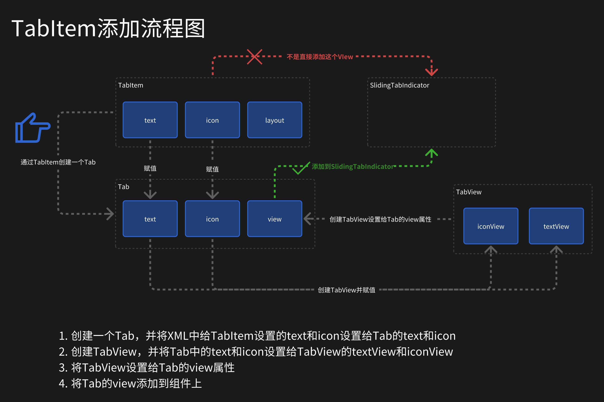

# XML 中给 TabItem 设置 visibility 无效

```xml
<com.google.android.material.tabs.TabLayout>
    <com.google.android.material.tabs.TabItem
        android:visibility="gone"/>
    <com.google.android.material.tabs.TabItem/>
</com.google.android.material.tabs.TabLayout>
```

在给 TabLayout 的子 View TabItem 设置 visibility 属性时，发现不管是在 XML 预览还是运行出来都没有隐藏。

TabItem 是一个自定义 VIew，有三个自定义属性，分别是 text、icon、customLayout。

> 猜想：是不是在 xml 中设置 gone 后运行阶段是不是又被设置为 visible 了

为了验证猜想，自定义一个类继承 TabItem，在构造函数中获取其 visibility 的值，发现其值确实为 GONE，并没有被设置为 visibility。

既然 TabItem 没问题，那么肯定是 TabLayout 做了什么。在 TabLayout 中搜索 TabItem，只有一个地方使用了，那就是 addTabFromItemView(TabItem item)方法。

```java
private void addTabFromItemView(@NonNull TabItem item) {
  final Tab tab = newTab();
  if (item.text != null) {
    tab.setText(item.text);
  }
  if (item.icon != null) {
    tab.setIcon(item.icon);
  }
  if (item.customLayout != 0) {
    tab.setCustomView(item.customLayout);
  }
  if (!TextUtils.isEmpty(item.getContentDescription())) {
    tab.setContentDescription(item.getContentDescription());
  }
  addTab(tab);
}

@NonNull
public Tab newTab() {
  Tab tab = createTabFromPool();
  tab.parent = this;
  tab.view = createTabView(tab);
  if (tab.id != NO_ID) {
    tab.view.setId(tab.id);
  }

  return tab;
}

@NonNull
private TabView createTabView(@NonNull final Tab tab) {
  TabView tabView = tabViewPool != null ? tabViewPool.acquire() : null;
  if (tabView == null) {
    tabView = new TabView(getContext());
  }
  tabView.setTab(tab);
  tabView.setFocusable(true);
  tabView.setMinimumWidth(getTabMinWidth());
  if (TextUtils.isEmpty(tab.contentDesc)) {
    tabView.setContentDescription(tab.text);
  } else {
    tabView.setContentDescription(tab.contentDesc);
  }
  return tabView;
}
```

上面三个核心方法，先通过 newTab 创建一个 Tab，Tab 是 TabLayout 的静态内部类，其内部有属性 text、icon、customView 和 view 等。在创建 Tab 的同时，也通过 createTabView 方法创建出了一个 TabView 并设置给了 Tab 的 view 属性。Tab 创建好之后，又从 TabItem 中取出 text 和 icon 设置给 Tab，此时 Tab 已经有了文本 text、图标 icon 以及 TabView。

其实 TabLayout 真正显示在界面上的就是这个 TabView 而不是在 XML 中设置的 TabItem。因为 TabItem 并没有被添加到 View 的控件树中，所以设置 visibility 属性是无效的。

