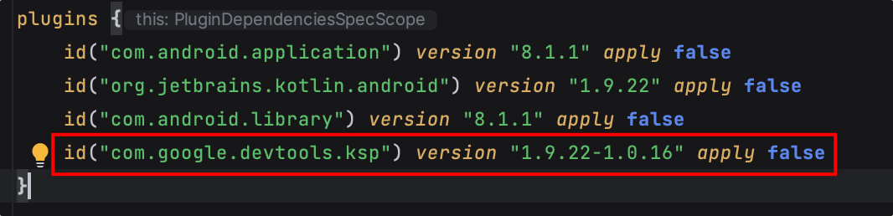
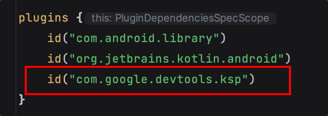

# kapt 替换成 ksp，as 没有了 kapt

ksp 比 kapt 效率高，需要手动开启
在项目根目录的`build.gradle.kts`中添加插件 `com.google.devtools.ksp`

插件的版本号需要和使用的 kotlin 版本匹配上，可以从 https://github.com/google/ksp/releases 上面找对应的版本

然后在使用 ksp 的 module 中添加

添加好同步后就可以使用 ksp 了
