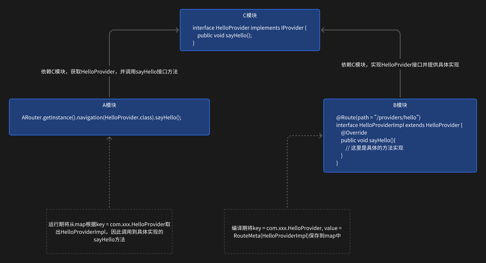
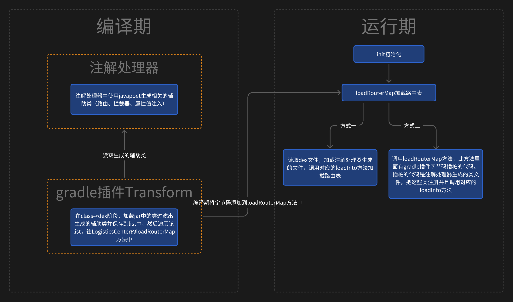
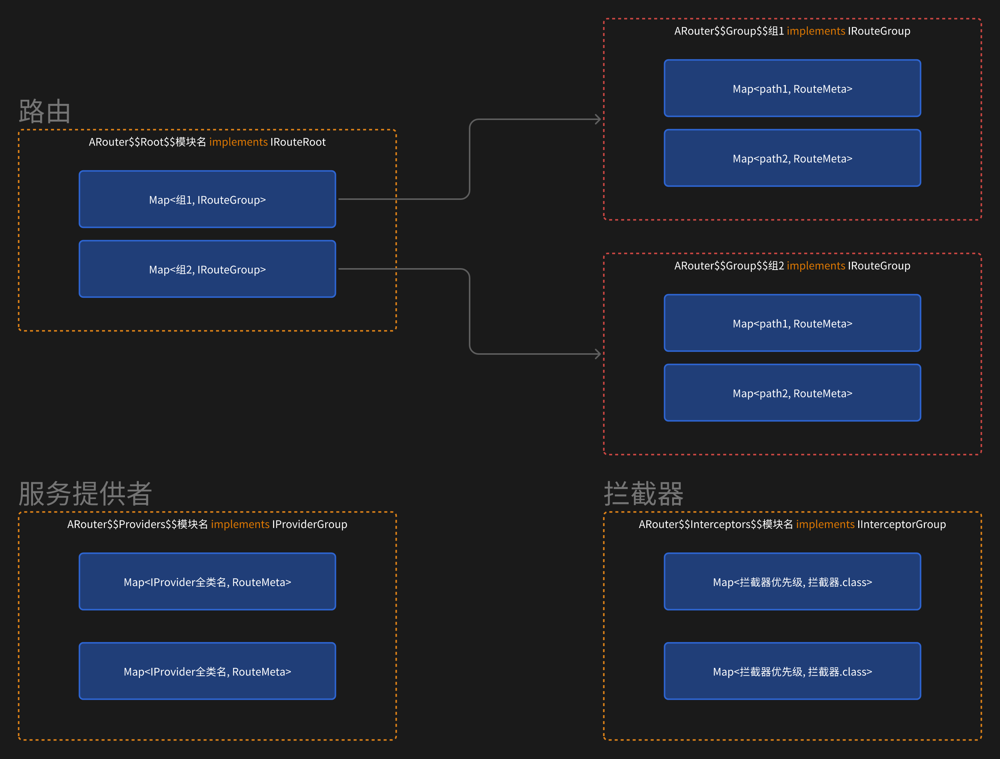
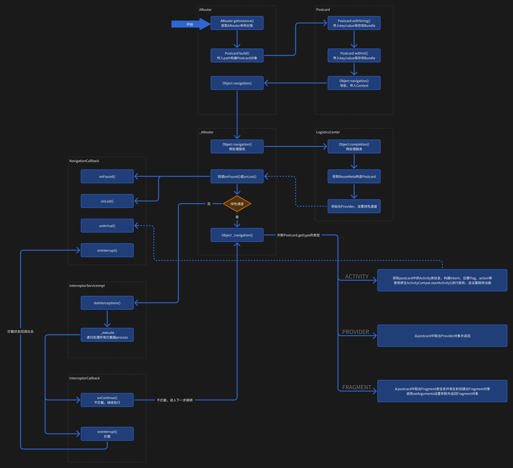

# ARouter

## 简介

Arouter 是阿里开源的一个安卓平台的路由框架，为项目组件化架构提供解耦的架构支持。支持页面跳转、跳转拦截等功能。

## 集成

module/build.gradle

```kotlin
// kotlin方式
kapt {
    arguments { arg("AROUTER_MODULE_NAME", project.getName()) }
}

// 非kotlin的方式
android{
    defaultConfig{
        javaCompileOptions {
            annotationProcessorOptions {
                arguments = [AROUTER_MODULE_NAME: project.getName(), AROUTER_GENERATE_DOC: "enable"]
            }
        }
    }
}

dependencies{
    implementation("com.alibaba:arouter-api:1.5.2")
    kapt("com.alibaba:arouter-compiler:1.5.2") // java使用annotationProcessor
}
```

此时，加载路由表还是使用默认的读取 dex 的方式，比较耗时。如果要使用 gradle 插件自动加载路由表，就需要再配置（可选配置）

project/build.gradle

```groovy
apply plugin: 'com.alibaba.arouter'
buildscript {
    dependencies {
        classpath("com.alibaba:arouter-register:1.0.2")
    }
}
```

## 基本使用

ARouter 提供了三个注解：@Route、@Autowired 和@Interceptor

- @Router：路由，表示可以路由到一个目标页面，可用在 Activity、Fragment 或 Service 等地方
- @Autowired：可页面的成员变量注入指定的值，无需显式指定
- @Interceptor：自定义拦截器使用的拦截注解

跳转之前需要给目标页面增加@Route 注解，并指定 path，path 表示该页面的一个路径，用/开头，并最少要有两级，如/activity/test

给 TestActivity 添加@Route 注解

```kotlin
@Route(path = "/activity/test")
class TestActivity : AppcompatActivity() {
    @Autowired
    @JvmField var name: String? = null
    @Autowired
    @JvmField var age: Int? = 0
}
```

## 正常跳转

```java
ARouter.getInstance().build("/activity/test").withString("name", "zhangsan")
    .withInt("age", 20).navigation(this, new NavigationCallback() {
    @Override
    public void onFound(Postcard postcard) {
        // 找到了目标路由，但不一定跳转成功了
    }

    @Override
    public void onLost(Postcard postcard) {
        // 没找到路由
    }

    @Override
    public void onArrival(Postcard postcard) {
        // 跳转成功
    }

    @Override
    public void onInterrupt(Postcard postcard) {
        // 被拦截
    }
});
```

使用 build 方法传入一个参数 path，该 path 就是目标页面注解中的 path。通过一系列的 with 方法传递参数，最终也是添加到 Bundle 中。

## 拦截器拦截

需要自定义拦截器，实现 IInterceptor 接口并在类上加@Interceptor 注解，且需要设置改拦截器的优先级，然后在 process 中写处理的逻辑。

```kotlin
@Interceptor(priority = 1)
class MyInterceptor : IInterceptor {
    override fun init(context: Context?) {

    }

    override fun process(postcard: Postcard, callback: InterceptorCallback) {
        if (postcard.path == "/activity/test") {
            // 做一些处理
            if (...) {
                callback.onContinue(postcard)
            } else {
                callback.onInterrupt(IllegalArgumentException("拦截了"))
                }
            } else {
                callback.onContinue(postcard)
            }
        }
    }
}
```

值得注意的是，写好了拦截器的类不需要我们主动去调用，而是在编译期会将这个拦截器生成到 ARouter$$Interceptors$$xxx 类中，在 navigation 的执行链中最终会执行到所有的拦截器的 process 方法。

::: warning 提示

1. 自定义拦截器无需主动调用，会自动执行到所有的拦截器，并按设置的优先级依次执行，且拦截器的优先级不能相同
2. 通过 postcard.path 来匹配需要拦截哪个页面，if(postcard.path == "/activity/test")表示只拦截 path 为/activity/test 的页面
3. 在拦截器中必须要调用拦截器的回调方法 onContinue()或 onInterrupt()，否则无法执行到后续的动作。例如跳转页面时，虽然调用了 navigation 方法，但是如果有拦截器的 process 方法中是空执行，那么不会跳转成功

:::

## 解析参数

```java
ARouter.getInstance().build("/activity/test")
    .withInt("age", 18) // 整型
    .withString("name", "test") // 字符串
    .navigation();
```

跳转时使用 with 方法传入参数，在目标页面使用@Autowired 注解打在成员变量 age 和 name 上面，并且在 kotlin 中必须要加上@JvmField 注解提供 get/set 方法。同时比如要在 Activity 的 onCreate 方法中注入当前页面，否则无法注入值。

```kotlin
ARouter.getInstance().inject(this)
```

## Provider 跨模块调用

一个模块 A 想要使用另一个模块 B 的功能，但 A 不直接依赖 B，而是提供一个接口模块 C 暴露出来，C 模块的接口实现 IPovider 接口。A 依赖 C 模块，访问 C 模块接口的方法，B 同样依赖 C 模块，实现 C 模块的接口做具体的实现。在运行阶段，A 调用 C 中的接口方法，实际上会调用到 B 中的具体实现方法。这样就达到了 A 没有直接依赖 B，但是最终却调用到了 B 中的方法实现。


## 源码分析

### 执行流程


首先需要调用 init 方法进行初始化，在初始化的时候去加载路由表。加载路由表有两种方式，两种方式的前提都是需要在注解处理器中生成一些辅助类，这些辅助类是用 javapoet 库生成的，用于在运行期将注解中提供的跳转信息添加到 Map 中作为路由表。

在编译器生成好了辅助类后， 运行期在初始化的时候进行加载

- 加载 dex 方式：读取 dex 文件，并且过滤出包名为 com.alibaba.android.arouter.routes 的类，这些类就是生成的辅助类，然后分别调用这些辅助类的 loadInto 方法，将信息保存到 Warehouse 类中。但是这种方式是同步的方式堵塞线程的，一般都是在 Application 中执行，会拖慢 APP 的启动速度。
- 针对 dex 方式的优化，在编译器使用 gradle 插件读取到生成的辅助类，然后将调用这些辅助类的 loadInto 方法的代码通过字节码插桩的方式插入到 LogisticsCenter 的 loadRouterMap 方法中，在初始化的时候直接调用到插入的代码，也就是在运行时调用到了插入代码的 loadInto 方法，然后将信息保存到 Warehouse 类中

以最简单的跳转`ARouter.getInstance().build("/test/activity2").navigation()`作为示例来看，首先通过 getInstance()方法获取一个单例类 ARouter，然后通过 build 方法传入一个 path 构造一个 Postcard 对象。实际 Postcard 对象是在`_Router` 中构建的，Postcard 中保存着一些跳转使用到的信息，例如跳转参数、action、context、flag 以及跳转动画等。

然后调用 navigation 方法进行跳转，最终调用到`_ARouter` 的 navigation 方法，判断 postcard 里面的类型，如果是 ACTIVITY 类型的话，就会调用 Context 的 startActivity 方法进行跳转。

ARouter 源码共有 4 个模块

1. arouter-annotation：提供注解，路由类型以及保存路由相关的信息的类
2. arouter-compiler：注解处理器，编译期生成辅助类
3. arouter-api：提供 APP 调用的 api 接口
4. arouter-gradle-plugin：对读取 dex 文件的优化，在编译器读取生成的辅助类字节码插桩的方式插入到代码中，以便运行时调用插入的方法，取代读取 dex 很耗时的方式

### 编译期

#### RouteProcessor

处理 Route 注解并生成辅助类。首先使用 roundEnv.getElementsAnnotatedWith(Route.class)获取所有使用了@Route 注解的类，可能是 Activity/Fragment/Service 等，然后遍历这些类，根据不同的类构造出不同的 RouteMeta，RouteMeta 中保存着路由需要的一些信息（路由类型：是 Activity 还是 Fragment 等、目标的 Class、路由路径及分组和跳转携带的参数等）

遍历完后，根据每个类创建的 RouteMeta 进行分组保存到 groupMap 中。Map 的 key 为组名，value 为相同组的 RouteMeta 集合。

在使用@Route 注解时，可以指定组名 group，如果不指定的话，会从 path 中解析出组名。path 最少要 2 级。比如 path 为/activity/test，那么会将 activity 作为组名。

最后遍历 groupMap，根据不同的类型声明不同带有 loadInto 方法的辅助类。生成的辅助类有以下几种：

1. ARouter$$Root$$模块名：保存路由表的根节点，每个使用了 Route 注解的模块都会生成一个该类，继承自 IRouteRoot，有一个 `loadInto(Map<String, Class<? extends IRouteGroup>> routes)` 方法，保存当前模块每个分组对应的 IRouteGroup，在 IRouteGroup 中才保存着当前分组下所有的 RouteMeta
2. ARouter$$Group$$组名：ARouter$$Root$$模块名中保存的是 Map<组名, IRouteGroup>，而该类中则是其中一个组中的 IRouteGroup。保存的是该组名下的所有路由 RouteMeta。当前模块如果有多个不同的组就会有多个该文件。如：ARouter$$Group$$group1，ARouter$$Group$$group2
3. ARouter$$Providers$$模块名：ARouter$$Group$$组名一样保存的是 RouteMeta，不同的是保存的类型是 PROVIDER 每个模块中 PROVIDER 没有分组的概念

::: info 生成文件的路径：
java：build/generated/ap_generated_sources/debug|release/out/com.alibaba.android.arouter.routers
kotlin：build/generated/kapt/debug|release/com.alibaba.android.arouter.routers
:::

它们保存的格式是


#### InterceptorProcessor

拦截器的辅助类生成注解处理器，根据 roundEnv.getElementsAnnotatedWith(Interceptor.class)获取使用了@Interceptor 注解的类，然后遍历所有使用注解的类获取到拦截器的优先级和类信息。将所有的拦截器添加到 map 中并生成辅助类文件。

生成的类为 ARouter$$Interceptors$$模块名，保存着每个拦截器的优先级与.class

#### AutowiredProcessor

根据`roundEnvironment.getElementsAnnotatedWith(Autowired.class)`获取使用@Autowired 的属性集合 `Set<Element>`，并通过 Element 获取到每个使用@Autowired 注解对应的类保存到 parentAndChild 的 Map 中。

然后遍历 parentAndChild，拿到类和注解的属性，根据属性的类型调用 Activity 的 getIntent().getXXXExtra 或者 Fragment 的 getArguments()..getXXXExtra 方法通过 key 取到对应的值，key 就是属性名字符串。

以上步骤都是在组装根据 key 获取对应 value 的方法，然后使用 javapoet 生成类。生成的类如下：

```java
public class Test3Activity$$ARouter$$Autowired implements ISyringe {
  private SerializationService serializationService;

  @Override
  public void inject(Object target) {
    serializationService = ARouter.getInstance().navigation(SerializationService.class);
    Test3Activity substitute = (Test3Activity)target;
    substitute.name = substitute.getIntent().getExtras() == null ? substitute.name : substitute.getIntent().getExtras().getString("name", substitute.name);
    substitute.age = substitute.getIntent().getIntExtra("age", substitute.age);
    substitute.girl = substitute.getIntent().getBooleanExtra("boy", substitute.girl);
  }
}
```

<font color='orange'>如果是在 Activity 中使用注解，那么就会生成 XXXActivity$$ARouter$$Autowired 类，并有一个带有 target 参数的 inject 方法，target 参数就是对应的 Activity。然后将 target 强转成对应的 Activity 对象，并且使用 getIntent().getXXXExtra()方法从 Intent 中获取到值并且赋值非对应的变量。Fragment 中方式也一样，不过是从 getArguments().getXXXExtra()中获取的值。</font>

不过该 inject 方法需要在运行期在对应的 Activity/Fragment 注入当前对象才能得到执行。

#### gradle 插件注入代码

使用 gradle 插件在编译期扫描 jar 包中的 class 文件，扫描出目录为 com/alibaba/android/arouter/routes/下的 class 文件，该目录下的文件就是注解处理器自动生成的文件。将扫出来的 class 文件再进一步过滤，保留出实现了接口 IRouteRoot、IInterceptorGroup 和 IProviderGroup 的类并保存到 ScanSetting.classList 集合中。

接着遍历上面的三个接口的集合（IRouteRoot、IInterceptorGroup 和 IProviderGroup 被添加到了一个集合中），在 RegisterCodeGenerator 类中插入字节码。

1. 遍历 jar 中的 class 文件，找出 loadRouterMap 方法，并封装成一个 MethodVisitor 对象
2. 遍历之前扫码出来的继承了三个接口的类的集合 ScanSetting.classList，然后向 LogisticsCenter.loadRouterMap 方法中注入 register 方法，参数为 classList 中保存的类名，如 ARouter$$Root$$Test
3. 通过 ClassWriter 将代码注入

```java
// 注入后的代码如下
public class LogisticsCenter {
    private static void loadRouterMap() {
        registerByPlugin = false;
        register("ARouter$$Root$$Test")
        register("ARouter$$Providers$$Test")
        register("ARouter$$Interceptors$$Test")
    }
}
```

### 运行期

#### 初始化

一般在 Application 中初始化 ARouter.init(application)，最终调用到 LogisticsCenter.init()，在该方法中加载路由表。

首先执行到 loadRouterMap 方法，方法中只有一行代码就是将变量 registerByPlugin 设置为 false，表示不使用 gradle 插件方式加载。默认的代码就是这些，但是在编译期使用了 gradle 插件的话，那么会在 loadRouterMap 方法中会插入一些方法，最后会调用到 register 方法，register 方法中调用了 registerRouteRoot、registerProvider 和 registerInterceptor 这三个方法，这三个方法中都再次将变量 registerByPlugin 设置为 true 了。

因此如果在编译器使用了 gradle 插件，那么就不会使用加载 dex 的方式。

```java
private static void register(String className) {
    if (!TextUtils.isEmpty(className)) {
        try {
            Class<?> clazz = Class.forName(className);
            Object obj = clazz.getConstructor().newInstance();
            if (obj instanceof IRouteRoot) {
                registerRouteRoot((IRouteRoot) obj);
            } else if (obj instanceof IProviderGroup) {
                registerProvider((IProviderGroup) obj);
            } else if (obj instanceof IInterceptorGroup) {
                registerInterceptor((IInterceptorGroup) obj);
            } else {
                logger.info(TAG, "register failed, class name: " + className
                        + " should implements one of IRouteRoot/IProviderGroup/IInterceptorGroup.");
            }
        } catch (Exception e) {
            logger.error(TAG,"register class error:" + className, e);
        }
    }
}
```

1. 读取 dex 方式加载路由表
   如果开启了 debug 模式或者是 App 升级（包括第一次安装及卸载安装）的话，就会先从 dex 中读取，然后保存到 SharedPreferences 中，下次直接从 SharedPreferences 中读取缓存了，避免每次初始化都需要读取 dex。

在工具类 ClassUtils.getFileNameByPackageName 方法中，使用线程池以堵塞线程的方式读取 dex，从 dex，在所有的 dex 文件中过滤出包名为 com.alibaba.android.arouter.routes 的类保存到 Set 集合中。包含该包名的类都是编译期注解处理器生成的类，如 ARouter$$Root$$模块名。

拿到类集合首先保存到 SharedPreferences 中，然后遍历该集合，该集合中有三种类型的文件

1. ARouter$$Root$$开头的文件
2. ARouter$$Interceptors$$开头的文件
3. ARouter$$Providers$$开头的文件

然后根据不同的类型分别使用反射创建出对应的对象，并调用其 loadInto 方法，将对应的信息保存到 Warehouse 中对应的 Map 中。

2. gradle 插件方式加载路由表
   在编译期已经向 loadRouterMap 方法中注入了 register 方法，在 register 方法中调用了 registerRouteRoot、registerProvider 和 registerInterceptor 方法，又分别调用了对应的 loadInto 方法，同样的将对应的信息保存到了 Warehouse 中对应的 Map 中。

#### 页面跳转

```kotlin
// MainActivity
class MainActivity : AppCompatActivity() {
    override fun onCreate(savedInstanceState: Bundle?) {
        super.onCreate(savedInstanceState)
        setContentView(R.layout.activity_main)

        // 点击按钮带参数跳转
        findViewById<Button>(R.id.btn_to_second).setOnClickListener {
            ARouter.getInstance().build("/activity/second")
                .withString("name", "zhangsan")
                .withInt("age", 20)
                .navigation(this)
        }
    }
}

// SecondActivity
@Route(path = "/activity/second")
class SecondActivity : AppCompatActivity() {
    @Autowired
    @JvmField
    var name: String = ""

    @Autowired
    @JvmField
    var age: Int = 0

    override fun onCreate(savedInstanceState: Bundle?) {
        super.onCreate(savedInstanceState)
        setContentView(R.layout.activity_second)
        ARouter.getInstance().inject(this)
        Toast.makeText(this, "name = $name - age = $age", Toast.LENGTH_SHORT).show()
    }
}
```

上面代码示例流程图

