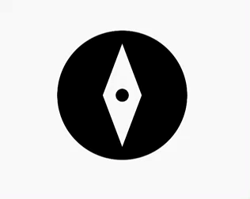
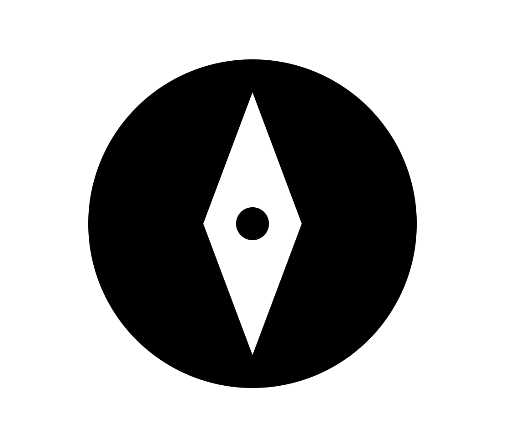
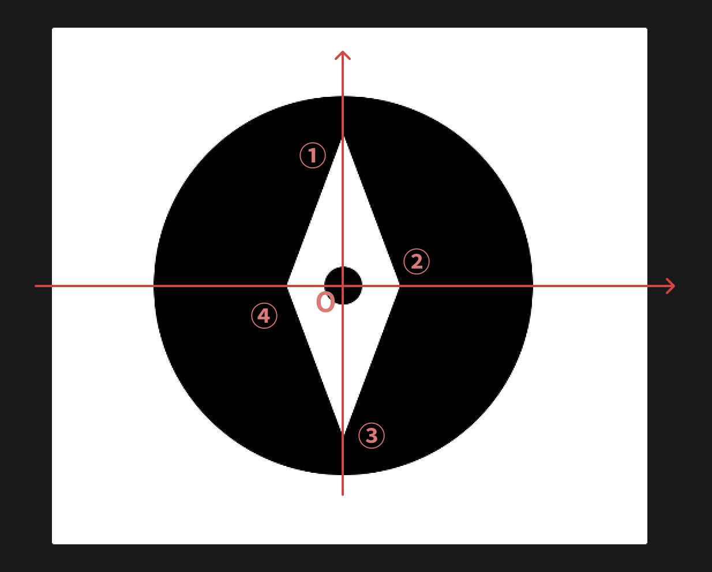

# 旋转的指针



看图分析可以知道

1. 需要绘制外层背景、大圆、指针和小圆
2. 外层背景和指针颜色一致，大圆和小圆背景一致
3. 点击时，指针顺时针旋转 45 度
4. 旋转的同时，外层背景、大圆、指针和小圆的颜色会进行黑白反转
5. 旋转 45 度后再次点击会再次旋转到 0 度

实现上面的功能需要自定义 VIew，这里将大圆的直径设置为整个自定义 View 宽高的最小值的一半，小圆直径为大圆直径的十分之一，指针针尖与大圆的边距与小圆的直径相等

> 大圆直径 = min(宽, 高) / 2
>
> 小圆直径 = 大圆直径 / 10
>
> 针尖边距 = 小圆直径

首先在 `onSizeChanged` 方法中计算各自的尺寸

```kotlin
private var pointerCircleRadius = 0f // 小圆半径
private var pointerPadding = 0f // 针尖边距
private var circleWidth = 0f // 大圆直径

override fun onSizeChanged(w: Int, h: Int, oldw: Int, oldh: Int) {
    super.onSizeChanged(w, h, oldw, oldh)
    circleWidth = min(w, h) / 2f
    pointerPadding = circleWidth / 10f
    pointerCircleRadius = pointerPadding / 2f
}
```

## 绘制静态效果


先将大圆的圆心移动到自定义 View 的中心，便于后面的计算

```kotlin
canvas.translate(width / 2f, height / 2f)
```

1. 绘制外层白色背景
   ```kotlin
   canvas.drawColor(Color.WHITE)
   ```
2. 绘制黑色大圆
   ```kotlin
   paint.color = Color.BLACK
   canvas.drawCircle(0f, 0f, circleWidth / 2f, paint)
   ```
3. 绘制指针
   绘制指针使用 Path，根据四个顶点连接成一个封闭的指针
   
   ```kotlin
    path.reset()
    path.moveTo(0f, -(circleWidth / 2f - pointerPadding)) // 将点移动到点 1
    path.lineTo(pointerCircleRadius _ 3, 0f) // 连接到点 2
    path.lineTo(0f, circleWidth / 2f - pointerPadding) // 连接到点 3
    path.lineTo(-pointerCircleRadius _ 3, 0f) // 连接到点 4
    path.close() // 连接点 4 和点 1，形成封闭的图形
    paint.color = Color.WHITE
    canvas.drawPath(path, paint) // 绘制 path
   ```
4. 绘制小圆
   ```kotlin
    paint.color = Color.BLACK
    canvas.drawCircle(0f, 0f, pointerCircleRadius, paint)
   ```

## 绘制动态效果

绘制好了静态效果之后，可以先给指针增加旋转 45 度的效果，使用 ValueAnimator

5.  旋转

    ::: details 查看代码

    ```kotlin
    // 创建一个 ValueAnimator
    val animation = ValueAnimator.ofFloat(degree, if (degree == 0f) 45f else 0f)
    animation.duration = 500
    animation.addUpdateListener { anim ->
    val value = anim.animatedValue as Float
    degree = value // 获取到实时的值后刷新
    invalidate()
    }

    animation.addListener(object : Animator.AnimatorListener {
    override fun onAnimationStart(animation: Animator) {
    isAnimating = true
    }

        override fun onAnimationEnd(animation: Animator) {
            isAnimating = false
        }

        override fun onAnimationCancel(animation: Animator) {
            isAnimating = false
        }

        override fun onAnimationRepeat(animation: Animator) {
        }

    })
    animation.start()

    // 绘制旋转的指针
    path.reset()
    path.moveTo(0f, -(circleWidth / 2f - pointerPadding))
    path.lineTo(pointerCircleRadius _ 3, 0f)
    path.lineTo(0f, circleWidth / 2f - pointerPadding)
    path.lineTo(-pointerCircleRadius _ 3, 0f)
    path.close()

    canvas.rotate(degree, 0f, 0f) // 旋转
    canvas.drawPath(path, paint)
    ```

    :::

6.  颜色渐变

    颜色渐变同样使用 ValueAnimator

    ```kotlin
    val animation = ValueAnimator.ofObject(ArgbEvaluator(), Color.WHITE, Color.BLACK)
    animation.duration = 500
    animation.addUpdateListener { anim ->
        color = anim.animatedValue as Int
        invalidate()
    }
    animation.start()
    ```

## 完整代码

::: details 点击查看完整代码

```kotlin
package com.cyl.abdc.animationtest

import android.animation.Animator
import android.animation.ArgbEvaluator
import android.animation.ValueAnimator
import android.content.Context
import android.graphics.Canvas
import android.graphics.Color
import android.graphics.Paint
import android.graphics.Path
import android.util.AttributeSet
import android.view.MotionEvent
import android.view.View
import kotlin.math.min

class PointerView(context: Context, attributeSet: AttributeSet) : View(context, attributeSet) {
    private val path by lazy { Path() }
    private val circlePaint by lazy { Paint() }
    private val pointerPaint by lazy { Paint() }
    private var pointerCircleRadius = 0f // 指针中间的圆的半径
    private var pointerPadding = 0f
    private var circleWidth = 0f
    private var degree = 0f
    private var isAnimating = false
    private var circleColor = Color.BLACK
    private var pointerColor = Color.WHITE

    override fun onDraw(canvas: Canvas) {
        super.onDraw(canvas)
        canvas.translate((width) / 2f, (height) / 2f)
        drawView(canvas)
    }

    override fun onSizeChanged(w: Int, h: Int, oldw: Int, oldh: Int) {
        super.onSizeChanged(w, h, oldw, oldh)
        circleWidth = min(w, h) / 2f // 中间圆形的直径为宽高最小边的一半
        pointerPadding = circleWidth / 10f // padding为大圆的1/10
        pointerCircleRadius = pointerPadding / 2f // 小圆半径为padding的一半
    }

    private fun drawView(canvas: Canvas) {
        circlePaint.color = circleColor
        pointerPaint.color = pointerColor
        canvas.drawColor(pointerColor)
        drawBigCircle(canvas, circlePaint)
        drawPointer(canvas, pointerPaint)
        drawSmallCircle(canvas, circlePaint)
    }

    // 画大圆
    private fun drawBigCircle(canvas: Canvas, paint: Paint) {
        canvas.drawCircle(0f, 0f, circleWidth / 2f, paint)
    }

    // 画小圆
    private fun drawSmallCircle(canvas: Canvas, paint: Paint) {
        canvas.drawCircle(0f, 0f, pointerCircleRadius, paint)
    }

    // 画指针
    private fun drawPointer(canvas: Canvas, paint: Paint) {
        path.reset()
        path.moveTo(0f, -(circleWidth / 2f - pointerPadding))
        path.lineTo(pointerCircleRadius * 3, 0f)
        path.lineTo(0f, circleWidth / 2f - pointerPadding)
        path.lineTo(-pointerCircleRadius * 3, 0f)
        path.close()

        canvas.rotate(degree, 0f, 0f)
        canvas.drawPath(path, paint)
    }

    override fun onTouchEvent(event: MotionEvent?): Boolean {
        when (event?.action) {
            MotionEvent.ACTION_DOWN -> {
                performClick()
            }

            MotionEvent.ACTION_UP -> {
                if (isAnimating) return true
                degreeAnimation()
                // 指针颜色渐变
                colorAnimation(
                    startColor = if (degree == 0f) Color.WHITE else Color.BLACK,
                    endColor = if (degree == 0f) Color.BLACK else Color.WHITE
                ) { pointerColor = it.animatedValue as Int }

                // 背景颜色渐变
                colorAnimation(
                    startColor = if (degree == 0f) Color.BLACK else Color.WHITE,
                    endColor = if (degree == 0f) Color.WHITE else Color.BLACK
                ) { circleColor = it.animatedValue as Int }
            }
        }
        return true
    }

    private fun degreeAnimation() {
        val animation = ValueAnimator.ofFloat(degree, if (degree == 0f) 45f else 0f)
        animation.duration = 500
        animation.addUpdateListener { anim ->
            val value = anim.animatedValue as Float
            degree = value
            invalidate()
        }

        animation.addListener(object : Animator.AnimatorListener {
            override fun onAnimationStart(animation: Animator) {
                isAnimating = true
            }

            override fun onAnimationEnd(animation: Animator) {
                isAnimating = false
            }

            override fun onAnimationCancel(animation: Animator) {
                isAnimating = false
            }

            override fun onAnimationRepeat(animation: Animator) {
            }
        })
        animation.start()
    }

    private fun colorAnimation(startColor: Int, endColor: Int, valueUpdated: (ValueAnimator) -> Unit) {
        val animation = ValueAnimator.ofObject(ArgbEvaluator(), startColor, endColor)
        animation.duration = 500
        animation.addUpdateListener { anim ->
            valueUpdated(anim)
        }
        animation.start()
    }

    override fun performClick(): Boolean {
        return super.performClick()
    }
}
```

:::
