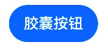
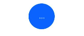
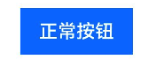
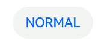
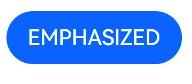
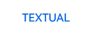
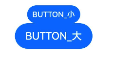
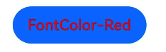
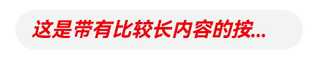
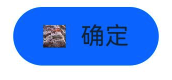

# 按钮 Button

## 属性

### 标签

`label` 设置按钮标签，就是按钮上要显示的文本

### 按钮类型

`type` 是参数 options 的属性，表示按钮类型，有胶囊按钮、圆形按钮和普通按钮。

```ts
Button("ButtonType").type(ButtonType.Capsule);
```

| 胶囊按钮                                      | 圆形按钮                                     | 普通按钮                                     |
| --------------------------------------------- | -------------------------------------------- | -------------------------------------------- |
|  |  |  |

### 点击效果

`stateEffect` 设置按钮被点击后是否有反馈效果。设置成 true 表示有反馈效果。

```ts
Button("StateEffect").stateEffect(true);
```

### 按钮风格

`buttonStyle` 设置按钮风格。

```ts
Button("ButtonStyle").buttonStyle(ButtonStyleMode.NORMAL);
```

| 正常按钮                                      | 强调色按钮                                        | 纯文本按钮                                     |
| --------------------------------------------- | ------------------------------------------------- | ---------------------------------------------- |
|  |  |  |

正常按钮有浅灰色背景，强调按钮有强调色蓝色背景，纯文本按钮没有背景，但是点击时会有背景色反馈效果。

### 按钮尺寸

`controlSize` 设置按钮尺寸，有大尺寸和小尺寸。

```ts
Button("ControlSize").controlSize(ControlSize.SMALL);
```



### 按钮字体颜色

```ts
Button("FontColor-Red").fontColor(Color.Red);
```



### 按钮字体大小

```ts
Button("FontSize").fontSize(30);
```

### 按钮字体粗细

```ts
Button("FontWeight").fontWeight(FontWeight.Normal);
```

### 按钮字体风格

设置按钮是否需要斜体。

```ts
Button("FontStyle").fontStyle(FontStyle.Italic);
```

### 按钮字体

### 按钮标签样式

设置按钮文本的溢出方式，最大行等

```ts
Button(
  "这是带有比较长内容的按钮，它的最大行数是两行，溢出方式设置成在尾部显示三个省略号。字体的颜色是红色，按钮风格是正常按钮，最小字体大小是14"
)
  .width("80%")
  .type(ButtonType.Capsule)
  .stateEffect(true)
  .buttonStyle(ButtonStyleMode.NORMAL)
  .controlSize(ControlSize.NORMAL)
  .fontColor(Color.Red)
  .fontWeight(FontWeight.Bold)
  .fontSize(20)
  .fontFamily("黑体")
  .fontStyle(FontStyle.Italic);
```



如果设置了 labelStyle 后，fontSize 和 fontStyle 等属性就会失效

```
Button(
  "这是带有比较长内容的按钮，它的最大行数是两行，溢出方式设置成在尾部显示三个省略号。字体的颜色是红色，按钮风格是正常按钮，最小字体大小是14"
)
  .width("80%")
  .type(ButtonType.Capsule)
  .stateEffect(true)
  .buttonStyle(ButtonStyleMode.NORMAL)
  .controlSize(ControlSize.NORMAL)
  .fontColor(Color.Red)
  .fontWeight(FontWeight.Bold)
  .fontSize(20)
  .fontFamily("黑体")
  .fontStyle(FontStyle.Italic)
  .labelStyle({ // [!code ++]
    overflow: TextOverflow.Ellipsis, // [!code ++]
    maxLines: 2, // [!code ++]
    minFontSize: 14, // [!code ++]
  }); // [!code ++]
```

## 子组件

Button 还可以添加子组件，自定义按钮的内容而不仅仅是只显示文本。

```ts
Button() {
  Row() {
    Image($r('app.media.img')).size({ width: 15, height: 15 })
    Text('确定').margin({ left: 10 })
  }
}
.padding({ left: 20, right: 20, top: 10, bottom: 10 })
```



## 事件

[通用事件](./通用事件.md)
