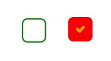
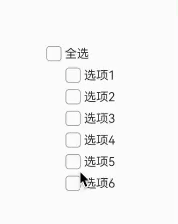

# CheckBox 多选框

```ts
CheckBox(options?: {name?: string, group?: string})
```

- name：多选框的名称（不是显示在页面上的文本）
- group：多选框所属的组

## 属性

[通用属性](./通用属性.md)

### 选中状态

select 是否选中状态，默认不选中。

### 选中状态颜色

selectedColor 设置选中状态的边框颜色

### 未选中状态颜色

unselectedColor 设置未选中状态的边框颜色

### 图标样式

markStype 设置多选框内部图标样式（选中状态里面那个 √ 的样式）。可以设置颜色、粗细和大小。

### 形状

设置多选框的形状，圆形或者是圆角方形。`CheckBoxShape.CIRCLE` 或 `CheckBoxShape.ROUNDED_SQUARE`

```ts
Checkbox({ name: "checkbox" })
  .selectedColor(Color.Red)
  .unselectedColor(Color.Green)
  .mark({
    strokeColor: Color.Orange,
    strokeWidth: 3,
    size: 10,
  })
  .shape(CheckBoxShape.ROUNDED_SQUARE);
```



## 事件

除了支持通用事件外，还支持 onChange 事件，监听选中状态。

```ts
onChange(callback: (value: boolean) => void)
```

value 为 true 表示选中。

## 群组

除了单个多选框外，还可能有多个多选框在一个组中，比如`一键全选`功能。

一键全选功能需要 CheckBoxGroup 和 CheckBox 搭配使用，这 2 个组件都有一个 group 的参数，就是使用这个参数把 CheckBoxGroup 和 CheckBox 关联起来的。

### 全选

CheckBoxGroup 还有一个 selectAll 属性，表示是否全选。

```ts
CheckboxGroup({ group: "group" }).selectAll(this.isSelectedAll);
```

### 勾选变化

使用`onChange (callback: (event: CheckboxGroupResult) => void )`来监听勾选情况。回调函数的参数是 CheckBoxGroupResult 类型，该类型有 2 个属性，一个是 name，表示被选中的 CheckBox 组件的 name 数组。另一个是 CheckBoxGroup 的状态（全选/部分/全不选）。

- name：字符串数组类型，选中 CheckBox 组件指定的 name 数组。
- status：SelectStatus 类型，有 All、Part、None 三种值。

```ts
build(){
    Column() {
        this.checkboxGroup()
        ForEach([1, 2, 3, 4, 5, 6], (item: number, index) => {
            this.checkbox(item)
        })
    }
}


@Builder
checkboxGroup() {
Row() {
    CheckboxGroup({ group: 'group' })
    .onChange((event) => {
        console.log(`${event.status} - ${event.name}`)
    })
    Text('全选')
}
}

@Builder
checkbox(item: number) {
Row() {
    Checkbox({ name: `checkbox${item}`, group: 'group' }).shape(CheckBoxShape.ROUNDED_SQUARE)
    Text(`选项${item}`)
}
.margin({ left: 60 })
}
```


