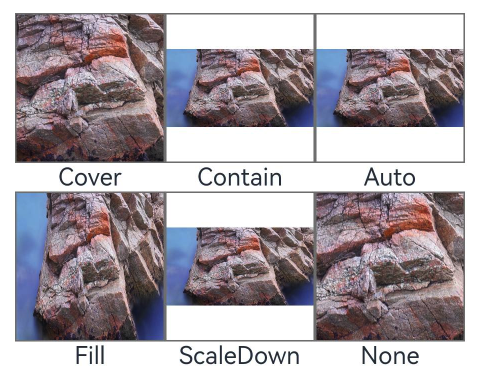
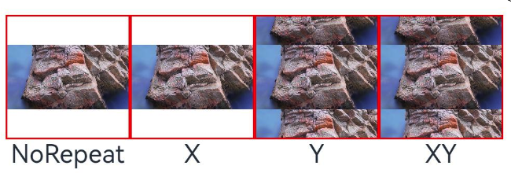
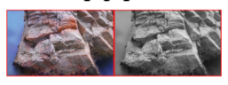
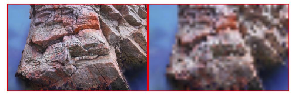
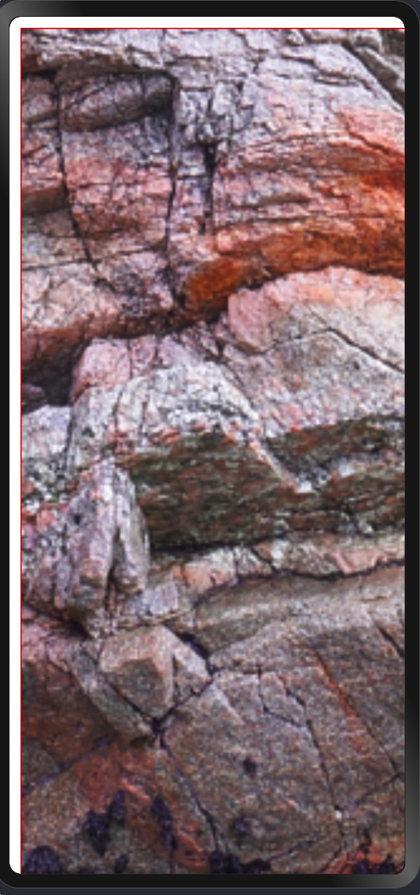
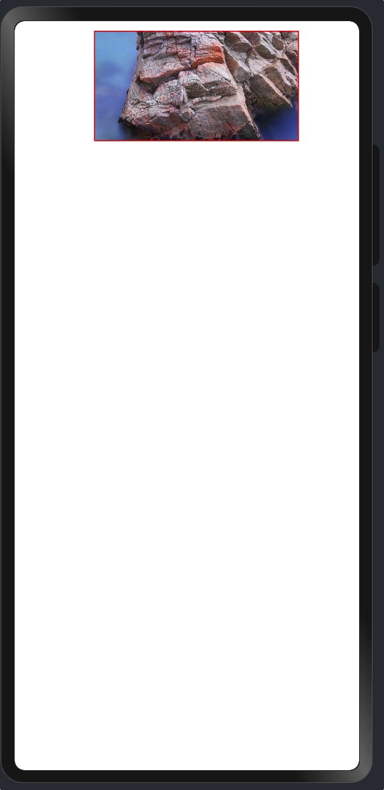
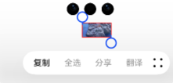

# 图片 Image

显示图片，支持 png、jpg、jpeg、bmp、svg、webp 和 gif 格式的图片。

## 属性

### src

设置图片数据源，支持 PixelMap 像素图、字符串类型的本地图片以及网络图片和 Base64、DrawableDescriptor

```ts
Image($r("app.media.img"));
```

### 占位图

alt 设置图片加载过程中的占位图，仅支持本地图片不支持网络图片。

```ts
Image($r("app.media.img")).alt($r("app.media.icon"));
```

### 图片填充

objectFit 设置图片的填充效果，默认为 ImageFit.Cover

```ts
Image($r("app.media.img")).objectFit(ImageFit.Contain);
```

- Cover：等比缩放，使图片能完全覆盖组件区域，图片可能会被裁剪
- Contain：等比缩放，使图片完全显示在组件上，如果图片与组件比例一致，那么图片四边与组件四边重合，如果不一致，只有两条边重合
- Auto：自适应显示
- Fill：不等比缩放，使图片能完全覆盖组件，图片不会被裁剪
- ScaleDown：等比缩放显示，与 Cover 的区别是 Cover 的缩放必须要让图片的边界与组件边界重合
- None：不缩放，原尺寸显示



### 图片重复

objectRepeat 当图片不足以填充组件时，设置图片的重复模式。默认是 ImageRepeat.NoRepeat。

```ts
Image($r("app.media.img")).objectRepeat(ImageRepeat.X);
```

- NoRepeat：不重复
- X：X 方向上重叠
- Y：Y 方向上重叠
- XY：XY 两个方向上重叠
  

### 插值效果

interpolation 设置图片的插值效果，缓解图片缩放时的锯齿问题

### 渲染模式

renderMode 设置图片的渲染模式，原色或者黑白色

```ts
Image($r("app.media.img")).renderMode(ImageRenderMode.Original);
```

- Original：原色
- Template：黑白色（IDE 的预览没效果）



### 解码尺寸

sourceSize 设置图片解码尺寸，降低图片的分辨率。

```ts
Row() {
    Image($r('app.media.img'))
        .border({ width: 1, color: Color.Red })
        .size({ width: 160, height: 100 })
    Image($r('app.media.img'))
        .border({ width: 1, color: Color.Red })
        .size({ width: 160, height: 100 })
        .sourceSize({ width: 16, height: 10 })
}
```



### 适配图源尺寸

fitOriginalSize 当没给图片组件设置尺寸时，设置是否让图片显示为图片原始的尺寸大小，默认是 false。

为 false 时，图片可能根据设置的不同放大占满整个屏幕。设置成 true 的话，那么就会显示成图片原始的大小。

1. fitOriginalSize = false

```ts
Image($r("app.media.img"))
  .border({ width: 1, color: Color.Red })
  .fitOriginalSize(false);
```

效果图：



2. fitOriginalSize = true

```ts
Image($r("app.media.img"))
  .border({ width: 1, color: Color.Red })
  .fitOriginalSize(true);
```



### 填充颜色

fillColor 设置图片的填充颜色，只针对 svg 格式的图片有效。

```ts
Image(
  "https://developer.huawei.com/allianceCmsResource/resource/HUAWEI_Developer_VUE/images/HW-LOGO.svg"
)
  .border({ width: 1, color: Color.Red })
  .size({ width: 100, height: 50 })
  .objectFit(ImageFit.Contain)
  .fillColor(Color.Red);
```


左侧原图，右侧填充红色

### 自动缩放大小

autoSize 设置图片解码过程中是否对图源自动缩放。设置为 true 时，组件会根据显示区域的尺寸决定用于绘制的图源尺寸，有利于减少内存占用。如原图大小为 1920x1080，而显示区域大小为 200x200，则图片会降采样解码到 200x200 的尺寸，大幅度节省图片占用的内存。

### 同步加载

syncLoad 设置是否同步加载图片，同步加载会阻塞 UI 线程，不会显示占位图。默认是异步加载。

### 图片复制

copyOption 设置图片是否可以被复制，长按/鼠标右键/快捷键 CTRL+C 等方式进行复制。设置成 CopyOption.None 时不能复制。

```ts
Image($r("app.media.img")).copyOption(CopyOptions.InApp);
```



### 颜色滤镜

colorFilter 设置图片颜色滤镜效果。参数是一个 4x5 的矩阵，每一行分别表示 RGBA

```java
Image($r('app.media.img')).colorFilter(new ColorFilter(
  [
    1, 0, 0, 0, 0, // RED
    0, 1, 0, 0, 0, // GREEN
    0, 0, 1, 0, 0, // BLUE
    0, 0, 0, 1, 0, // ALPHA
  ]
))
```

### 可拖动

draggable 设置组件是否可拖动，默认不可拖动。

## 事件

[通用事件](./通用事件.md)

### 加载完成

onComplete，图片加载成功或者解码成功时回调，图片正常加载出来时回调 2 次。回调中能拿到组件和图片的一些信息。

```ts
Image($r("app.media.img")).onComplete((event) => {});
```

| 属性            | 类型   | 说明                                    |
| --------------- | ------ | --------------------------------------- |
| width           | number | 图片的宽度                              |
| height          | number | 图片的高度                              |
| componentWidth  | number | 组件的宽度                              |
| componentHeight | number | 组件的高度                              |
| loadingStatus   | number | 加载状态，0-加载成功 1-解码成功         |
| contentWidth    | number | 图片实际被绘制的宽度                    |
| contentHeight   | number | 图片实际被绘制的高度                    |
| contentOffsetX  | number | 实际被绘制的内容相对于组件 x 轴的偏移量 |
| contentOffsetY  | number | 实际被绘制的内容相对于组件 y 轴的偏移量 |

### 加载结束

onFinish，格式为 `svg` 的图片的动画播放完成时触发。

```ts
Image($r("app.media.img")).onFinish(() => {});
```

### 加载错误

onError，图片加载错误时触发。返回组件的宽高和错误信息。

```ts
Image($r("app.media.img")).onError((event) => {});
```

| 属性            | 类型   | 说明         |
| --------------- | ------ | ------------ |
| componentWidth  | number | 组件的宽度   |
| componentHeight | number | 组件的高度   |
| message         | string | 加载错误信息 |
