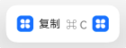
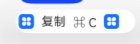
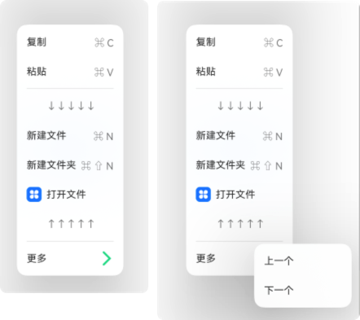

# Menu 菜单

[通用属性-菜单](./通用属性.md#菜单)

菜单组件，需要与 MenuItem 或 MenuGroup 一起搭配使用。MenuItem 表示菜单项，MenuGroup 表示菜单组，菜单组中的菜单项也是 MenuItem。使用组件的通用属性 `bindMenu` 绑定菜单。

## 使用方式

```ts
// 单MenuItem
Menu(){
    MenuItem()
    MenuItem()
    MenuItem()
}

// 菜单分组
Menu(){
    MenuGroup() {
        MenuItem()
        MenuItem()
        MenuItem()
    }
}
```

MenuItem 的内容可以使用 MenuItemOptions 或者 CustomBuilder 来构建。

- MenuItemOptions

```ts
Button('显示菜单').bindMenu(this.buildMenu())

@Builder
buildMenu() {
    Menu() {
      MenuItem({
        startIcon: $r('app.media.icon'), // item前面的图标
        content: '复制', // item的文本内容
        endIcon: $r('app.media.icon'), // item后面的图标
        labelInfo: '⌘ C' // item文本后面的标签，比如显示快捷键
      })
    }
  }
```



- CustomBuilder

```ts
Button('显示菜单').bindMenu(this.buildMenu())

@Builder
buildMenu() {
    Menu() {
      MenuItem(this.buildMenuItem()) // 使用CustomBuilder
    }
}

@Builder
buildMenuItem() {
    Row({ space: 10 }) {
      Image($r('app.media.icon')).size({ width: 20, height: 20 })
      Text('复制')
      Text('⌘ C')
      Image($r('app.media.icon')).size({ width: 20, height: 20 })
    }
}
```



## 属性

### 字体大小

fontSize 设置所有字体大小

### 字体

font 设置字体

### 字体颜色

fontColor 设置字体颜色

### 圆角

radius 设置 Menu 组件的圆角半径

### 菜单宽度

width 设置 Menu 组件的宽度，最小宽度为 64vp

## 示例

```ts
build() {
    Column() {
      Button('显示菜单')
        .bindMenu(this.buildMenu())
    }
  }

  @Builder
  buildMenu() {
    Menu() {
      MenuItem({
        content: '复制',
        labelInfo: '⌘ C'
      })
      MenuItem({
        content: '粘贴',
        labelInfo: '⌘ V'
      })

      MenuItemGroup({
        header: "↓↓↓↓↓",
        footer: '↑↑↑↑↑'
      }) {
        MenuItem({
          content: '新建文件',
          labelInfo: '⌘ N'
        })
        MenuItem({
          content: '新建文件夹',
          labelInfo: '⌘ ⇧ N'
        })
        MenuItem({
          startIcon: $r('app.media.icon'),
          content: '打开文件',
        })
      }

      MenuItem({
        content: '更多',
        endIcon: $r('app.media.more'),
        builder: this.buildSubMenu() // 点击弹出子菜单
      })
    }
  }

  @Builder
  buildSubMenu() {
    Menu() {
      MenuItem({
        content: '上一个',
      })

      MenuItem({
        content: '下一个',
      })
    }
  }

```


