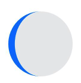

# Progress 进度条

进度条，表示事件处理进度。

```ts
Progress({
  value: 10,
  total: 100,
  type: ProgressType.Capsule,
});
```

<table>
    <tr>
        <th>属性</th>
        <th>类型</th>
        <th>说明</th>
        <th>二级类型</th>
        <th>示例</th>
    </tr>
    <tr>
        <td>value</td>
        <td>number</td>
        <td>当前进度</td>
        <td>-</td>
        <td>10</td>
    </tr>
    <tr>
        <td>total</td>
        <td>number</td>
        <td>总进度</td>
        <td>-</td>
        <td>100</td>
    </tr>
    <tr>
        <td rowspan='5'>type</td>
        <td rowspan='5'>ProgressType</td>
        <td rowspan='5'>进度条样式</td>
        <td>ProgressType.Linear线性样式</td>
        <td></td>
    </tr>
    <tr>
        <td>ProgressType.Ring环形无刻度样式</td>
        <td></td>
    </tr>
    <tr>
        <td>ProgressType.Eclipse圆形样式，类似月牙到满月的过渡样式</td>
        <td></td>
    </tr>
    <tr>
        <td>ProgressType.ScaleRing带有刻度的环形样式</td>
        <td></td>
    </tr>
    <tr>
        <td>ProgressType.Capsule胶囊样式</td>
        <td></td>
    </tr>

</table>

## 属性

### 进度条颜色

color 设置进度条的颜色，单色或者渐变色。

### 进度条背景色

backgroundColor 设置进度条背景色。

### 样式

style 设置进度条样式。类型为 ProgressStyleOptions 或 对应 type 的 style。

1. 共用样式

```ts
declare interface ProgressStyleOptions {
  strokeWidth?: Length; // 进度条宽度
  scaleCount?: number; // 环形进度条总刻度数
  scaleWidth?: Length; // 环形进度条刻度粗细
}
```

2. LinearStyleOptions，线性类型的样式

```ts
// type 为 ProgressType.Linear，那么 style 就是LinearStyleOptions
declare interface LinearStyleOptions {
  strokeWidth?: Length; // 进度条宽度
  strokeRadius?: PX | VP | LPX | Resource; // 圆角半径
}

// 示例
Progress({
  value: 20,
  type: ProgressType.Linear,
}).style({
  strokeWidth: 20,
  strokeRadius: 5,
});
```


3. RingStyleOptions，环形类型样式

```ts
// type 为 ProgressType.Ring，那么 style 就是就是RingStyleOptions
declare interface RingStyleOptions {
  strokeWidth?: Length; // 进度条宽度
  shadow?: boolean; // 是否显示进度条阴影
  status?: ProgressStatus; // 进度条状态，LOADING加载动效，PROGRESSING停留在具体的进度值上不动
}

// 示例
Progress({
  value: 20,
  type: ProgressType.Ring,
}).style({
  strokeWidth: 10,
  shadow: true,
  status: ProgressStatus.LOADING,
});
```


4. EclipseStyleOptions，月牙形类型样式

```ts
// type 为 ProgressType.Eclipse，那么 style 就是就是EclipseStyleOptions
declare interface EclipseStyleOptions {
  enableSmoothEffect?: boolean; // 进度平滑动效开关
}
```

5. CapsuleStyleOptions，胶囊类型样式

```ts
// type 为 ProgressType.Capsule，那么 style 就是就是CapsuleStyleOptions
declare interface CapsuleStyleOptions {
  borderColor?: ResourceColor; // 边框颜色
  borderWidth?: Length; // 边框宽度
  content?: string; // 文本内容
  font?: Font; // 字体
  fontColor?: ResourceColor; // 字体颜色
  showDefaultPercentage?: boolean; // 是否显示百分比，默认false，与content冲突，设置了content后只显示content，不显示百分比

  // 示例
Progress({
    value: 20,
    type: ProgressType.Capsule,
}).style({
    borderColor: Color.Blue,
    borderWidth: 2,
    content: '下载进度',
    fontColor: Color.Blue,
    showDefaultPercentage: true
})}
```


::: tip 冲突
showDefaultPercentage 与 content 冲突，设置了 content 后只显示 content，不显示百分比
:::

6. ScaleRingStyleOptions，带刻度环形类型样式

```ts
// type 为 ProgressType.ScaleRing，那么 style 就是ScaleRingStyleOptions
declare interface ScaleRingStyleOptions {
  strokeWidth?: Length; // 进度条宽度
  scaleWidth?: Length; // 环形进度条刻度粗细
  scaleCount?: number; // 环形进度条总刻度数
}

// 示例
Progress({
  value: 20,
  type: ProgressType.ScaleRing,
}).style({
  strokeWidth: 10,
  scaleWidth: 2,
  scaleCount: 20,
});
```


