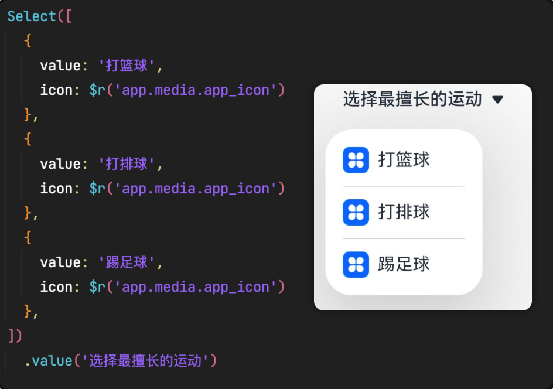
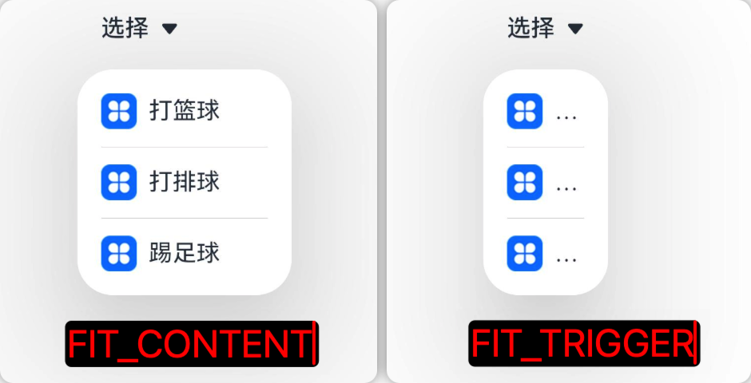
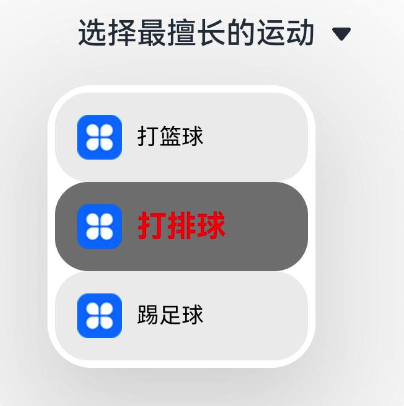

# Select 下拉选择菜单

```ts
Select(options: Array<SelectOption>)
```

参数 options 是数据源，每一项的 SelectOption 包含 value 和 icon，分别表示下拉菜单的文本和文本前面的图标。



## 属性

| 名称                    | 类型                      | 说明                                                                                                                                                                                 |
| ----------------------- | ------------------------- | ------------------------------------------------------------------------------------------------------------------------------------------------------------------------------------ |
| selected                | number                    | 设置下拉菜单默认选中项的索引，从 0 开始，默认是-1，表示不选中                                                                                                                        |
| value                   | string                    | 设置弹出菜单按钮的文本，比如上图中的"选择最擅长的运动"那个按钮                                                                                                                       |
| font                    | Font                      | 设置弹出菜单按钮的文本的字体，文字大小和文字权重                                                                                                                                     |
| fontColor               | ResourceColor             | 设置弹出菜单按钮的文本颜色                                                                                                                                                           |
| selectedOptionBgColor   | ResourceColor             | 设置下拉菜单被选中项的背景颜色                                                                                                                                                       |
| selectedOptionFont      | Font                      | 设置下拉菜单被选中项的字体                                                                                                                                                           |
| selectedOptionFontColor | ResourceColor             | 设置下拉菜单被选中项的字体颜色                                                                                                                                                       |
| optionBgColor           | ResourceColor             | 设置下拉菜单未被选中项的背景颜色                                                                                                                                                     |
| optionFont              | Font                      | 设置下拉菜单未被选中项的字体                                                                                                                                                         |
| optionFontColor         | ResourceColor             | 设置下拉菜单未被选中项的字体颜色                                                                                                                                                     |
| optionWidth             | Dimension/OptionWidthMode | 设置下拉菜单整个弹窗的宽度，Dimension 为具体的宽度值，OptionWidthMode 有两种模式：1. `FILL_CONTENT` 宽度与下拉选项的文本内容自适应 2. `FIT_FIT_TRIGGER` 宽度与下拉选择按钮的宽度适配 |
| optionHeight            | Dimension                 | 设置下拉菜单整个弹窗的高度，不设置时会根据数据源的长度来自适应高度                                                                                                                   |

optionWidth 的 OptionWidthMode 效果对比



## 事件

| 名称                                                       | 说明                                                       |
| ---------------------------------------------------------- | ---------------------------------------------------------- |
| onSelect(callback: (index: number, value: string) => void) | 菜单项被选中后的回调，index：选中项索引，value：选中项文本 |

## 示例

```ts
Select([
  {
    value: "打篮球",
    icon: $r("app.media.app_icon"),
  },
  {
    value: "打排球",
    icon: $r("app.media.app_icon"),
  },
  {
    value: "踢足球",
    icon: $r("app.media.app_icon"),
  },
])
  .value("选择最擅长的运动")
  .optionBgColor("#eeeeee")
  .optionFont({
    size: 12,
    weight: FontWeight.Regular,
  })
  .optionFontColor(Color.Black)
  .selected(1)
  .selectedOptionBgColor(Color.Gray)
  .selectedOptionFont({
    size: 16,
    weight: FontWeight.Bold,
  })
  .selectedOptionFontColor(Color.Red)
  .onSelect((index, value) => {
    console.log(`当前选中的是 ：index = ${index} , value = ${value}`);
  });
```


