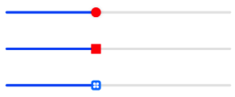
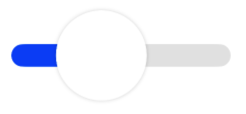
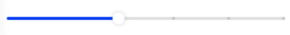
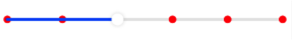

# 拖动条 Slider

```ts
Slider(options?: {
    value?: number, // 当前值
    min?: number, // 最小值
    max?: number, // 最大值
    step?: number, // 步长
    style?: SliderStyle, // 样式，滑块在滑轨之上还是在滑轨内，在滑轨内，滑轨会更粗
    direction?: Axis, // 方向，横线或纵向
    reverse?: boolean // 是否翻转，翻转后进度从右侧开始
})
```

滑块在滑轨之上

滑块在滑轨之内


## 属性

### 滑块颜色和大小

blockColor 设置滑块颜色，blockSize 设置滑块大小

```ts
Slider({ value: 2, min: 0, max: 5, step: 1 })
  .blockColor(Color.Red)
  .blockSize({ width: 30, height: 30 });
```

设置滑块为红色，大小为 30


### 滑块边框颜色和粗细

blockBorderColor 设置滑块边框的颜色，需要同时设置滑块边框粗细属性。blockBorderWidth 设置滑块边框粗细。

```ts
Slider({ value: 2, min: 0, max: 5, step: 1 })
  .blockBorderColor(Color.Red)
  .blockBorderWidth(1);
```


### 滑块样式

blockStype 设置滑块样式。默认为圆形样式，还可以设置其它形状或者是图片滑块

```ts
Column({ space: 20 }) {
    Slider({ value: 2, min: 0, max: 5, step: 1 })
        .blockStyle({type: SliderBlockType.DEFAULT})
        .blockColor(Color.Red)

    Slider({ value: 2, min: 0, max: 5, step: 1 })
        .blockStyle({
          type: SliderBlockType.SHAPE,
          shape: new Rect({ width: 10, height: 20 })
    }).blockColor(Color.Red)

    Slider({ value: 2, min: 0, max: 5, step: 1 })
        .blockStyle({
          type: SliderBlockType.IMAGE,
          image: $r('app.media.icon')
    })
}
```



### 滑轨颜色

trackColor 设置滑轨颜色

```ts
Slider({ value: 2, min: 0, max: 5, step: 1 }).trackColor(Color.Green);
```

设置滑轨为绿色


### 滑轨粗细

trackThickness 设置滑轨的粗细，滑块会跟着滑轨一起改变尺寸。

```ts
Slider({ value: 2, min: 0, max: 5, step: 1 }).trackThickness(30);
```

设置滑轨高度为 30



### 进度颜色

selectedColor 设置滑块滑过的进度颜色

```ts
Slider({ value: 2, min: 0, max: 5, step: 1 }).selectedColor(Color.Orange);
```

设置进度颜色为橙色


### 显示步长刻度

showSteps 设置是否显示步长刻度，默认不显示。

```ts
Slider({ value: 2, min: 0, max: 5, step: 1 }).showSteps(true);
```



### 气泡提示

showTips 设置在滑动时是否显示气泡提示，第一次参数 boolean 类型，表示是否显示，第二个参数为提示的内容。

```ts
Slider({ value: 2, min: 0, max: 5, step: 1 }).showTips(true, currentValue);
```


### 刻度颜色和尺寸

stepColor 设置滑轨上的刻度线的颜色，stepSize 设置刻度线的大小。需要设置 showSteps(true)。

```ts
Slider({ value: 2, min: 0, max: 5, step: 1 })
  .showSteps(true)
  .stepSize(10)
  .stepColor(Color.Red);
```



## 事件

### 滑块进度改变

```ts
onChange(callback: (value: number, mode: SliderChangeMode) => void)
```

value 表示当前改变后的进度值，mode 表示相关的触摸状态。

- Begin：组件被按下时触发
- Moving：组件被拖动时触发
- End：离开组件时触发
- Click：点击组件后离开组件时触发，一般先触发 Click 状态后再触发 End 状态

