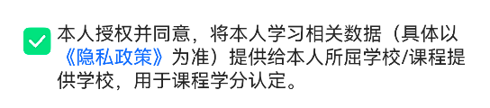
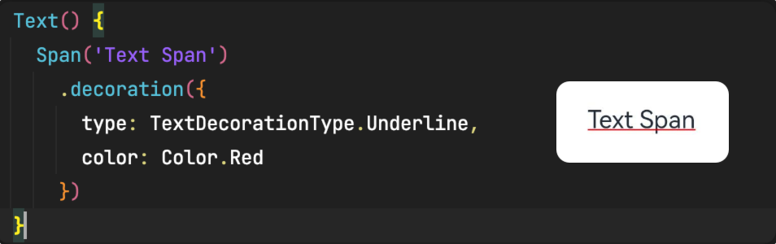
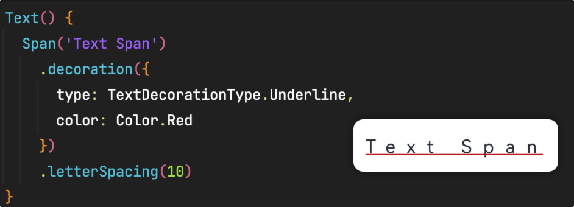
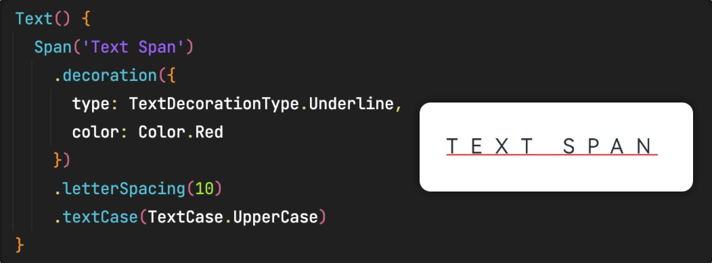

# Span

作为 Text 组件的子组件，用于显示行内文本。比如 app 启动时需要勾选的隐私政策文本。



## 属性

### 文本装饰

decoration 设置文本的装饰效果，如装饰颜色（非文本颜色，比如设置装饰是下划线，那么设置的就是下划线的颜色）、样式（下划线、删除线）等。



### 字符间距

letterSpacing 设置字符间距。



### 文本大小写

textCase 设置文本大小写，比如设置字母全部大写就可以设置属性 `textCase(TextCase.UpperCase)`



## 示例

实现开头隐私政策的效果

```ts
@Component
@Entry
export struct SpanTest {
  @State privatePolicyChecked: boolean = false

  build() {
    Column({ space: 20 }) {
      Row() {
        Checkbox()
          .shape(CheckBoxShape.ROUNDED_SQUARE)
          .selectedColor('#18E097')
          .select(this.privatePolicyChecked)
          .onChange((checked: boolean) => {
            this.privatePolicyChecked = checked
        })

        Text() {
          Span('本人授权并同意，将本人学习相关数据（具体以')
          Span('《隐私政策》')
            .fontColor('#3A83FF')
            .onClick(() => {
            })
          Span('为准）提供给本人所屈学校/课程提供学校，用于课程学分认定。')
        }
        .fontSize(14)
        .textAlign(TextAlign.JUSTIFY)
        .onClick(() => {
          this.privatePolicyChecked = !this.privatePolicyChecked
        })
      }
      .margin({ right: 25, top: 20 })
      .alignItems(VerticalAlign.Top)
    }
  }
}
```
