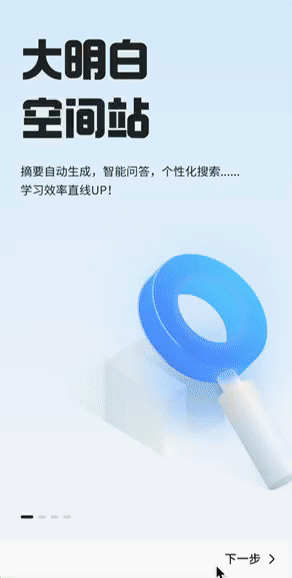

# 步骤导航 Stepper

用于引导用户按照步骤完成任务的场景，比如安装引导，有上一步、下一步、跳过步骤和完成等步骤。

```ts
Stepper(value?: { index?: number; })
```

## Stepper 事件

Stepper 有一个参数，指定当前显示在第几步。并且有以下几个事件监听

1. `onChange(callback :(prevIndex?: number, index?: number))` ：步骤发生变化时回调

   - preIndex：变化前的索引值
   - index：切换后的索引值（当前索引值）

2. `onNext(callback :(index?: number, pendingIndex: number, ))` ：下一步时触发

   - index：当前步骤索引值
   - pendingIndex：下一步骤索引值

3. `onPrevious(callback :(index?: number, pendingIndex: number, ))` ：上一步时触发

   - index：当前步骤索引值
   - pendingIndex：上一步骤索引值

4. `onSkip(callback: () => void)`：当点击 StepperItem 的 ItemState 为 Skip 的标签时触发

5. `onFinish(callback: () => void)`：点击最后一步的标签时触发，比如点击最后一步完成时跳转首页，跳转逻辑就在这个回调中实现

Stepper 组件只能包含 StepperItem 这一种子组件，每个 StepperItem 表示一个步骤。

## StepperItem

StepperItem 除了有通用属性外，还有标签和状态属性可以设置。

1. `prevLabel`：上一步的标签文本
2. `nextLabel`：下一步的标签文本
3. `status`：状态

   - ItemState.Normal：正常状态，可以点击下一步标签进入下一个步骤
   - ItemState.Disabled：禁用状态，无法点击下一步
   - ItemState.Waiting：等待状态，需要完成某个事情后，需要将状态改为 Normal 才能进入下一步骤
   - ItemState.Skip：跳过状态，点击下一步按钮的标签会触发 `onSkip` 事件

## 示例

下面示例总共有 4 步，第一步正常下一步，第二步需要等待 2 秒后才能下一步，第三步正常下一步，第四步点击【立即体验】后触发 onFinish 事件回调显示 toast


```ts
@Component
@Entry
export struct StepperTest {
  @State index: number = 0
  @State secondState: ItemState = ItemState.Waiting

  build() {
    Stepper({ index: this.index }) {
      StepperItem() {
        Image($r('app.media.guide_new1'))
      }
      .prevLabel('上一步')
      .nextLabel('下一步')

      StepperItem() {
        Image($r('app.media.guide_new2'))
      }
      .prevLabel('上一步')
      .nextLabel('下一步')
      .status(this.secondState)

      StepperItem() {
        Image($r('app.media.guide_new3'))
      }
      .prevLabel('上一步')
      .nextLabel('下一步')

      StepperItem() {
        Image($r('app.media.guide_new4'))
      }
      .prevLabel('上一步')
      .nextLabel('立即体验')
    }
    .onChange((preIndex, index) => {
      this.index = index
      if (index == 1) {
        setTimeout(() => {
          // 模拟耗时操作，2秒后操作完成可以继续下一步
          this.secondState = ItemState.Normal
        }, 2000)
      }
    })
    .onFinish(() => {
      promptAction.showToast({ message: '完成引导' })
    })
    .onSkip(() => {
      console.log(`onSkip`)
    })
  }
}

```
