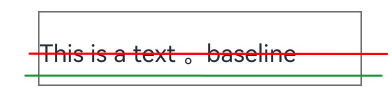
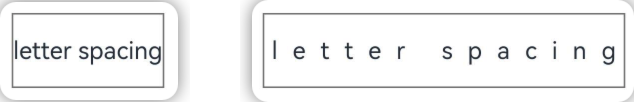
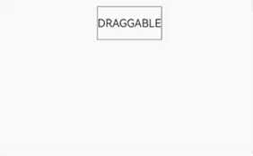
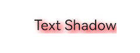
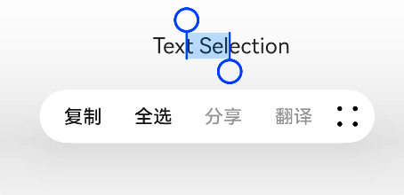
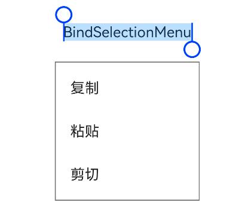

# 文本框 Text

显示文本信息，可以设置 `Span` 、 `ImageSpan` 、 `SymbolSpan` 和 `ContainerSpan` 作为子组件。

```ts
Text((content?: string | Resource, value?: TextOptions))
```

`content` 传入显示的文本，可以是字符串字面量以及字符串类型的资源类型。 `value` 中可以设置 `TextController` 。

## 属性

### 字体颜色

`fontColor` 设置文本颜色，参数可以传入系统的 `Color` ，如 `Color.Red` ，或者是资源类型，如 `$r('app.color.red')` ，以及字符串的十六进制颜色值，如 `'#FF0000'`。

### 字体大小

```ts
Text("FontSize").fontSize(12);
```

### 字体样式

设置字体样式，有正常 `Normal` 和斜体 `Italic`

```ts
Text("FontStyle").fontStyle(FontStyle.Italic);
```

### 字体粗细

设置文字粗细，数值类型或 `FontWeight` 类型，数值类型的范围是 `100 ~ 900` ，默认 400。 FontWeight 可以设置 FontWeight.Bold 等。

```ts
Text("FontWeight").fontWeight(FontWeight.Bold);
```

### 字体

设置字体

```ts
Font("FontFamily").fontFamily(xxx);
```

### 合并设置

font 可以分别指定文字大小、字体和样式

```ts
Text("font").font({
  size: 12,
  family: "",
  weight: FontWeight.Normal,
  style: FontStyle.Italic,
});
```

### 水平对齐方向

设置文本在水平方向的对齐方向，有 `Start` 、 `Center` 、 `End` 和 `JUSTIFY` 四种。

- Start： 文本靠左侧显示
- Center：文本水平居中显示
- End： 文本靠右侧显示
- JUSTIFY： 在文本超过一行时，除开最后一行，其它行的文本两端对齐。比如英文段落，单词的长短不一，当行的剩余空间不够放下一个单词时，这个单词就会放在下一行，然后行尾留有空白。设置了这个属性后，会保证行的两头不会留白。

### 文本溢出

当文本超过指定行数时的处理方式。需要配合 `maxLines` 使用。

- None：直接截断，超出部分不显示
- Clip：与 None 效果一致
- Ellipsis：超出文本用省略号代替，省略号的位置默认在尾部，也可以设置在头部或中间显示
- MARQUEE：跑马灯滚动显示，设置成跑马灯时，maxLines 失效。

### 最大行数

`maxLines` 设置文本最大能显示的行数，超过的部分通过 textOverflow 来指定处理方式。

### 行高

`lineHeight` 设置每一行的高度。如果使用资源类型的话，应该在 `'app.float.xx'` 中指定单位为 `fp`。

### 文本装饰

设置文本的装饰样式，如设置文本的下划线、删除线以及其颜色。

```ts
Text("decoration").decoration({
  type: TextDecorationType.Underline,
  color: Color.Red,
});
```

- Underline：下划线，在每行文本的下方
- Overline：上划线，在每行文本的上方
- LineThrough：删除线，在每行文本的中间
- None：没有效果

### 基准线偏移量

设置基准线的偏移量，参数为正值时，基准线往上移，为负值时，基准线往下移。

```ts
Text("baselineOffset").baselineOffset(30);
```



如上图，假设默认的基准线是绿线所在的位置，在设置了 `baselineOffset` 为 30 后，基准线就到了红线的位置，且文本会往上移。

### 字符间距

设置每个字符的间距。

```ts
Text("letter spacing").letterSpacing(10);
```



### 大小写

`textCase` 设置文本大小写

```ts
Text("Text Case").textCase(TextCase.LowerCase);

declare enum TextCase {
  Normal,
  LowerCase,
  UpperCase,
}
```

### 文本复制

`copyOption` 设置文本是否可以复制粘贴。

```ts
Text("copyOption").copyOption(CopyOptions.InApp);

declare enum CopyOptions {
  None = 0, // 不允许复制粘贴，长按不会弹出文本选择框
  InApp = 1, // 允许在App内复制粘贴
  LocalDevice = 2, // 运行在当前设备中复制粘贴
  CROSS_DEVICE = 3, // 可以跨设备复制粘贴
}
```

### 文本拖拽

`draggable` 设置文本拖拽效果，需要搭配 `copyOption` 一起使用。以为需要先选中文本，然后再次按下时可以将选中的文本拖走。

```ts
Text("DRAGGABLE")
  .border({ width: 1, color: Color.Gray })
  .height(50)
  .copyOption(CopyOptions.LocalDevice) // [!code focus]
  .draggable(true); // [!code focus]
```



### 文字阴影

`textShadow` 设置文字阴影效果。

```ts
textShadow(value: ShadowOptions | Array<ShadowOptions>): TextAttribute;

declare interface ShadowOptions {
  radius: number | Resource; // 阴影圆角
  type?: ShadowType; // 阴影类型，颜色/模糊
  color?: Color | string | Resource | ColoringStrategy; // 阴影颜色
  offsetX?: number | Resource; // 阴影水平偏移量
  offsetY?: number | Resource; // 阴影竖直偏移量
  fill?: boolean; // 是否填充区域
}
```

参数可以是 `ShadowOptions` 类型或者是数组类型，当是数组时，表示可以设置多种阴影叠加。

```ts
Text("Text Shadow").height(50).textShadow({
  radius: 10,
  type: ShadowType.COLOR,
  color: Color.Red,
  offsetX: 10,
  offsetY: 10,
});
```



### 首行缩进

`textIntent` 首行缩进。

### 文本选中区域

`selection` 设置文本选中区域，选中的区域文本会高亮且有拖动菜单。必须和 `copyOption` 搭配使用，并且不能设置成 `CopyOptions.None`。点击空白地方会取消选中。

```ts
Text("Text Selection")
  .height(50)
  .copyOption(CopyOptions.InApp) // 不能设置成None
  .selection(3, 8); // 从文本内容索引为 【3 ~ 8) 的字符选中
```



### 自定义选择菜单

`bindSelectionMenu` 设置自定义选择菜单，长按 Text 弹出的菜单，需要设置属性 `copyOption`，否则无效。参数 `content: CustomBuilder` 使用使用 `Menu` 和 `MenuItem`。

```ts
bindSelectionMenu(spanType: TextSpanType, content: CustomBuilder, responseType: TextResponseType, options?: SelectionMenuOptions): TextAttribute;
```

```ts
Text("Text Selection")
  .height(50)
  .copyOption(CopyOptions.InApp)
  .bindSelectionMenu(
    TextSpanType.TEXT,
    this.buildSelectMenu(),
    TextResponseType.LONG_PRESS
  );


@Builder
buildSelectMenu() {
  Row() {
    Menu() {
      MenuItem({ content: '复制' })
      MenuItem({ content: '粘贴' })
      MenuItem({ content: '剪切' })
    }
  }.border({ width: 1, color: Color.Gray })
}
```



## 事件

其它事件见[通用事件](./通用事件.md)

### 拷贝

复制文本时回调

```ts
Text("copy").onCopy((value) => {}); // value是拷贝的文本
```

### 文本选择

文本选中的位置发生变化时触发回调

```ts
Text("BindSelectionMenu")
  .height(50)
  .copyOption(CopyOptions.InApp)
  .onTextSelectionChange((start, end) => {
    // start：选中文本开始位置（包含），end：选中文本结束位置（不包含）
  });
```

## 文本控制器

文本控制器可以关闭弹出的菜单，比如长按 Text 弹出自定义的菜单，点击菜单项需要关闭菜单，就需要使用文本控制器来关闭菜单。

```ts
Text("TextController", { controller: this.controller }) // [!code focus] 传入controller对象
  .height(50)
  .copyOption(CopyOptions.InApp)
  .bindSelectionMenu(
    TextSpanType.TEXT,
    this.buildSelectMenu(),
    TextResponseType.LONG_PRESS
  );

@Builder
buildSelectMenu() {
  Row() {
    Menu() {
      MenuItem({ content: '复制' }).onClick(() => {
        this.controller.closeSelectionMenu() // [!code focus] 关闭菜单
      })
      MenuItem({ content: '粘贴' })
      MenuItem({ content: '剪切' })
    }
  }.border({ width: 1, color: Color.Gray })
}
```
