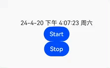

# TextClock 文本时钟

```ts
TextClock(options?: {
    timeZoneOffset?: number;
    controller?: TextClockController;
})
```

- timeZoneOffset：时区偏移量，取值范围 `[-14,12]` ，表示东十二区到西十二区。
- controller：控制器，控制时钟的开始和停止。

## 属性

### 时间格式

format 指定时间格式。

<table>
    <tr>
        <th>含义</th>
        <th>符号表示</th>
        <th>说明</th>
        <th>示例</th>
    </tr>
    <tr>
        <td rowspan='2'>年</td>
        <td>yyyy</td>
        <td>长格式完整年份</td>
        <td>2024年</td>
    </tr>
    <tr>
        <td>yy</td>
        <td>短格式年份</td>
        <td>24年</td>
    </tr>
    <tr>
        <td rowspan='2'>月</td>
        <td>MM</td>
        <td>小于10的月份前面带0</td>
        <td>04月</td>
    </tr>
    <tr>
        <td>M</td>
        <td>前面不带0</td>
        <td>4月</td>
    </tr>
    <tr>
        <td rowspan='2'>日</td>
        <td>dd</td>
        <td>小于10的日期前面带0</td>
        <td>08日</td>
    </tr>
    <tr>
        <td>d</td>      
        <td>前面不带0</td>
        <td>8日</td>
    </tr>
    <tr>
        <td rowspan='2'>时</td>
        <td>H</td>
        <td>24小时制</td>
        <td>15</td>
    </tr>
    <tr>
        <td>h</td>
        <td>12小时制</td>
        <td>3</td>
    </tr>
    <tr>
        <td>分钟</td>
        <td>m</td>
        <td>分钟，前面带0</td>
        <td>05</td>
    </tr>
    <tr>
        <td>秒钟</td>
        <td>s</td>
        <td>秒钟，前面带0</td>
        <td>05</td>
    </tr>
    <tr>
        <td>毫秒</td>
        <td>SSS</td>
        <td>毫秒</td>
        <td>900</td>
    </tr>
    <tr>
        <td>上午/下午</td>
        <td>a</td>
        <td>设置为12小时制时生效</td>
        <td>下午</td>
    </tr>
    <tr>
        <td rowspan='2'>星期</td>
        <td>E</td>
        <td>4个E(EEEE)是星期几，小于4个E(E/EE/EEE)是周几</td>
        <td>周六</td>
    </tr>
</table>

示例

| 格式                   | 显示                         |
| ---------------------- | ---------------------------- |
| `yyyy年MM月dd日 H:m:s` | `2024年04月20日 15:40:22`    |
| `yy/M/d H:m:s`         | `24/4/20 15:41:37 星期六`    |
| `yy-M-d a h:m:s E`     | `24-4-20 下午 15:43:17 周六` |

### 文字阴影

textShadow 设置文字阴影效果。

使用方式和效果参考 [Text 的文字阴影](./Text.md#文字阴影)

## 事件

[通用事件](./通用事件.md)

### 时间变化

时间变化会回调 onDateChange。回调的参数是从 1970 年 1 月 1 日到现在的秒钟时间戳。

```ts
TextClock().onDateChange((value) => {
  console.log(`dateChanged => ${value}`);
});
```

:::tip 提示
在卡片中使用时，一分钟回调一次

不在卡片中使用时，一秒钟回调一次

卡片刷新不需要那么及时
:::

## 控制器

控制时钟的开始和停止

```ts
clockController: TextClockController = new TextClockController();

build() {
    Column() {
      TextClock({ controller: this.clockController })
        .format('yy-M-d a h:m:s E')
        .onDateChange((value) => {
          console.log(`dateChanged => ${value}`)
        })

      Button('Start')
        .onClick(() => {
          this.clockController.start()
        })
      Button('Stop')
        .onClick(() => {
          this.clockController.stop()
        })
    }
}
```


