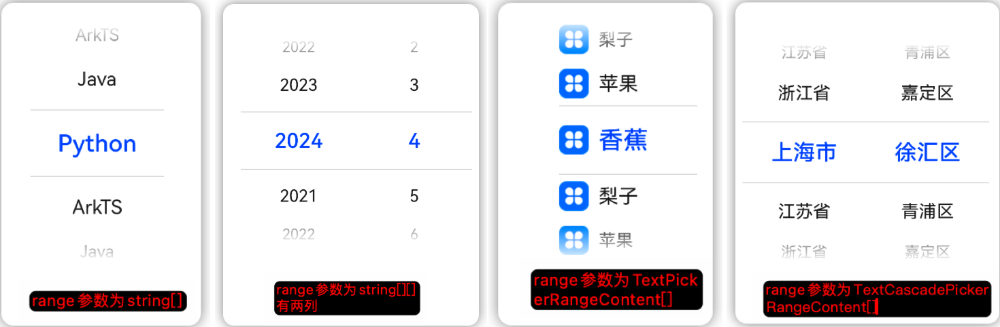
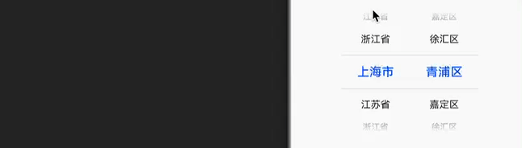

# TextPicker 文本选择器

```ts
TextPicker(options:{
    range: string[] | string[][] | Resource | TextPickerRangeContent[] | TextCascadePickerRangeContent[];
    value?: string | string[];
    selected?: number | number[];
})
```



- range：选择器的数据
  - string[]：一维数组，只有一列的选择器（上图第一个）
  - string[][]：二维数组，有两列选择器，两列之间没有联动关系（上图第二个）
  - TextPickerRangeContent[]：一维数组，只有一列选择器，可以指定文本和图标（上图第三个）
  - TextCascadePickerContent[]：一维数组，只有一列选择器，可以指定层级关系的选择器，有联动（上图第四个）
- value：默认选中的值
- selected：默认选中的索引，优先级高于 value

## 属性

[通用属性](./通用属性.md)

### item 高度

defaultPickerItemHeight 设置选择器每个选项的高度。

### 消失文字样式

[参考 TimePicker 的样式](./TimePicker.md#消失文字样式)

### 选中文字样式

[参考 TimePicker 的样式](./TimePicker.md#选中文字样式)

### 其它文字样式

[参考 TimePicker 的样式](./TimePicker.md#其它文字样式)

### 设置选中项

selectedIndex 设置选中项在数组中的索引值，优先级高于 options 中的 selected

### 循环滚动

canLoop 设置选择器是否可以循环滚动。true 可循环，false 不可循环。

## 事件

[通用事件](./通用事件.md)

```ts
onChange(callback: (value: string | string[], index: number | number[]) => void)
```

滚动时选中触发，value 是选择器中的文本，index 是文本在数组中的索引。

## 示例

:::details 查看代码

```ts
TextPicker({
  range: [
    {
      text: "上海市",
      children: [
        {
          text: "徐汇区",
        },
        {
          text: "青浦区",
        },
        {
          text: "嘉定区",
        },
      ],
    },
    {
      text: "江苏省",
      children: [
        {
          text: "苏州市",
        },
        {
          text: "无锡市",
        },
        {
          text: "南京市",
        },
      ],
    },
    {
      text: "浙江省",
      children: [
        {
          text: "杭州市",
        },
        {
          text: "温州市",
        },
        {
          text: "湖州市",
        },
      ],
    },
  ],
}).onChange((value, index) => {
  console.log(`selected : ${value} - ${index}`);
});
```

:::


