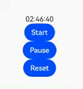

# TextTimer 计时器

计时控件，正计时或倒计时。

```ts
TextTimer(options?:{
    isCountDown?: boolean; // 是否倒计时
    count?: number; // 倒计时的时长，isCountDown为true时生效，单位毫秒，最长不能超过24小时的毫秒值
    controller?: TextTimerController; // 控制时间的开始、暂停和重置
})
```

## 属性

### 时间格式

format 设置时间格式。至少要包含 `HH/mm/ss/SS` 中的一个，不能包含 `yy/MM/dd`，因为倒计时时长 `count` 不能超过一天，使用小时 HH 就够了，包含了 `年月日` 的格式会使用默认的格式 `HH:mm:ss:SS`。

### 文字阴影

textShadow 设置文字阴影效果。

使用方式和效果参考 [Text 的文字阴影](./Text.md#文字阴影)

## 事件

### 计时回调

onTimer 计时器时间变化回调。

```ts
TextTimer({}).onTimer((utc, elapsedTime) => {});
```

- utc：表示从 1970 年 1 月 1 日到现在的时间戳，时间戳的单位与设置的 format 格式有关。

- elapsedTime：表示计时器经过的时间，比如倒计时过了 1 秒钟，那么 elapsedTime 就是 1。

:::tip 提示

1. 上面提到的 `与设置的 format 格式有关` 是指当 format 设置成 `HH:mm:ss`（最小单位是秒钟），那么单位就是秒钟，当 format 设置成 `HH:mm`，那么单位就是分钟，以此类推。

2. 并且 onTimer 回调的频率也和 format 有关，设置的最小单位是秒钟，那么 1 秒钟回调一次，设置的最小单位是分钟，那么 1 分钟回调一次，以此类推。

3. 锁屏及后台不回调。
   :::

## 控制器

TextTimerController 控制计时器的开始、停止和重置。

```ts
controller: TextTimerController = new TextTimerController()

build() {
    Column() {
      TextTimer({
        isCountDown: true,
        count: 10000000,
        controller: this.controller
      })
        .format('HH:mm:ss')
        .onTimer((utc, elapsedTime) => {
          console.log(`timer => utc = ${utc} , time = ${elapsedTime}`)
        })

      Button('Start')
        .onClick(() => {
          this.controller.start()
        })
      Button('Pause')
        .onClick(() => {
          this.controller.pause()
        })
      Button('Reset')
        .onClick(() => {
          this.controller.reset()
        })
    }
}
```


