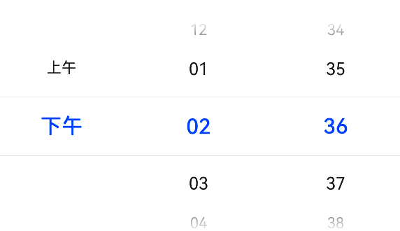
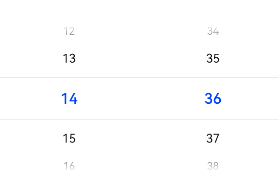
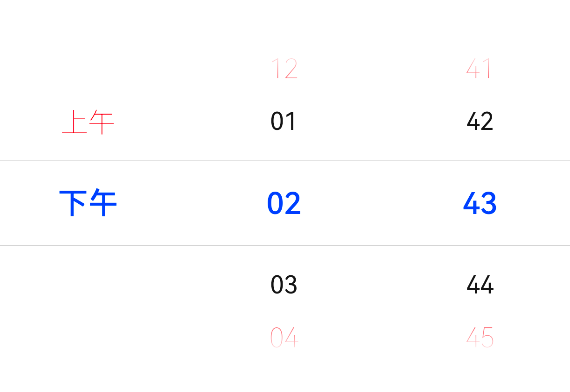
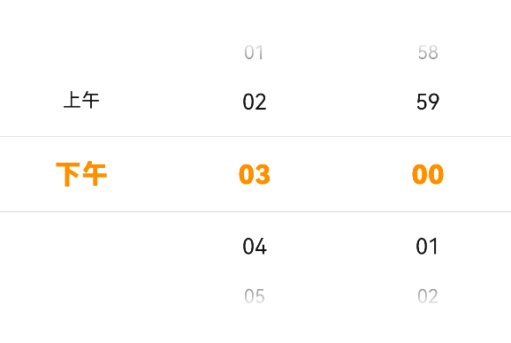
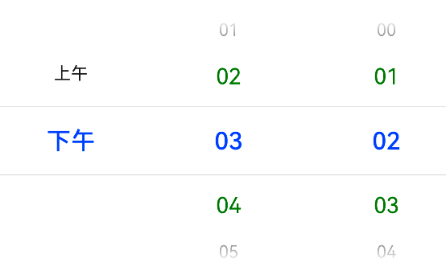

# TimePicker 时间选择器



```ts
TimePicker(options?:{
 selected?: Date, // 默认选中的日期，默认为当前时间
 format: TimePickerFormat // 时间格式，时分/时分秒
})

TimePicker({
    // 表示默认选中2022年11月29日下午10点50分40秒
    selected: new Date(2022, 10, 29, 22, 50, 40),
})
```

## 属性

[通用属性](./通用属性.md)

### 24 小时制

useMilitaryTime 设置 24 小时制。没有了 12 小时制的 `上午` 和 `下午`。



### 消失文字样式

disappearTextStyle 设置选择器最上面和最下面的文本样式。

```ts
{
  color: Color; // 文字颜色
  font: {
    size: number; // 文字大小
    weight: FontWeight; // 文字粗细
  }
}
```

```ts
TimePicker().disappearTextStyle({
  color: Color.Red,
  font: {
    size: 18,
    weight: FontWeight.Lighter,
  },
});
```



### 选中文字样式

selectedTextStyle 设置选中日期的文字样式

```ts
TimePicker().selectedTextStyle({
  color: Color.Orange,
  font: {
    size: 20,
    weight: FontWeight.Bolder,
  },
});
```



### 其它文字样式

textStyle 设置除了 disappearTextStyle 和 selectedTextStyle 的文本之外的文本样式。

```ts
TimePicker().textStyle({
  color: Color.Green,
  font: {
    size: 18,
    weight: FontWeight.Normal,
  },
});
```



## 事件

[通用事件](./通用事件.md)

选择器时间发生变化

```ts
onChange(callback: (value: TimePickerResult) => void)
```

value 里面可以获取到选中的时分秒
