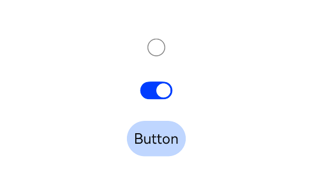

# 开关 Toggle

用一个组件来表示单选框、多选框和按钮的选中状态。用参数 type 表示类型，类型有 `Checkbox`、 `Button` 和 `Switch`。

:::tip 提示
当 type 为 Button 时，需要提供子组件，不然看不到效果。
:::



## 属性

### 打开状态背景色

selectedColor 设置组件在打开状态下的背景颜色。

```ts
Toggle({ type: ToggleType.Checkbox, isOn: false }).selectedColor(Color.Red);
```

设置打开颜色为红色


### Switch 圆形滑块颜色

switchPointColor 设置当 type 为 Switch 时，中间圆形滑块的颜色。

```ts
Toggle({ type: ToggleType.Switch, isOn: true }).switchPointColor(Color.Red);
```

设置 Switch 滑块颜色为红色


## 事件

### 开关监听

监听组件的开关状态。

```ts
onChange(callback: (isOn: boolean) => void)
```

```ts
Toggle({ type: ToggleType.Switch, isOn: true }).onChange((isOn: boolean) => {});
```

当开关为开时，isOn 返回 true，为关时，isOne 返回 false。
