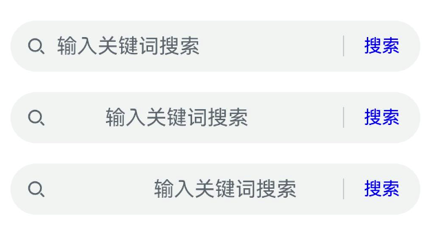
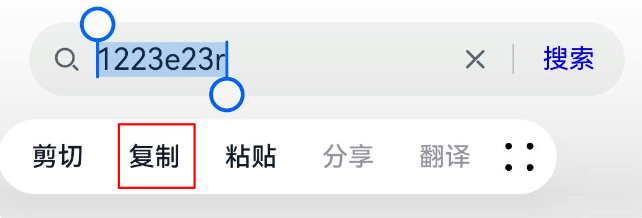
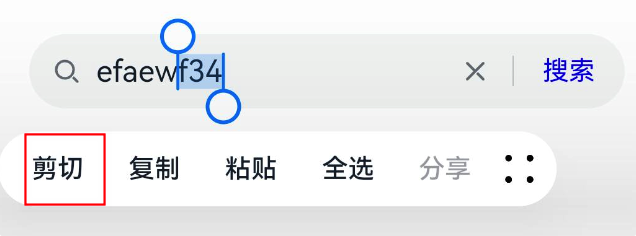

# Search 搜索框

```ts
Search(options: {
    value?: string, // 要搜索的文本内容
    placeholder?: string, // 没有搜索文本时的提示文本
    icon?: string, // 搜索框前面的搜索图标，系统默认是放大镜。支持本地图片和网络图片
    controller?: SearchController // 控制器，控制组件的状态和获取一些数据
})
```

默认组件样式


## 属性

### 搜索按钮

searchButton 设置搜索框末尾触发搜索的按钮文本，第一个参数是文本内容，第二个参数设置文本的大小和颜色。

```ts
Search()
  .searchButton("搜索", {
    fontSize: 14,
    fontColor: Color.Blue,
  })
  .onSubmit((value) => {
    // 点击搜索触发
  });
```


点击“搜索”会触发 `onSubmit` 回调。

### 提示文字

当搜索框没有输入文本时，会展示提示文本。placeholderColor 设置提示文本的字体颜色，placeholderFont 设置提示文本的样式。

```ts
Search({ placeholder: "输入关键词搜索" })
  .searchButton("搜索", {
    fontSize: 14,
    fontColor: Color.Blue,
  })
  .placeholderColor(Color.Gray)
  .placeholderFont({
    size: 12,
    weight: FontWeight.Lighter,
  });
```


### 搜索文字

当在搜索框输入文字时，fontColor 设置文字颜色，textFont 设置文本的样式。

```ts
Search({ placeholder: "输入关键词搜索" })
  .searchButton("搜索", {
    fontSize: 14,
    fontColor: Color.Blue,
  })
  .fontColor(Color.Red)
  .textFont({
    size: 20,
    weight: FontWeight.Normal,
  });
```


### 对齐方式

textAlign 设置文本（包括提示文字）的对齐方式。


上图分别是 `TextAlign.Start`、`TextAlign.Center`、`TextAlign.End` 的效果。

### 文本复制

copyOption 设置文本的复制限制，比如设置文本 `不可复制`、`只可在App内复制`、`只可在本设备上复制`、`可跨设备复制`。

- CopyOptions.None：不支持文本复制
- CopyOptions.InApp：只能在当前 App 中进行复制粘贴，在其它 App 中读取不到粘贴板上的文本
- CopyOptions.LocalDevice：复制后在当前设备上可以在任意 App 中粘贴
- CopyOptions.CrossDevice：复制后可以在联动的设备上进行跨设备粘贴

## 事件

### 提交

```ts
onSubmit(callback: (value: string) => void)
```

点击搜索按钮或者软键盘右下角的搜索按钮时触发，value 是当前搜索框中的文本内容。

### 文本改变

```ts
onChange(callback: (value: string) => void)
```

搜索框中的文本内容发生改变时触发，value 是当前搜索框中的文本内容。

### 复制

```ts
onCopy(callback: (value: string) => void)
```

长按搜索框弹出粘贴板，选中文本，点击粘贴板上的“复制”按钮后触发，value 是复制的文本内容。


### 粘贴

```ts
onPaste(callback: (value: string) => void)
```

长按搜索框弹出粘贴板，点击粘贴板上的“粘贴”按钮后触发，value 是粘贴的文本内容。


### 剪切

```ts
onCut(callback: (value: string) => void)
```

长按搜索框弹出粘贴板，选中文本，点击粘贴板上的“剪切”按钮后触发，value 是剪切的文本内容。


点击剪切后，会将 `f34` 剪切到粘贴板上。

## 控制器

```ts
controller: SearchController = new SearchController();

build(){
  Search({
    value: 'HarmonyOS NEXT学习手册',
    controller: this.controller
  })
}
```

### 光标位置

`caretPosition(value: number)` 设置光标的位置，value 为 6 表示光标在第 6 个字符后面。

```ts
this.controller.caretPosition(6);
```


第 6 个 字符是 `n`，因此光标听在 `n` 的后面。

:::warning 注意
在设置光标位置时需要搜索框有焦点后才有效。
:::

### 退出编辑

当处于编辑状态时，`stopEditing()` 可以退出编辑状态，光标会消失并且关闭输入法。

```ts
this.controller.stopEditing();
```

### 获取光标位置

`getCaretOffset` 可以获取光标的位置，返回类型是 CaretOffset。

```ts
CaretOffset {
  index: number // 字符索引
  x: number // 水平位置
  y: number // 垂直位置
}
```

```ts
const offset = this.controller.getCaretOffset();
console.log(`offset : ${JSON.stringify(offset)}`);
```

```
offset : {"index":18,"x":445.28515625,"y":39.30800247192383}
```

获取到的 index = 18，表示在搜索框最后一个字符的后面，默认情况下光标都是在文本最后的位置。

### 获取文本行数

`getTextContentLineCount` 获取搜索框的文本行数，搜索组件的行数固定为 1 行，因此获取到的一直是 1。
