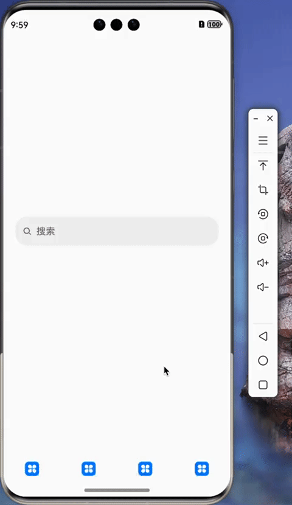

# 共享元素转场动画



给跳转前页面的组件和跳转后页面的组件都设置`sharedTransition`，并且设置同一个 id

- 跳转前页面

```ts{5-7}
SearchInput({ isEnabled: false })
  .margin({ left: $r("app.float.20vp"), right: $r("app.float.20vp") })
  .sharedTransition("search", { duration: 200, curve: Curve.Linear }) // [!code focus]
  .onClick(() => {
    // 跳转触发动画
    router.pushUrl({
      url: Constant.ROUTER_SEARCH,
    });
  });
```

- 跳转后页面

```ts
SearchInput()
  .margin({
    top: ScreenParams.STATUS_BAR_HEIGHT,
    left: $r("app.float.20vp"),
    right: $r("app.float.20vp"),
  })
  .sharedTransition("search", { duration: 200, curve: Curve.Linear }); // [!code focus]
```

::: tip 提示
代码中的`SearchInput`是一个自定义的组件，封装了系统组件`Search`
:::

::: warning 动画如有顿挫感
上述代码就能实现跳转元素共享动画，但是如果在跳转过程中，以为有系统默认的转场动画导致有顿挫感，那么可以使用以下代码关闭系统的默认跳转动画。

```ts
@Entry
@Component
export struct SearchPage {
  pageTransition() { // [!code focus]
    PageTransitionEnter({ duration: 0 }) // [!code focus] 将duration设置为0可关闭默认转场动画
    PageTransitionExit({ duration: 0 }) // [!code focus]
  } // [!code focus]

  build() {
    Column() {
      SearchInput()
        .margin({ top: ScreenParams.STATUS_BAR_HEIGHT, left: $r('app.float.20vp'), right: $r('app.float.20vp') })
        .sharedTransition('search', { duration: 200, curve: Curve.Linear })
  }
}
```

:::

---

本次案例中给 Ability 设置了状态栏沉浸式效果，因此给 Page 的顶部增加了边距效果，不然页面内容会与状态栏重叠。

起初是给跳转后页面的组件设置了 padding，但是输入框会先平移到屏幕顶部后再跳转到期望的位置。


猜测原因是页面的容器的左上角与状态栏重合，Column 默认是把子组件放在左上角的位置，然后发现设置了 paddingTop，才将子组件重新布局导致的顿挫感。

解决方法是将 padding 改为 margin，将容器的左上角放置在状态栏下方。

```ts
@Entry
@Component
export struct SearchPage {
  pageTransition() {
    PageTransitionEnter({ duration: 0 })
    PageTransitionExit({ duration: 0 })
  }

  build() {
    Column() {
      SearchInput()
        .padding({ top: ScreenParams.STATUS_BAR_HEIGHT, left: $r('app.float.20vp'), right: $r('app.float.20vp') }) // [!code --] // [!code focus]
        .margin({ top: ScreenParams.STATUS_BAR_HEIGHT, left: $r('app.float.20vp'), right: $r('app.float.20vp') }) // [!code ++] // [!code focus]
        .sharedTransition('search', { duration: 200, curve: Curve.Linear })
  }
}
```

::: tip 提示
`ScreenParams.STATUS_BAR_HEIGHT` 是在 `EntryAbility` 中获取到的状态栏高度，然后保存在 `ScreenParams.STATUS_BAR_HEIGHT` 变量中
:::

```ts
export default class EntryAbility extends UIAbility {
  onWindowStageCreate(windowStage: window.WindowStage): void {
    windowStage.getMainWindow((err, mainWindow) => {
      if (err.code) {
        return;
      }
      const full = true;
      mainWindow.setWindowLayoutFullScreen(full);
      let avoidArea = mainWindow.getWindowAvoidArea(
        window.AvoidAreaType.TYPE_SYSTEM
      );
      let statusBarHeightVp = px2vp(avoidArea.topRect.height);
      ScreenParams.STATUS_BAR_HEIGHT = statusBarHeightVp;
    });
  }
}
```
