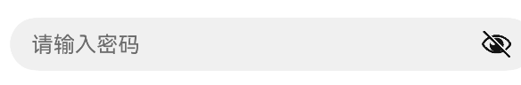
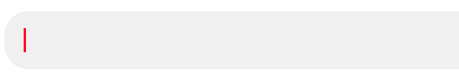
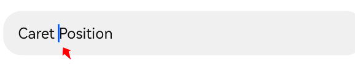
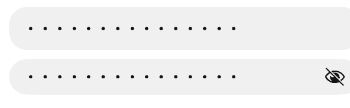
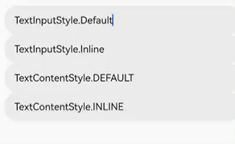
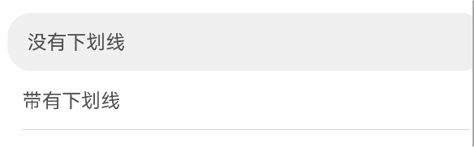
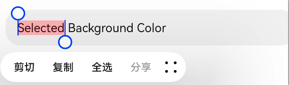
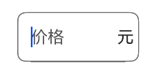
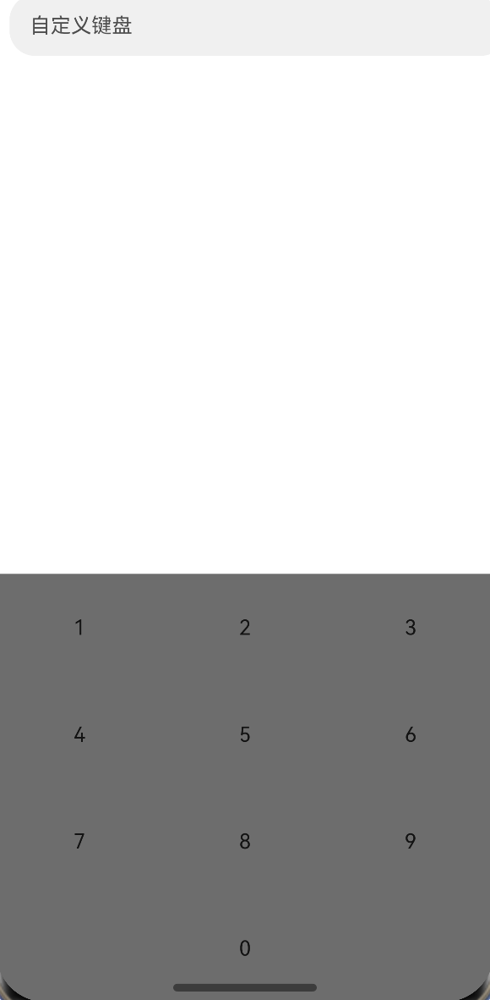

# 输入框

单行输入框 TextInput ， 多行输入框 TextArea，API 基本相同。

## 属性

除了通用属性以及与 [Text](Text.md#文本属性) 共用的属性外，还有以下属性。

### 文本内容

通过 `TextInputOptions` 中的 `text` 属性设置文本内容

```ts
Text({
  text: "输入框的文本内容",
});
```

### 提示文本

文本框没有内容时的提示文本，使用 `TextInputOptions` 中的 `placeholder` 属性设置提示文本

```ts
Text({
  text: "输入框的文本内容",
  placeholder: "提示文本",
});
```

还可以设置提示文本的颜色和字体。

```ts
TextInput({ text: "", placeholder: "请输入密码" })
  .placeholderColor(Color.Gray)
  .type(InputType.Password);
```



### 回车键类型

设置软键盘回车键的类型，比如设置成回车键为`搜索`、`发送`等。

```ts
TextInput({ text: "", placeholder: "search" })
  .placeholderColor(Color.Gray)
  .type(InputType.Normal)
  .enterKeyType(EnterKeyType.Search); // [!code highlight]
```

### 输入框类型

设置输入框的类型，默认 Normal ，还可以设置成邮箱/密码等。

```ts
TextInput().type(InputType.Password);

declare enum InputType {
  Normal, // 没有限制
  Number, // 纯数字
  PhoneNumber, // 电话号码模式，可以输入 +、-、*、#
  Email, // 邮箱，可以输入数字、字母、小数点和 @ 符号
  Password, // 密码
  NUMBER_PASSWORD, // 纯数字密码
  USER_NAME, // 用户名模式
  NEW_PASSWORD, // 新密码模式
  NUMBER_DECIMAL, // 小数点的数字输入
}
```

### 光标样式

可以使用 `caretColor` 只设置光标的颜色，也可以使用 `caretStyle` 同时设置光标的宽度和颜色，同时设置了颜色时以 `caretColor` 为准。

```ts
TextInput({ text: "" }).caretColor(Color.Red);
```



### 默认光标位置

设置当输入框获取到焦点时，默认光标的停留位置。

```ts
TextInput({ text: "Caret Position" }).defaultFocus(true).caretPosition(6);
```



### 输入限制

对文本输入的限制，比如电话号码的输入框限制只能输入数字类型。`inputFilter` 有 2 个参数，第一个参数是希望过滤的正则表达式，第二个参数是过滤失败返回的文本。

```ts
TextInput({ text: "aab4bcd3f45rraf" }).inputFilter("[0-9]", (error) => {
  console.log("input_filter : " + error);
});
```

上例中表示只想显示 0 ~ 9 的数字，运行后会发现输入框中只会有 `4345` 数字，其余的字母全部被过滤掉了。被过滤掉的字母触发了回调，打印出 `input_filter : aabbcdfrraf`

### 密码图标

当设置 `TextInput.type(InputType.Password)` 时，输入框的末尾默认会显示 `小眼睛` 来表示是否让密码明文显示。可以使用 `showPasswordIcon(false)` 隐藏小眼睛。

```ts
Column() {
    TextInput({ text: "aab4bcd3f45rraf" })
        .type(InputType.Password)
        .showPasswordIcon(false)
    TextInput({ text: "aab4bcd3f45rraf" })
        .type(InputType.Password)
        .showPasswordIcon(true)
        .margin({ top: 10 })
}
```



除此之外，还可以自定义密码图标。

```ts
TextInput()
  .type(InputType.Password)
  .passwordIcon({
    onIconSrc: $r("app.media.onicon"),
    offIconSrc: $r("app.media.officon"),
  });
```

### 输入风格

```ts

```

```ts
style(value: TextInputStyle | TextContentStyle): TextInputAttribute;

declare enum TextInputStyle {
    Default, Inline
}
declare enum TextContentStyle {
    DEFAULT, INLINE
}
```

```ts
TextInput({ text: "TextInputStyle.Default" }).style(TextInputStyle.Default);
TextInput({ text: "TextInputStyle.Inline" }).style(TextInputStyle.Inline);
TextInput({ text: "TextContentStyle.DEFAULT" }).style(TextContentStyle.DEFAULT);
TextInput({ text: "TextContentStyle.INLINE" }).style(TextContentStyle.INLINE);
```



### 下划线

是否显示下划线，默认是不显示下划线。


### 选词背景

设置选中文本背景颜色

```ts
TextInput({ text: "Selected Background Color" }).selectedBackgroundColor(
  Color.Red
);
```



### 输入框单位

在输入框后面显示单位组件。比如在 `价格输入框` 后面默认显示单位 `元`。
::: tip 提醒
必须要配合设置 `showUnderline(true)` 时才会生效。
:::

```ts
TextInput({ placeholder: "价格" })
        .border({ width: 1, color: Color.Gray })
        .selectedBackgroundColor(Color.Red)
        .showUnit(this.buildUnit())
        .showUnderline(true)


@Builder
buildUnit() {
    Column() {
      Text("元")
    }.height('100%')
    .padding(5)
    .justifyContent(FlexAlign.Center)
}
```



### 输入错误提示

输入了不符合定义规范的字符时，显示错误信息。

```ts
TextInput({ placeholder: "价格" })
  .border({ width: 1, color: Color.Gray })
  .type(InputType.Number)
  .showError(this.error)
  .onChange((value) => {
    if (this.isValueValid(value)) {
      // isValueValid是自己定义的判断字符串规范性的方法
      this.error = "";
    } else {
      this.error = "请输入正确的类型";
    }
  });
```

::: tip 提醒
showError 的参数不能直接写错误信息的字符串，不然会一直显示。应该使用变量控制，在规范时将变量置空。
:::

### 绑定键盘

`enableKeyboardOnFocus` 设置在输入框获得焦点时，会不会自动弹出键盘。 `true` 表示自动弹出键盘，`false` 表示需要点击后再弹出键盘。

### 关闭长按菜单

```ts
TextInput().selectionMenuHidden(true);
```

### 自定义键盘

弹出自定义的键盘而不是系统的键盘。

```ts
TextInput().customKeyboard(this.buildCustomKeyboard());

@Builder
buildCustomKeyboard() {
    Column() {
        Grid(null, { regularSize: [3, 4] }) {
        ForEach(["1", "2", "3", "4", "5", "6", "7", "8", "9", "", "0", ""], (item: string, index) => {
            GridItem() {
            Text(item)
                .width('100%')
                .height('100%')
                .textAlign(TextAlign.Center)
            }
        })
        }
        .columnsTemplate('1fr 1fr 1fr')
        .rowsTemplate('1fr 1fr 1fr 1fr')
    }
    .backgroundColor(Color.Gray)
    .width('100%')
    .height('40%')
}
```



### 清空按钮

`clearButton` 设置输入框尾部的清空按钮，点击会清空输入框的内容。有三种风格

- CancelButtonStyle.INVISIBLE ：不显示清空按钮
- CancelButtonStyle.INPUT ：输入了文本时才显示
- CancelButtonStyle.CONSTANT ：一直显示

```ts
TextInput().cancelButton({
  style: CancelButtonStyle.INPUT,
  icon: {
    size: 20,
    color: Color.Red,
    src: $r("app.media.app_icon"),
  },
});
```

### 字数统计

显示当前输入字符数以及最大字符数，需要和 `maxLength` 属性一起使用。

`options` 中的 `thresholdPercentage` 是一个数值，表示输入字符数占最大限制的百分比（如最大限制输入 `10`，`thresholdPercentage` 设置成`50`，就表示当输入字符大于等于`5` 的时候，统计组件就要显示了）

当输入字符到最大限制时，计数组件字体变成红色，再继续输入时不可输入，并且输入框会抖动。

```ts
showCounter(value: boolean, options?: InputCounterOptions): TextInputAttribute;
```

## 事件

其它事件见[通用事件](./通用事件.md)

### 文本变化

输入框内的文本内容发生变化时触发，回调函数的参数是变化后的文本内容。

```ts
onChange(callback: (value: string) => void)
```

### 提交

按下键盘回车键触发

```ts
onSubmit(callback: (enterKey: EnterKeyType, event: SubmitEvent) => void)
```

- enterKey：回车键类型，搜索，发送等类型
- event：提交事件，可以从提交事件中拿到文本内容 `event.text`

```ts
TextInput().onSubmit((enterKey, submitEvent) => {
  // 点击后回调，在这里面处理逻辑
});
```

### 输入状态变化

监听输入状态变化，如从 `编辑状态（有光标）` 退出 `非编辑状态（无光标）` 。

```ts
TextInput().onEditChange((isEditing) => {
  // isEditing表示是否编辑状态
});
```

### 复制/剪切/粘贴

长按输入框弹出的菜单，点击对应的菜单项触发对应的事件。 `value` 是被操作的内容。

```ts
controller: TextInputController = new TextInputController();

TextInput({ controller: this.controller })
  .onCopy((value) => {
    // 复制
  })
  .onCut((value) => {
    // 剪切
  })
  .onPaste((value) => {
    // 粘贴
  });
```

### 文本选择

同 `Text` 组件的 [onTextSelectionChange](./Text.md#文本选择)

## 输入框控制器

### 设置光标位置

```ts
this.controller.caretPosition(10); // 将光标设置在第10个字符前面
```

### 文本选中区域

设置文本的选中高亮区域

```ts
this.controller.setTextSelection(0, 10);
```

### 退出编辑

```ts
this.controller.stopEditing();
```
