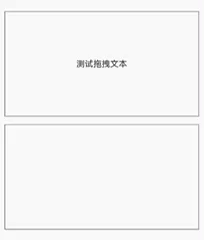
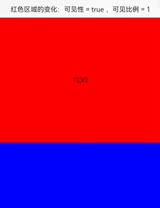
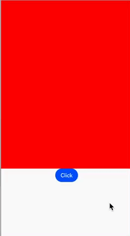
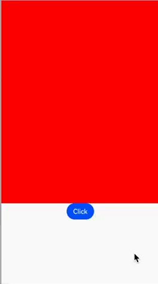
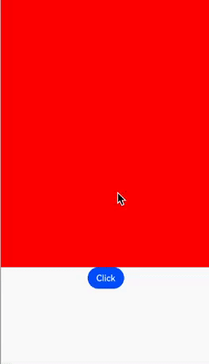

# 通用事件

## 点击事件

组件被点击时触发的事件回调

```ts
X().onClick((event: ClickEvent) => {});
```

ClickEvent 属性说明
| 名称 | 类型 | 说明 |
| -------------------------- | ----------- | ----------------------------------------------------------------------- |
| displayX | number | 点击位置离`应用屏幕左侧`的距离 |
| displayY | number | 点击位置离`应用屏幕顶部`的距离 |
| windowX | number | 点击位置离`应用窗口左侧`的距离 |
| windowY | number | 点击位置离`应用窗口顶部`的距离 |
| x | number | 点击位置离`当前组件左侧`的距离 |
| y | number | 点击位置离`当前组件顶部`的距离 |
| target | EventTarget | 被点击组件的`显示区域`信息 |
| target.area.width | Length | 被点击组件的`宽度` |
| target.area.height | Length | 被点击组件的`高度` |
| target.area.position | Position | 被点击组件相对于`父组件左上角`的位置 |
| target.area.globalPosition | Position | 被点击组件相对于`页面左上角`的位置 |
| timestamp | number | 点击时的`时间戳` |
| source | SourceType | 事件`输入设备类型`，如鼠标/触屏 |
| pressure | number | `按压力度` |
| sourceTool | SourceTool | 来源工具， 比如点击的 source 是触屏，那么是用`手指触屏`还是`手写笔触屏` |

## 触摸事件

在组件上按下、移动、抬起时触发的事件回调

```ts
X().onTouch((event: TouchEvent) => {});
```

TouchEvent 属性说明
| 名称 | 类型 | 说明 |
| -------------------------- | ----------- | ----------------------------------------------------------------------- |
| type | TouchType | 触摸事件的类型，`Down`、`Up`、`Move`、`Cancel` |
| touches | TouchObject[] | 全部手指的信息，信息含义可以参考 ClickEvent 的属性 |
| changedTouches | number | 当前发生变化的手指信息 |
| stopPropagation | () => void | 阻塞事件冒泡 |
| target | EventTarget | 被触摸组件的`显示区域`信息，EventTarget 的属性参考 ClickEvent 中 target 的属性 |
| timestamp | number | 触摸时的`时间戳` |
| source | SourceType | 事件`输入设备类型`，如鼠标/触屏 |
| pressure | number | `按压力度` |
| sourceTool | SourceTool | 来源工具， 比如触摸的 source 是触屏，那么是用`手指触屏`还是`手写笔触屏` |

## 挂载卸载事件

组件挂载触发`onAppear`事件、卸载触发`onDisAppear`事件。

```ts
@State flag: boolean = true;

build() {
    Column() {
        if (this.flag) {
            Button('挂载卸载').onClick(() => {
                this.flag = false
            })
            .onAppear(() => {
            // 挂载
            })
            .onDisAppear(() => {
            // 卸载
            })
        }
    }
    .margin(10)
}
```

组件显示时被挂载，回调 `onAppear` 事件，点击组件后组件被挂载，触发 `onDisAppear` 事件。

## 拖拽事件

组件被长按后拖拽触发的一系列事件。

- onDragStart：长按组件`开始拖动`时触发，触发一次，可以在这个回调中将想要发送的数据通过 `setData` 发送，目标组件通过 `getData` 拿到数据
- onDragMove：组件被`拖动时`触发，触发多次。当组件在目标组件范围外，会触发被拖动组件的 onDragMoe，如果拖到目标组件范围内，会触发目标组件的 onDragMove。其它事件类似，下面不再赘述
- onDragEnter：将组件`拖拽到`目标组件`范围内`触发
- onDragLeave：将组件从`拖出`目标组件`范围外`触发
- onDragEnd：松开组件`停止拖拽`触发
- onDrop：在目标组件范围内停止拖拽触发，可以在这里回调方法里面处理拖拽逻辑

::: details 展开查看完整代码

```ts
@Component
export struct CommonAtte {
    @State extraText: string = ''
    initText: string = "测试拖拽文本"

    build(){
        Column({ space: 5 }) {
          Text(this.initText)
            .margin({ top: 10 })
            .width("100%")
            .height(200)
            .draggable(true)
            .border({ width: 1, color: Color.Gray })
            .textAlign(TextAlign.Center)
            .onDragStart((event, params) => {
              console.log('start_start')
              let data = new UDC.PlainText()
              data.textContent = this.initText
              // 通过setData发送数据
              event.setData(new UDC.UnifiedData(data))
            })
            .dragPreview(this.buildDragPreview()) // 拖拽预览图

          Stack() {
            if (this.extraText.length > 0) {
              Text(this.extraText)
            }
          }
          .onDrop((event: DragEvent, params: string) => {
            // 通过getData拿到数据
            let data = event.getData()
            if (data != undefined) {
              let arr = data.getRecords()
              if (arr.length > 0) {
                // 前面通过setData的数据类型是PlainText，所以这里也要转成PlainText类型
                let text = arr[0] as UDC.PlainText
                this.extraText = text.textContent
              }
            }
          })
          .allowDrop([UTD.UniformDataType.PLAIN_TEXT])
          .height(200)
          .border({ width: 1, color: Color.Gray })
          .margin({ top: 10 })
          .width("100%")
        }
    }

    @Builder
    buildDragPreview() {
        Stack() {
            Text(this.initText)
        }.width('100%').height(200)
    }
}
```

:::



## 按键事件

组件获取焦点后，监听到的键盘按键事件。比如通过遥控器将焦点聚焦到按钮上，通过遥控器的`↑`按键增加音量。

```ts
X().onKeyEvent((event: KeyEvent) => {});
```

KeyEvent 属性说明

| 名称       | 类型          | 说明                                                                                           |
| ---------- | ------------- | ---------------------------------------------------------------------------------------------- |
| type       | KeyType       | 按键类型，`Up`、`Down`                                                                         |
| keyCode    | number        | 键码，如`KEYCODE_FN = 0`，键码就是 `0`                                                         |
| keyText    | string        | 键值，如`KEYCODE_FN = 0`，键值就是 `KEYCODE_FN`                                                |
| keySource  | KeySource     | 触发按键事件的设备类型，如`Keyboard`                                                           |
| deviceId   | number        | 触发按键事件的输入设备 ID                                                                      |
| metaKey    | number        | 按键发生时元键状态，按下是 1，未按下是 0，Windows 系统元键是 `WIN` 键，Mac 系统是 `Command` 键 |
| intentCode | IntentionCode | 按键对应的意图                                                                                 |

## 焦点事件

组件获取焦点和失去焦点的事件回调。获取焦点回调`onFocus`，失去焦点回调`onBlur`。

## 鼠标事件

鼠标光标移入和移出组件时触发 `onHover` 回调，移入时 `onHover` 回调的参数是 `true`，移出时回调的参数是 `false`。在组件上面移动光标触发 `onMouse` 回调。

```ts
X()
  .onHover((isHover: boolean, event: HoverEvent) => {})
  .onMouse((event: MouseEvent) => {});
```

## 区域变化

组件的大小和位置发生变化时触发。由动画平移导致的位置变化不会触发该回调。

```ts
Button().onAreaChange((oldValue: Area, newValue: Area) => {});
```

## 可见区域变化

组件可见区域面积发生时回调。

```ts
onVisibleAreaChange(
    ratios: Array<number>,
    event: (isVisible: boolean, currentRatio: number) => void
): T;
```

- ratios：阈值数组，可见区域比例取值范围，数组中的每个元素表示组件可见区域和组件面积的比例。比如组件只能看到一半的区域，那么比例就是 0.5。默认范围是 `0 ~ 1`。
- isVisible：可见区域变化情况，true 表示可见区域逐渐变大（如把组件从屏幕` 外`滑`向 `屏幕`内`），false 表示可见区域逐渐变小（如把组件从屏幕`内`滑`向`屏幕`外`）
- currentRatio：可见区域占组件面积的比例。组件完全不可见时为 0，完全可见时为 1



## 快捷键

设置组件的快捷键。

```ts
keyboardShortcut(
    value: string | FunctionKey,
    keys: Array<ModifierKey>, action?: () => void
): T;
```

- value：快捷键字符或者是功能键，功能键指 `ESC`，`F1 ~ F12`
- keys：组合键，`CTRL`，`SHIFT`，`ALT` 之间的组合
- action：按下组合键的响应事件

```ts
Button().keyboardShortcut("e", [ModifierKey.SHIFT], () => {
  console.log("触发了组合键");
});
```

上面的代码就表示按下 `SHIHFT` + `E` 两个键后就触发了打印 log

## 自定义事件分发

父组件可以通过 `onChildTouchTest` 来决定是否让子组件响应触摸事件。

```ts
onChildTouchTest(event: (value: Array<TouchTestInfo>) => TouchResult): T;
```

- value：触摸组件的信息数组，其中的 `id` 很有用。
- TouchResult：通过设置它的 id 和 strategy 来决定是否将事件分发给子组件。

TouchResult 有 id 和 strategy 两个属性，id 就是给组件设置的 id 属性，strategy 是事件分发策略。有三种策略

1. DEFAULT：默认策略，按照系统默认的策略分发
2. FORWARD_COMPETITION：会分发给指定 id 的子组件，同时安卓系统的分发流程走
3. FORWARD：会分发给指定 id 的子组件，其它组件不会被分发到事件，无法响应

```ts
Column() {
    Scroll() {
    Column() {
        Text().width('100%').height(500).backgroundColor(Color.Red)
        Text().width('100%').height(500).backgroundColor(Color.Blue)
    }
    }.height('70%')
    .id('scroll')

    Button('Click').onClick(() => {
    promptAction.showToast({ message: 'clicked' })
    })
}
.width('100%')
.height('100%')
.onChildTouchTest((value) => { // [!code ++]
    for (let v of value) { // [!code ++]
        if (v.id == 'scroll') { // [!code ++]
            return { id: v.id, strategy: TouchTestStrategy.FORWARD } // [!code ++]
        } // [!code ++]
    } // [!code ++]
    return { strategy: TouchTestStrategy.DEFAULT } // [!code ++]
}) // [!code ++]
```

|        | 不设置 onChildTouchTest（DEFAULT）                    | FORWARD_COMPETITION                                                                                                            | FORWARD                                                                                                        |
| ------ | ----------------------------------------------------- | ------------------------------------------------------------------------------------------------------------------------------ | -------------------------------------------------------------------------------------------------------------- |
| 效果图 |  |                                                                |                                                           |
| 说明   | 系统默认效果，Scroll 组件没有被触摸到，不响应滑动事件 | 事件分发给 id 为 scroll 的组件，同时也按照系统事件分发流程走，因此 Scroll 组件响应了滑动事件，点击 Button 组件也能响应点击事件 | 事件分发给 id 为 scroll 组件，但是不按照系统的分发流程，因此 Button 没办法被分发到事件，因此点击事件不能被响应 |
