# 通用属性

## 尺寸

### 宽度

设置组件的宽度，默认宽度为内容包裹`与安卓的wrap-content一样`，如果设置的大小比父容器还大，那么就会超出父容器。类型为 Legnth，可以设置数值、字符串或资源引用类型

```ts
declare type Length = string | number | Resource;
```

```ts
X() // X表示组件
  .width(100) // number
  .width("100") // string
  .width("100vp")
  .width($r("app.float.100vp")); // Resource
```

`100vp`需要在资源文件中声明，资源文件路径为`resources/base/element/float.json`

```json
{
  "float": [
    {
      "name": "100vp",
      "value": "100vp"
    }
  ]
}
```

### 高度

设置组件的高度，默认高度为内容包裹`与安卓的wrap-content一样`，如果设置的大小比父容器还大，那么就会超出父容器。类型为 Legnth，可以设置数值、字符串或资源引用类型

```ts
X().height(100);
```

### 大小

可以同时设置宽度和高度

```ts
X().size({ width: 100, height: 100 });
```

### 内边距

设置内边距（组件与组件内容的距离），类型为 Length 或 Padding，当类型为 Legnth 时表示四边距同时设置为一样的，为 Padding 时可以分开设置

```ts
X().padding(10);
X().padding({ left: 10, right: 20, top: 20, bottom: 20 });
```

### 外边距

设置外边距（组件与父组件的距离）

```ts
X().margin(10);
X().margin({ left: 10, right: 20, top: 20, bottom: 20 });
```

### 布局权重

设置组件权重，如 Row 组件中有 2 个子组件，第一个子组件不设置宽高和权重，另一个子组件设置`layoutWeight(1)`，那么第二个子组件就会占满 Row 容器剩余的宽度。

当 2 个子组件同时设置`layoutWeight(1)`时，它们会`1 : 1`平分 Row 容器的宽度。

### 约束大小

设置组件的约束大小，最大宽度、最大高度、最小宽度、最小高度。
::: warning 限制
当最小宽度大于组件的宽度时，以最小宽度为准；最小宽度小于组件宽度时，以实际宽度为准。

当最大宽度大于组件的宽度时，以实际宽度为准；最大宽度小于组件宽度时，以最大宽度为准。

高度同理。
:::

## 位置

### 对齐方式

设置容器组件的子组件的对齐方式。只在 Stack、Button、Marquee、StepperItem、Text、TextArea、TextInput、FolderInput 组件中生效，与 Text 相关的组件使用 TextAlign

### 方向

设置容器组件中子元素的布局方向，默认是 Direction.Auto，与设备的语言方向有关，比如大部分国家都是从左至右，那么 Auto 就表示从左至右，少部分国家是从右至左方向。

```ts
declare enum Direction {
  Ltr,
  Rtl,
  Auto,
}
```

### 位置

绝对定位，设置子组件在父组件左上角的偏移量。设置了 position 后会破坏原有的对齐方式，比如设置之前是居中显示，设置了`{x: 10, y: 20}`后，那么子组件就会在父容器的左上角距离左边 10 个像素，距离上边 20 个像素的位置。

```ts
Column() {
    Text()
    .width(100)
    .height(100)
    .backgroundColor(Color.Brown)
    .position({ x: 10, y: 20 })
}
.justifyContent(FlexAlign.Center)
.width(350)
.height(350)
.backgroundColor(Color.Blue)
```

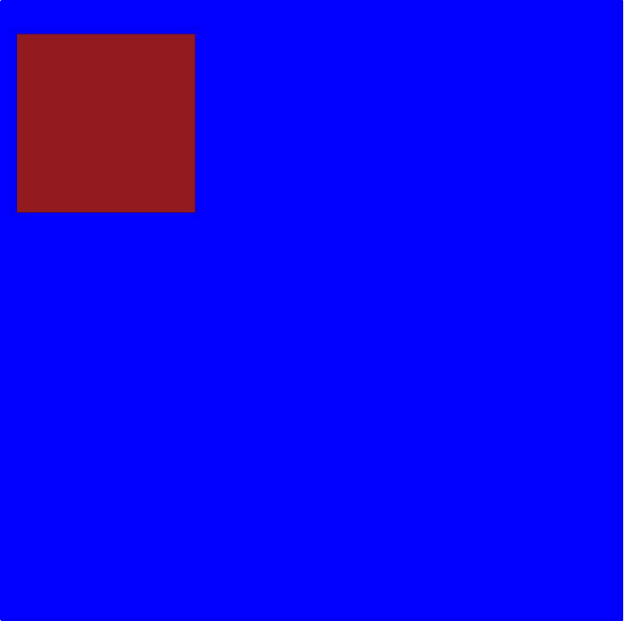

### 锚点

设置锚点，在 position 设置的位置上进一步偏移，偏移方向与 position 相反。

```ts
Column() {
    Text()
    .width(100)
    .height(100)
    .backgroundColor(Color.Brown)
    .position({ x: 10, y: 20 })
    .markAnchor({ x: 10, y: 20 }) // [!code ++]
}
.justifyContent(FlexAlign.Center)
.width(350)
.height(350)
.backgroundColor(Color.Blue)
```

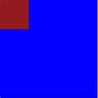

### 偏移量

相对定位，相对于组件自身的位置进行偏移。比如当前的位置是(10, 10)，设置了 offset(10, 10)后，那么此时的位置就是(20, 20)了。

### 对齐规则

设置容器 `RelativeContainer` 的子组件的对齐规则。设置子组件在父组件中的相对位置，比如要给子组件设置 id 才能显示出来。父组件的 id 固定为`__container__`。

[相对布局 RelativeContainer 使用方法](./RelativeContainer.md)

## 布局约束

### 宽高比例

设置组件的宽高比。当组件中有内容填充且不设置宽高只设置 aspectRatio 时，那么就会按照被填充的宽来计算实际的宽高。

::: info 示例
比如在 Text 组件中，没有设置其宽高，只设置了 Text 的文本内容，然后设置 aspectRatio 为 0.5，那么就会按照 Text 的文本内容作为宽，按照`宽/高 = 0.5`来计算高，即高是宽的 2 倍。

```ts
Text("123").backgroundColor(Color.Orange).aspectRatio(0.5);
```

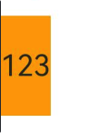

::: warning 提示
同时设置了 width 和 Height，以设置的 width 为准来计算 height。而不是以 height 为准来计算 width。
:::

### 显示优先级

设置组件在父容器组件中显示的优先级。容器空间不足时优先显示高优先级的组件。仅在单行组件`Row Column Flex`组件中生效。

- 不设置优先级

```ts
Row() {
  Text().width(50).height(40).backgroundColor(Color.Black)
  Text().width(80).height(40).backgroundColor(Color.Red)
  Text().width(50).height(40).backgroundColor(Color.Blue)
}
.backgroundColor(Color.Gray)
.width(150)
.height(50)
```

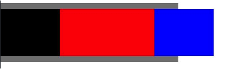

在不设置优先级的情况下，所有的组件都会显示出来，会超出父容器。

- 前 2 个组件设置优先级

```ts
Row() {
  // 这里优先级要保证最少是2，默认的应该是1，不然设置成1和不设置都一样效果，优先级谁也不比谁高
  Text().width(50).height(40).backgroundColor(Color.Black).displayPriority(2)
  Text().width(80).height(40).backgroundColor(Color.Red).displayPriority(2)
  Text().width(50).height(40).backgroundColor(Color.Blue)
}
.backgroundColor(Color.Gray)
.width(150)
.height(50)
```

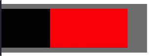

最后一个组件没有设置优先级，但是父容器的组件不足以放下它，因此不显示最后一个组件。效果不同于不设置优先级的情况。

- 最后一个优先级最高

```ts
Row() {
  Text().width(50).height(40).backgroundColor(Color.Black).displayPriority(1)
  Text().width(80).height(40).backgroundColor(Color.Red).displayPriority(2)
  Text().width(50).height(40).backgroundColor(Color.Blue).displayPriority(3)
}
.backgroundColor(Color.Gray)
.width(150)
.height(50)
```

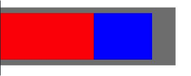

最后一个组件优先级最高，第一个最低，即使第一个组件写在前面，但是在父容器空间不足时，依旧会不显示第一个组件而是显示最后一个优先级最高的组件。

## Flex 布局

### flexBasis

设置组件的基准尺寸。默认为 auto，表示基准尺寸为组件原本大小，不支持使用百分比。

当组件的宽度设置为 50，基准尺寸设置为 100，那么组件会以 100 的宽度来绘制。

以 Text 为例，设置基准尺寸为 100，当文本字数比较长时，文本就会按照宽度为 100 的地方换行，就和设置了约束尺寸 minWidth = 100 一样。

### flexGrid

设置组件在父容器中占据剩余空间的比例。效果与`layoutWeight`一致。

### flexShrink

设置子组件压缩尺寸占父容器的比例。父容器是 Row 和 Column 时，默认是 0，表示不压缩。父容器是 Flex 时，默认是 1。

```ts
Row(){
  Text('1').width('50%').height(100).flexShrink(0)
  Text('2').width('40%').height(100).flexShrink(1)
  Text('3').width('40%').height(100).flexShrink(1)
}
```

上面三个组件中，组件 1 不压缩，占据父容器宽度的 50%，组件 2 和组件 3 按照 1:1 的比例占据父容器剩余宽度的 50%，即各占 25%。

### itemSelf

设置子组件在父组件交叉轴的对齐方式，优先级高于 alignItems。

```ts
Row() {
  Text('1').backgroundColor(Color.Green).width('30%').height(50).alignSelf(ItemAlign.Start)
  Text('2').backgroundColor(Color.Red).width('40%').height(50).alignSelf(ItemAlign.Center)
  Text('3').backgroundColor(Color.Yellow).width('30%').height(50).alignSelf(ItemAlign.End)
}.width('100%')
.height(100)
.backgroundColor(Color.Gray)
```

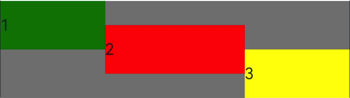

::: warning 提示
交叉轴垂直于主轴，Row 组件的主轴是水平方向，则交叉轴就是竖直方向；Column 的主轴是竖直方向，则交叉轴就是水平方向。
:::

## 边框

### 边框宽度

设置边框线条粗细。参数单位可以是 Length 或 EdgeWidths 类型，Length 类型同时指定四条边的边框，EdgeWidths 类型可分别设置每一条边的边框。

```ts
Column() {
  Text('123').borderWidth(5)
  Text('123').borderWidth({ left: 2, top: 5, right: 3, bottom: 1 }).margin({ top: 5 })
}
```

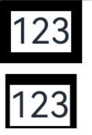

### 边框颜色

设置边框颜色，参数单位可以是 ResourceColor 或 EdgeColors，ResourceColor 同时设置四条边框一样的颜色，而 EdgeColors 可以分别设置不同的颜色。

```ts {5-10}
Text("123").borderWidth(5).borderColor(Color.Red);
Text("123")
  .borderWidth({ left: 2, top: 5, right: 3, bottom: 1 })
  .margin({ top: 5 })
  .borderColor({
    left: Color.Red,
    right: Color.Green,
    top: Color.Gray,
    bottom: Color.Orange,
  });
```


### 边框弧度

设置边框圆角。参数类型可以是 Length 或 BorderRadiuses，Length 设置四个角一样的弧度，BorderRadiuses 可以分别设置不同的弧度。

```ts
Text("123")
  .borderWidth(5)
  .borderColor(Color.Red) // color
  .borderRadius(10); // [!code ++]
Text("123")
  .borderWidth({ left: 2, top: 5, right: 3, bottom: 1 })
  .margin({ top: 5 })
  .borderColor({
    left: Color.Red,
    right: Color.Green,
    top: Color.Gray,
    bottom: Color.Orange,
  })
  .borderRadius({ topLeft: 5, topRight: 10, bottomLeft: 20, bottomRight: 15 }); // [!code ++]
```

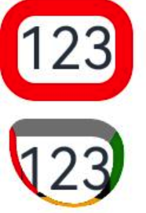

### 边框样式

设置边框线的样式，样式有`点、实线、虚线`。参数是一个枚举 BorderStyle，设置四边统一风格的样式；或者是 EdgeStyles 分别设置四边不一样的样式。

```ts
declare enum BorderStyle {
  Dotted, // 点
  Dashed, // 虚线
  Solid, // 实线
}
```

```ts
Row() {
  Text('点').borderWidth(2).borderStyle(BorderStyle.Dotted)
  Text('虚线').borderWidth(2).borderStyle(BorderStyle.Dashed).margin({ left: 10, right: 10 })
  Text('实线').borderWidth(2).borderStyle(BorderStyle.Solid)
}
```

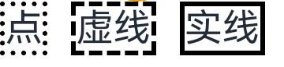

### 边框合并设置

使用一个 api 同时设置边框边框粗细/颜色/样式/圆角等，将 borderWidth、borderColor、borderRadius 和 borderStyle 合成一个 api。类型是 BorderOptions

```ts
declare interface BorderOptions {
  width?: EdgeWidths | Length;
  color?: EdgeColors | ResourceColor;
  radius?: BorderRadiuses | Length;
  style?: EdgeStyles | BorderStyle;
}
```

```ts
Text("BORDER").border({
  width: 5,
  color: Color.Blue,
  radius: 10,
  style: BorderStyle.Dashed,
});
```

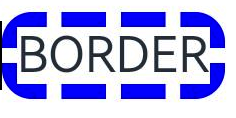

## 图片边框

### 图片边框

给组件设置图片边框，参数类型是`BorderImgaeOption`。

```ts
declare interface BorderImageOption {
  slice?: Length | EdgeWidths; // 设置边框图片四个角的切割宽度
  repeat?: RepeatMode; // 重复模式
  source?: string | Resource | LinearGradient; // 图片边框的资源地址或者是渐变色边框
  width?: Length | EdgeWidths; // 边框宽度
  outset?: Length | EdgeWidths; // 设置边框图片向外延伸的距离
  fill?: boolean; // 是否填充
}
```

## 背景

### 背景颜色

设置组件背景色

```ts
Text("backgroundColor").backgroundColor($r("app.color.gray"));
```

### 背景图片

设置组件的背景图片，图片支持本地资源图片、网络图片、Base64，不支持 SVG 图片。

- src：图片源地址
- repeat：图片重复模式，

```ts
Text("XY")
  .width(50)
  .height(50)
  .fontSize(12)
  .borderWidth(1)
  .backgroundImage($r("app.media.icon"), ImageRepeat.XY); // [!code focus]
```

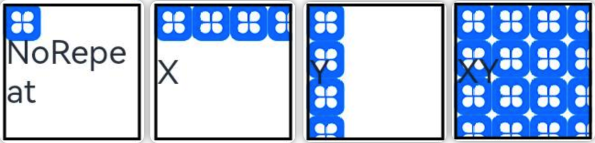

### 背景图片大小

设置组件背景图片大小，参数类型为 SizeOptions 或 ImageSize，当参数是 SizeOptions 时，可以指定宽度和高度，如果只指定一个宽度或者高度时，会按照图片的比例进行绘制；当参数是 ImageSize 时，可以设置图片的缩放模式，它的值有 3 种

- Auto：默认值，保持图片比例
- Cover：填充组件，可能会缩放图片
- Contain：保持图片比例，在组件中以图片比例最大程度的占据组件的空间，但是图片会完全的展示在组件中

```ts
Text()
  .width(50)
  .height(50)
  .borderWidth(1)
  .backgroundImageSize(ImageSize.Contain); // [!code focus]

Text()
  .width(50)
  .height(50)
  .borderWidth(1)
  .backgroundImageSize({ width: 40, height: 20 }); // [!code focus]
```

### 背景图片位置

设置组件背景图的位置，参数类型为 Position 或 Alignment。

当参数设置为 Position 时，表示相对于组件左上角的位置。

```ts
Text()
  .width(50)
  .height(50)
  .borderWidth(1)
  .backgroundImage($r("app.media.icon"))
  .backgroundImagePosition({ x: 20, y: 30 }); // [!code focus]
```

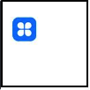

除了设置数值外，还可以设置百分比，下例中 x 设置为 50%，表示背景图片的左侧在组件水平位置 50%的地方。

```ts
Text()
  .width(50)
  .height(50)
  .borderWidth(1)
  .backgroundImage($r("app.media.icon"))
  .backgroundImagePosition({ x: "50%", y: 30 }); // [!code focus]
```

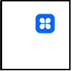

当参数设置为 Alignment 时，表示背景图片的对齐方式。

```ts
Text()
  .width(50)
  .height(50)
  .borderWidth(1)
  .backgroundImage($r("app.media.icon"))
  .backgroundImagePosition(Alignment.Bottom); // [!code focus]
```

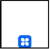

上例表示把背景图片放在组件的下方中间位置。

### 背景模糊

设置组件背景和内容之间的模糊。设置时底部最好有图片背景，不然默认的白色页面看不出效果。

## 透明度

opacity 设置组件的不透明度，取值范围是 0~1,0 表示完全透明，1 表示完全不透明。默认是 1 完全不透明。

```ts
Text("opacity=1").width(50).height(50).backgroundColor(Color.Black);
Text("opacity=0.5")
  .width(50)
  .height(50)
  .backgroundColor(Color.Black)
  .opacity(0.5);
```

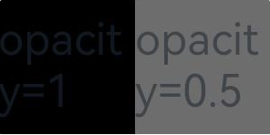

## 显示隐藏

设置组件的显示和隐藏，隐藏有 2 种情况，一种是隐藏了会占据空间，另一个是隐藏了不占据空间。和安卓中的 `GONE`、`INVISIBLE` 对应

- Visible：显示
- Hidden：隐藏但占位置，与安卓的 INVISIBLE 一样
- None：隐藏不占据位置，与安卓的 GONE 一样

```ts
Text().visibility(Visibility.Hidden);
```

## 禁用控制

设置控件是否可用（可交互）。如 Button 设置为 enable = false 后，点击不会响应 onClick 事件。

```ts
Button("启用按钮").enabled(true);
Button("禁用按钮").enabled(false);
```


## 浮层

为组件添加遮罩浮层。参数类型为 string 或 CustomBuilder 自定义组件类型。想过类似于 Stack 组件，组件本身的内容在底层，而设置的遮罩内容在上层。

同时还可以设置遮罩内容的偏移量和对齐方式。

```ts
Button("overlay").overlay("OVERLAY");
```

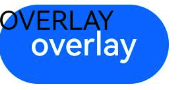

## 组件层级

设置组件 z 轴上的层叠顺序。 参数是数值类型，数值越大说明层级越高，层级高的组件显示在越上层。默认是 0。

```ts
// 不设置层级
Stack() {
  Text('1').size({ width: 100, height: 100 }).backgroundColor(Color.Orange)
  Text('2').size({ width: 80, height: 80 }).backgroundColor(Color.Blue)
  Text('3').size({ width: 50, height: 50 }).backgroundColor(Color.Red)
}

// 中间的组件设置层级
Stack() {
  Text('1').size({ width: 100, height: 100 }).backgroundColor(Color.Orange)
  Text('2').size({ width: 80, height: 80 }).backgroundColor(Color.Blue).zIndex(1)
  Text('3').size({ width: 50, height: 50 }).backgroundColor(Color.Red)
}
```

把中间的组件`Text('2')`的 zIndex 设置为 1，层级比`Text('3')`要高，因此会显示在其上方，因为大小更大把`Text('3')`给挡住了。

下图左侧未设置层级顺序，右侧设置第二个组件层级为 1
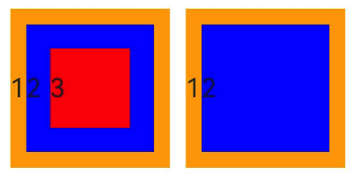

## 图像转换

### 旋转

设置组件旋转，角度参数 angle 是必须设置，默认表示按照顺时针旋转指定的角度。除了默认的平面旋转外，还可以设置绕 X,Y,Z 轴旋转。默认旋转都是按照组件的中心进行旋转。

```ts
Text("1").size({ width: 50, height: 50 }).backgroundColor(Color.Orange).rotate({
  angle: 45,
});
```

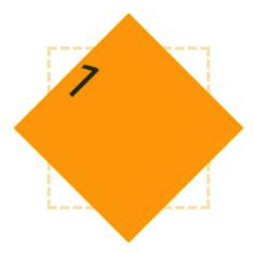

绕坐标轴旋转，下例中设置同时绕 X 轴和 Y 轴旋转 45 度。

```ts
Text("1").size({ width: 50, height: 50 }).backgroundColor(Color.Orange).rotate({
  x: 1,
  y: 1,
  angle: 45,
});
```

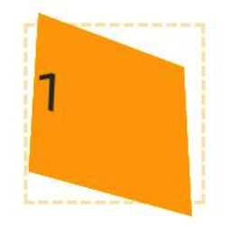

::: warning 提示
图中虚线位置表示旋转前的位置。

`x:1` 和 `y:1` 的设置中，如果不为 1 则表示会绕该轴进行旋转 angle 度，为 0 或者不指定则不生效。
:::

除此之外还可以设置旋转中心等。默认旋转中心为 `centerX = '50%'`，`centerY = '50%'`，`centerZ = 0`

### 平移

设置组件平移。可以设置向 X,Y,Z 轴方向上进行平移。参数可以设置为数值类型或百分比。

```ts
Text("1")
  .size({ width: 50, height: 50 })
  .backgroundColor(Color.Orange)
  .translate({ x: "50%", y: "50%" });
```

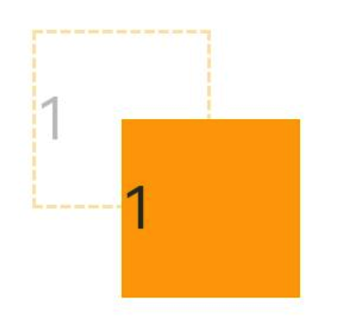

### 缩放

设置组件缩放，可以设置在坐标轴方向上进行缩放以及设置缩放中心，默认缩放中心为组件中心。

参数中的`x`、`y`、`z`表示缩放比例，默认是 1，大于 1 表示放大，小于 1 表示缩小。

```ts
// 不设置缩放中心，默认是组件中心
Text("1").size({ width: 50, height: 50 }).backgroundColor(Color.Orange).scale({
  x: 0.5,
  y: 0.5,
});

// 设置缩放中心在组件左上角
Text("1").size({ width: 50, height: 50 }).backgroundColor(Color.Orange).scale({
  x: 0.5,
  y: 0.5,
  centerX: 0,
  centerY: 0,
});
```

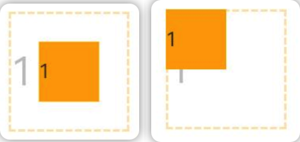

## 图像效果（毛玻璃）

### 内容模糊

设置组件的内容（前景）模糊效果，比如 Text 的文字模糊。

```ts
Row() {
  Text('normal')
  Text('blur').textAlign(TextAlign.Center).blur(1)
}
```


### 背景模糊

设置组件的背景模糊效果。参数值越大越模糊，为 0 时不模糊。

```ts
Text("backdropBlur")
  .backgroundImage($r("app.media.startIcon"))
  .backdropBlur(10);
```

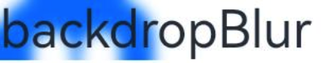

### 阴影

设置组件的阴影效果。

```ts
Text("backdropBlur").shadow({
  color: Color.Blue, // 阴影颜色
  radius: 10, // 阴影四个角的圆角弧度
  offsetX: 10, // x方向上的偏移量
  offsetY: 10, // y方向上的偏移量
  fill: false, // 是否填充
});
```

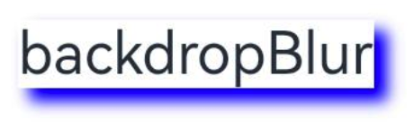

### 灰度效果

设置组件的灰度效果，如在哀悼日时很多 app 首页都有灰度设置。设置参数范围是`0 ~ 1`，默认为 0，表示不设置灰度，1 表示完全灰度。小于 0 按 0 处理，大于 1 按 1 处理。

```ts
Row() {
  Image($r('app.media.img')).width(100).height(50)
  Image($r('app.media.img')).width(100).height(50).grayscale(0.8)
}
```


### 亮度

设置组件的亮度效果，默认为 1，小于 1 会变暗，大于 1 效果变亮。数值越大越亮，推荐设置范围`0 ~ 2`

```ts
Row() {
  Image($r('app.media.img')).width(60).height(30)
  Image($r('app.media.img')).width(60).height(30).brightness(0.5)
  Image($r('app.media.img')).width(60).height(30).brightness(1.5)
}
```


### 饱和度

设置组件的饱和度。参数范围为 `0 ~ +∞`，默认为 1，数值越大，饱和度越大。小于 0 按 0 处理。

```ts
Row() {
  Image($r('app.media.img')).width(60).height(30)
  Image($r('app.media.img')).width(60).height(30).saturate(5)
  Image($r('app.media.img')).width(60).height(30).saturate(30)
}
```

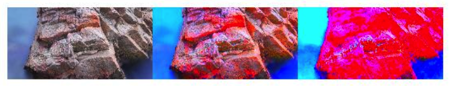

### 对比度

设置组件的对比度。参数范围为 `0 ~ +∞`，默认为 1，数值越大，对比度越大。小于 0 按 0 处理。

```ts
Row() {
  Image($r('app.media.img')).width(60).height(30)
  Image($r('app.media.img')).width(60).height(30).contrast(2)
  Image($r('app.media.img')).width(60).height(30).contrast(5)
}
```


### 图像反转

反转输入的图像。参数类型是 number 或 InvertOptions 类型。

当参数类型是 number 时，表示图像反转的比例，取值范围是`0 ~ 1`。0 无变化，1 完全反转。

```ts
Row() {
  Image($r('app.media.img')).width(60).height(30)
  Image($r('app.media.img')).width(60).height(30).invert(1)
}
```

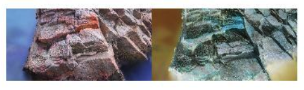

当参数类型是 InvertOptions 时，会对比组件背景颜色的灰度值和设置的 threshold 值，当背景颜色的灰度值大于设置的 threshold 时取设置的 high 值，反之取设置的 low 值。

```ts
Row() {
  Image($r('app.media.img')).width(60).height(30)
  Image($r('app.media.img')).width(60).height(30).invert({
    low: 0,
    high: 1,
    threshold: 0.5,
    thresholdRange: 0.2
  })
}
```


### 深褐色

将图像转换为深褐色。参数取值范围为`0 ~ 1`，默认为 0，表示无变化，1 表示完全转成深褐色。

```ts
 Row() {
  Image($r('app.media.img')).width(100).height(50)
  Image($r('app.media.img')).width(100).height(50).sepia(1)
}
```


### 色相旋转

设置组件色相旋转效果，参数为旋转角度。默认值为 0，取值范围为 `-∞ ~ +∞`，参数为 number 类型时填写具体数值（如 90），参数为字符串时填写数值+deg（如 90deg）。
::: tip 提示
虽然取值范围是 `-∞ ~ +∞`，但是一般都会设置为 `0 ~ 360`，因为 `n 和 n + 360` 度的色相一样。360 度一轮回。
:::

```ts
Row() {
  Image($r('app.media.img')).width(100).height(50)
  Image($r('app.media.img')).width(100).height(50).hueRotate(50)
}
```


### 颜色叠加

给组件设置颜色叠加效果

```ts
Row() {
  Image($r('app.media.img')).width(100).height(50)
  Image($r('app.media.img')).width(100).height(50).colorBlend(Color.Red)
}
```


### 线性渐变模糊

设置组件内容的线性渐变模糊。第一个参数为模糊半径，数值越大越模糊，取值范围为 `0 ~ 60`。第二个参数设置渐变的方向以及每段的渐变距离等。

```ts
linearGradientBlur(value: number, options: LinearGradientBlurOptions): T;
```

```ts
Row() {
  Image($r('app.media.img')).width(100).height(50)
  Image($r('app.media.img')).width(100).height(50).linearGradientBlur(100, {
    fractionStops: [[0.8, 0.5], [1, 1]],
    direction: GradientDirection.Left
  })
}
```


::: info 参数说明
fractionStops 参数是一个二维数组，里面的数组有两个元素，第一个元素表示不透明度，第二个元素表示组件的位置。

如 `[0.8,0.5]` 表示组件左侧开始到组件中间 `50%` 的位置设置不透明度为 `0.8`。也就是上图中的效果。

`direction` 表示渐变方向。
:::

### 混合模式

设置图像的混合模式，与安卓中的 PorterDuffXfermode 意思一致。

```ts
Stack() {
  Image($r('app.media.startIcon')).width(30).height(30)
  Image($r('app.media.img')).width(30).height(30)
}
.blendMode(BlendMode.XOR)
```

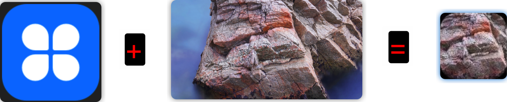

## 形状裁剪

### 裁剪

按指定形状对当前组件进行裁剪。
