# 通用属性

## 尺寸

### 宽度

设置组件的宽度，默认宽度为内容包裹`与安卓的wrap-content一样`，如果设置的大小比父容器还大，那么就会超出父容器。类型为 Legnth，可以设置数值、字符串或资源引用类型

```ts
declare type Length = string | number | Resource;
```

```ts
X() // X表示组件
  .width(100) // number
  .width("100") // string
  .width("100vp")
  .width($r("app.float.100vp")); // Resource
```

`100vp`需要在资源文件中声明，资源文件路径为`resources/base/element/float.json`

```json
{
  "float": [
    {
      "name": "100vp",
      "value": "100vp"
    }
  ]
}
```

### 高度

设置组件的高度，默认高度为内容包裹`与安卓的wrap-content一样`，如果设置的大小比父容器还大，那么就会超出父容器。类型为 Legnth，可以设置数值、字符串或资源引用类型

```ts
X().height(100);
```

### 大小

可以同时设置宽度和高度

```ts
X().size({ width: 100, height: 100 });
```

### 内边距

设置内边距（组件与组件内容的距离），类型为 Length 或 Padding，当类型为 Legnth 时表示四边距同时设置为一样的，为 Padding 时可以分开设置

```ts
X().padding(10);
X().padding({ left: 10, right: 20, top: 20, bottom: 20 });
```

### 外边距

设置外边距（组件与父组件的距离）

```ts
X().margin(10);
X().margin({ left: 10, right: 20, top: 20, bottom: 20 });
```

### 布局权重

设置组件权重，如 Row 组件中有 2 个子组件，第一个子组件不设置宽高和权重，另一个子组件设置`layoutWeight(1)`，那么第二个子组件就会占满 Row 容器剩余的宽度。

当 2 个子组件同时设置`layoutWeight(1)`时，它们会`1 : 1`平分 Row 容器的宽度。

### 约束大小

设置组件的约束大小，最大宽度、最大高度、最小宽度、最小高度。
::: warning 限制
当最小宽度大于组件的宽度时，以最小宽度为准；最小宽度小于组件宽度时，以实际宽度为准。

当最大宽度大于组件的宽度时，以实际宽度为准；最大宽度小于组件宽度时，以最大宽度为准。

高度同理。
:::

## 位置

### 对齐方式

设置容器组件的子组件的对齐方式。只在 Stack、Button、Marquee、StepperItem、Text、TextArea、TextInput、FolderInput 组件中生效，与 Text 相关的组件使用 TextAlign

### 方向

设置容器组件中子元素的布局方向，默认是 Direction.Auto，与设备的语言方向有关，比如大部分国家都是从左至右，那么 Auto 就表示从左至右，少部分国家是从右至左方向。

```ts
declare enum Direction {
  Ltr,
  Rtl,
  Auto,
}
```

### 位置

绝对定位，设置子组件在父组件左上角的偏移量。设置了 position 后会破坏原有的对齐方式，比如设置之前是居中显示，设置了`{x: 10, y: 20}`后，那么子组件就会在父容器的左上角距离左边 10 个像素，距离上边 20 个像素的位置。

```ts
Column() {
    Text()
    .width(100)
    .height(100)
    .backgroundColor(Color.Brown)
    .position({ x: 10, y: 20 })
}
.justifyContent(FlexAlign.Center)
.width(350)
.height(350)
.backgroundColor(Color.Blue)
```


### 锚点

设置锚点，在 position 设置的位置上进一步偏移，偏移方向与 position 相反。

```ts
Column() {
    Text()
    .width(100)
    .height(100)
    .backgroundColor(Color.Brown)
    .position({ x: 10, y: 20 })
    .markAnchor({ x: 10, y: 20 }) // [!code ++]
}
.justifyContent(FlexAlign.Center)
.width(350)
.height(350)
.backgroundColor(Color.Blue)
```


### 偏移量

相对定位，相对于组件自身的位置进行偏移。比如当前的位置是(10, 10)，设置了 offset(10, 10)后，那么此时的位置就是(20, 20)了。

### 对齐规则

设置容器 `RelativeContainer` 的子组件的对齐规则。设置子组件在父组件中的相对位置，比如要给子组件设置 id 才能显示出来。父组件的 id 固定为`__container__`。

[相对布局 RelativeContainer 使用方法](./RelativeContainer.md)

## 布局约束

### 宽高比例

设置组件的宽高比。当组件中有内容填充且不设置宽高只设置 aspectRatio 时，那么就会按照被填充的宽来计算实际的宽高。

::: info 示例
比如在 Text 组件中，没有设置其宽高，只设置了 Text 的文本内容，然后设置 aspectRatio 为 0.5，那么就会按照 Text 的文本内容作为宽，按照`宽/高 = 0.5`来计算高，即高是宽的 2 倍。

```ts
Text("123").backgroundColor(Color.Orange).aspectRatio(0.5);
```


::: warning 提示
同时设置了 width 和 Height，以设置的 width 为准来计算 height。而不是以 height 为准来计算 width。
:::

### 显示优先级

设置组件在父容器组件中显示的优先级。容器空间不足时优先显示高优先级的组件。仅在单行组件`Row Column Flex`组件中生效。

- 不设置优先级

```ts
Row() {
  Text().width(50).height(40).backgroundColor(Color.Black)
  Text().width(80).height(40).backgroundColor(Color.Red)
  Text().width(50).height(40).backgroundColor(Color.Blue)
}
.backgroundColor(Color.Gray)
.width(150)
.height(50)
```


在不设置优先级的情况下，所有的组件都会显示出来，会超出父容器。

- 前 2 个组件设置优先级

```ts
Row() {
  // 这里优先级要保证最少是2，默认的应该是1，不然设置成1和不设置都一样效果，优先级谁也不比谁高
  Text().width(50).height(40).backgroundColor(Color.Black).displayPriority(2)
  Text().width(80).height(40).backgroundColor(Color.Red).displayPriority(2)
  Text().width(50).height(40).backgroundColor(Color.Blue)
}
.backgroundColor(Color.Gray)
.width(150)
.height(50)
```


最后一个组件没有设置优先级，但是父容器的组件不足以放下它，因此不显示最后一个组件。效果不同于不设置优先级的情况。

- 最后一个优先级最高

```ts
Row() {
  Text().width(50).height(40).backgroundColor(Color.Black).displayPriority(1)
  Text().width(80).height(40).backgroundColor(Color.Red).displayPriority(2)
  Text().width(50).height(40).backgroundColor(Color.Blue).displayPriority(3)
}
.backgroundColor(Color.Gray)
.width(150)
.height(50)
```


最后一个组件优先级最高，第一个最低，即使第一个组件写在前面，但是在父容器空间不足时，依旧会不显示第一个组件而是显示最后一个优先级最高的组件。

## Flex 布局

### flexBasis

设置组件的基准尺寸。默认为 auto，表示基准尺寸为组件原本大小，不支持使用百分比。

当组件的宽度设置为 50，基准尺寸设置为 100，那么组件会以 100 的宽度来绘制。

以 Text 为例，设置基准尺寸为 100，当文本字数比较长时，文本就会按照宽度为 100 的地方换行，就和设置了约束尺寸 minWidth = 100 一样。

### flexGrid

设置组件在父容器中占据剩余空间的比例。效果与`layoutWeight`一致。

### flexShrink

设置子组件压缩尺寸占父容器的比例。父容器是 Row 和 Column 时，默认是 0，表示不压缩。父容器是 Flex 时，默认是 1。

```ts
Row(){
  Text('1').width('50%').height(100).flexShrink(0)
  Text('2').width('40%').height(100).flexShrink(1)
  Text('3').width('40%').height(100).flexShrink(1)
}
```

上面三个组件中，组件 1 不压缩，占据父容器宽度的 50%，组件 2 和组件 3 按照 1:1 的比例占据父容器剩余宽度的 50%，即各占 25%。

### itemSelf

设置子组件在父组件交叉轴的对齐方式，优先级高于 alignItems。

```ts
Row() {
  Text('1').backgroundColor(Color.Green).width('30%').height(50).alignSelf(ItemAlign.Start)
  Text('2').backgroundColor(Color.Red).width('40%').height(50).alignSelf(ItemAlign.Center)
  Text('3').backgroundColor(Color.Yellow).width('30%').height(50).alignSelf(ItemAlign.End)
}.width('100%')
.height(100)
.backgroundColor(Color.Gray)
```


::: warning 提示
交叉轴垂直于主轴，Row 组件的主轴是水平方向，则交叉轴就是竖直方向；Column 的主轴是竖直方向，则交叉轴就是水平方向。
:::

## 边框

### 边框宽度

设置边框线条粗细。参数单位可以是 Length 或 EdgeWidths 类型，Length 类型同时指定四条边的边框，EdgeWidths 类型可分别设置每一条边的边框。

```ts
Column() {
  Text('123').borderWidth(5)
  Text('123').borderWidth({ left: 2, top: 5, right: 3, bottom: 1 }).margin({ top: 5 })
}
```


### 边框颜色

设置边框颜色，参数单位可以是 ResourceColor 或 EdgeColors，ResourceColor 同时设置四条边框一样的颜色，而 EdgeColors 可以分别设置不同的颜色。

```ts {5-10}
Text("123").borderWidth(5).borderColor(Color.Red);
Text("123")
  .borderWidth({ left: 2, top: 5, right: 3, bottom: 1 })
  .margin({ top: 5 })
  .borderColor({
    left: Color.Red,
    right: Color.Green,
    top: Color.Gray,
    bottom: Color.Orange,
  });
```

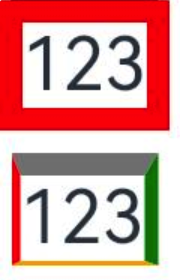

### 边框弧度

设置边框圆角。参数类型可以是 Length 或 BorderRadiuses，Length 设置四个角一样的弧度，BorderRadiuses 可以分别设置不同的弧度。

```ts
Text("123")
  .borderWidth(5)
  .borderColor(Color.Red) // color
  .borderRadius(10); // [!code ++]
Text("123")
  .borderWidth({ left: 2, top: 5, right: 3, bottom: 1 })
  .margin({ top: 5 })
  .borderColor({
    left: Color.Red,
    right: Color.Green,
    top: Color.Gray,
    bottom: Color.Orange,
  })
  .borderRadius({ topLeft: 5, topRight: 10, bottomLeft: 20, bottomRight: 15 }); // [!code ++]
```


### 边框样式

设置边框线的样式，样式有`点、实线、虚线`。参数是一个枚举 BorderStyle，设置四边统一风格的样式；或者是 EdgeStyles 分别设置四边不一样的样式。

```ts
declare enum BorderStyle {
  Dotted, // 点
  Dashed, // 虚线
  Solid, // 实线
}
```

```ts
Row() {
  Text('点').borderWidth(2).borderStyle(BorderStyle.Dotted)
  Text('虚线').borderWidth(2).borderStyle(BorderStyle.Dashed).margin({ left: 10, right: 10 })
  Text('实线').borderWidth(2).borderStyle(BorderStyle.Solid)
}
```


### 边框合并设置

使用一个 api 同时设置边框边框粗细/颜色/样式/圆角等，将 borderWidth、borderColor、borderRadius 和 borderStyle 合成一个 api。类型是 BorderOptions

```ts
declare interface BorderOptions {
  width?: EdgeWidths | Length;
  color?: EdgeColors | ResourceColor;
  radius?: BorderRadiuses | Length;
  style?: EdgeStyles | BorderStyle;
}
```

```ts
Text("BORDER").border({
  width: 5,
  color: Color.Blue,
  radius: 10,
  style: BorderStyle.Dashed,
});
```


## 图片边框

### 图片边框

给组件设置图片边框，参数类型是`BorderImgaeOption`。

```ts
declare interface BorderImageOption {
  slice?: Length | EdgeWidths; // 设置边框图片四个角的切割宽度
  repeat?: RepeatMode; // 重复模式
  source?: string | Resource | LinearGradient; // 图片边框的资源地址或者是渐变色边框
  width?: Length | EdgeWidths; // 边框宽度
  outset?: Length | EdgeWidths; // 设置边框图片向外延伸的距离
  fill?: boolean; // 是否填充
}
```

## 背景

### 背景颜色

设置组件背景色

```ts
Text("backgroundColor").backgroundColor($r("app.color.gray"));
```

### 背景图片

设置组件的背景图片，图片支持本地资源图片、网络图片、Base64，不支持 SVG 图片。

- src：图片源地址
- repeat：图片重复模式，

```ts
Text("XY")
  .width(50)
  .height(50)
  .fontSize(12)
  .borderWidth(1)
  .backgroundImage($r("app.media.icon"), ImageRepeat.XY); // [!code focus]
```


### 背景图片大小

设置组件背景图片大小，参数类型为 SizeOptions 或 ImageSize，当参数是 SizeOptions 时，可以指定宽度和高度，如果只指定一个宽度或者高度时，会按照图片的比例进行绘制；当参数是 ImageSize 时，可以设置图片的缩放模式，它的值有 3 种

- Auto：默认值，保持图片比例
- Cover：填充组件，可能会缩放图片
- Contain：保持图片比例，在组件中以图片比例最大程度的占据组件的空间，但是图片会完全的展示在组件中

```ts
Text()
  .width(50)
  .height(50)
  .borderWidth(1)
  .backgroundImageSize(ImageSize.Contain); // [!code focus]

Text()
  .width(50)
  .height(50)
  .borderWidth(1)
  .backgroundImageSize({ width: 40, height: 20 }); // [!code focus]
```

### 背景图片位置

设置组件背景图的位置，参数类型为 Position 或 Alignment。

当参数设置为 Position 时，表示相对于组件左上角的位置。

```ts
Text()
  .width(50)
  .height(50)
  .borderWidth(1)
  .backgroundImage($r("app.media.icon"))
  .backgroundImagePosition({ x: 20, y: 30 }); // [!code focus]
```


除了设置数值外，还可以设置百分比，下例中 x 设置为 50%，表示背景图片的左侧在组件水平位置 50%的地方。

```ts
Text()
  .width(50)
  .height(50)
  .borderWidth(1)
  .backgroundImage($r("app.media.icon"))
  .backgroundImagePosition({ x: "50%", y: 30 }); // [!code focus]
```


当参数设置为 Alignment 时，表示背景图片的对齐方式。

```ts
Text()
  .width(50)
  .height(50)
  .borderWidth(1)
  .backgroundImage($r("app.media.icon"))
  .backgroundImagePosition(Alignment.Bottom); // [!code focus]
```


上例表示把背景图片放在组件的下方中间位置。

### 背景模糊

设置组件背景和内容之间的模糊。设置时底部最好有图片背景，不然默认的白色页面看不出效果。

## 透明度

opacity 设置组件的不透明度，取值范围是 0~1,0 表示完全透明，1 表示完全不透明。默认是 1 完全不透明。

```ts
Text("opacity=1").width(50).height(50).backgroundColor(Color.Black);
Text("opacity=0.5")
  .width(50)
  .height(50)
  .backgroundColor(Color.Black)
  .opacity(0.5);
```


## 显示隐藏

设置组件的显示和隐藏，隐藏有 2 种情况，一种是隐藏了会占据空间，另一个是隐藏了不占据空间。和安卓中的 `GONE`、`INVISIBLE` 对应

- Visible：显示
- Hidden：隐藏但占位置，与安卓的 INVISIBLE 一样
- None：隐藏不占据位置，与安卓的 GONE 一样

```ts
Text().visibility(Visibility.Hidden);
```

## 禁用控制

设置控件是否可用（可交互）。如 Button 设置为 enable = false 后，点击不会响应 onClick 事件。

```ts
Button("启用按钮").enabled(true);
Button("禁用按钮").enabled(false);
```


## 浮层

为组件添加遮罩浮层。参数类型为 string 或 CustomBuilder 自定义组件类型。想过类似于 Stack 组件，组件本身的内容在底层，而设置的遮罩内容在上层。

同时还可以设置遮罩内容的偏移量和对齐方式。

```ts
Button("overlay").overlay("OVERLAY");
```


## 组件层级

设置组件 z 轴上的层叠顺序。 参数是数值类型，数值越大说明层级越高，层级高的组件显示在越上层。默认是 0。

```ts
// 不设置层级
Stack() {
  Text('1').size({ width: 100, height: 100 }).backgroundColor(Color.Orange)
  Text('2').size({ width: 80, height: 80 }).backgroundColor(Color.Blue)
  Text('3').size({ width: 50, height: 50 }).backgroundColor(Color.Red)
}

// 中间的组件设置层级
Stack() {
  Text('1').size({ width: 100, height: 100 }).backgroundColor(Color.Orange)
  Text('2').size({ width: 80, height: 80 }).backgroundColor(Color.Blue).zIndex(1)
  Text('3').size({ width: 50, height: 50 }).backgroundColor(Color.Red)
}
```

把中间的组件`Text('2')`的 zIndex 设置为 1，层级比`Text('3')`要高，因此会显示在其上方，因为大小更大把`Text('3')`给挡住了。

下图左侧未设置层级顺序，右侧设置第二个组件层级为 1


## 图像转换

### 旋转

设置组件旋转，角度参数 angle 是必须设置，默认表示按照顺时针旋转指定的角度。除了默认的平面旋转外，还可以设置绕 X,Y,Z 轴旋转。默认旋转都是按照组件的中心进行旋转。

```ts
Text("1").size({ width: 50, height: 50 }).backgroundColor(Color.Orange).rotate({
  angle: 45,
});
```


绕坐标轴旋转，下例中设置同时绕 X 轴和 Y 轴旋转 45 度。

```ts
Text("1").size({ width: 50, height: 50 }).backgroundColor(Color.Orange).rotate({
  x: 1,
  y: 1,
  angle: 45,
});
```


::: warning 提示
图中虚线位置表示旋转前的位置。

`x:1` 和 `y:1` 的设置中，如果不为 1 则表示会绕该轴进行旋转 angle 度，为 0 或者不指定则不生效。
:::

除此之外还可以设置旋转中心等。默认旋转中心为 `centerX = '50%'`，`centerY = '50%'`，`centerZ = 0`

### 平移

设置组件平移。可以设置向 X,Y,Z 轴方向上进行平移。参数可以设置为数值类型或百分比。

```ts
Text("1")
  .size({ width: 50, height: 50 })
  .backgroundColor(Color.Orange)
  .translate({ x: "50%", y: "50%" });
```


### 缩放

设置组件缩放，可以设置在坐标轴方向上进行缩放以及设置缩放中心，默认缩放中心为组件中心。

参数中的`x`、`y`、`z`表示缩放比例，默认是 1，大于 1 表示放大，小于 1 表示缩小。

```ts
// 不设置缩放中心，默认是组件中心
Text("1").size({ width: 50, height: 50 }).backgroundColor(Color.Orange).scale({
  x: 0.5,
  y: 0.5,
});

// 设置缩放中心在组件左上角
Text("1").size({ width: 50, height: 50 }).backgroundColor(Color.Orange).scale({
  x: 0.5,
  y: 0.5,
  centerX: 0,
  centerY: 0,
});
```


## 图像效果（毛玻璃）

### 内容模糊

设置组件的内容（前景）模糊效果，比如 Text 的文字模糊。

```ts
Row() {
  Text('normal')
  Text('blur').textAlign(TextAlign.Center).blur(1)
}
```


### 背景模糊

设置组件的背景模糊效果。参数值越大越模糊，为 0 时不模糊。

```ts
Text("backdropBlur")
  .backgroundImage($r("app.media.startIcon"))
  .backdropBlur(10);
```


### 阴影

设置组件的阴影效果。

```ts
Text("backdropBlur").shadow({
  color: Color.Blue, // 阴影颜色
  radius: 10, // 阴影四个角的圆角弧度
  offsetX: 10, // x方向上的偏移量
  offsetY: 10, // y方向上的偏移量
  fill: false, // 是否填充
});
```


### 灰度效果

设置组件的灰度效果，如在哀悼日时很多 app 首页都有灰度设置。设置参数范围是`0 ~ 1`，默认为 0，表示不设置灰度，1 表示完全灰度。小于 0 按 0 处理，大于 1 按 1 处理。

```ts
Row() {
  Image($r('app.media.img')).width(100).height(50)
  Image($r('app.media.img')).width(100).height(50).grayscale(0.8)
}
```


### 亮度

设置组件的亮度效果，默认为 1，小于 1 会变暗，大于 1 效果变亮。数值越大越亮，推荐设置范围`0 ~ 2`

```ts
Row() {
  Image($r('app.media.img')).width(60).height(30)
  Image($r('app.media.img')).width(60).height(30).brightness(0.5)
  Image($r('app.media.img')).width(60).height(30).brightness(1.5)
}
```


### 饱和度

设置组件的饱和度。参数范围为 `0 ~ +∞`，默认为 1，数值越大，饱和度越大。小于 0 按 0 处理。

```ts
Row() {
  Image($r('app.media.img')).width(60).height(30)
  Image($r('app.media.img')).width(60).height(30).saturate(5)
  Image($r('app.media.img')).width(60).height(30).saturate(30)
}
```


### 对比度

设置组件的对比度。参数范围为 `0 ~ +∞`，默认为 1，数值越大，对比度越大。小于 0 按 0 处理。

```ts
Row() {
  Image($r('app.media.img')).width(60).height(30)
  Image($r('app.media.img')).width(60).height(30).contrast(2)
  Image($r('app.media.img')).width(60).height(30).contrast(5)
}
```


### 图像反转

反转输入的图像。参数类型是 number 或 InvertOptions 类型。

当参数类型是 number 时，表示图像反转的比例，取值范围是`0 ~ 1`。0 无变化，1 完全反转。

```ts
Row() {
  Image($r('app.media.img')).width(60).height(30)
  Image($r('app.media.img')).width(60).height(30).invert(1)
}
```


当参数类型是 InvertOptions 时，会对比组件背景颜色的灰度值和设置的 threshold 值，当背景颜色的灰度值大于设置的 threshold 时取设置的 high 值，反之取设置的 low 值。

```ts
Row() {
  Image($r('app.media.img')).width(60).height(30)
  Image($r('app.media.img')).width(60).height(30).invert({
    low: 0,
    high: 1,
    threshold: 0.5,
    thresholdRange: 0.2
  })
}
```

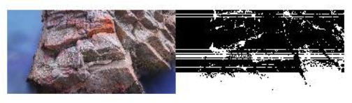

### 深褐色

将图像转换为深褐色。参数取值范围为`0 ~ 1`，默认为 0，表示无变化，1 表示完全转成深褐色。

```ts
 Row() {
  Image($r('app.media.img')).width(100).height(50)
  Image($r('app.media.img')).width(100).height(50).sepia(1)
}
```


### 色相旋转

设置组件色相旋转效果，参数为旋转角度。默认值为 0，取值范围为 `-∞ ~ +∞`，参数为 number 类型时填写具体数值（如 90），参数为字符串时填写数值+deg（如 90deg）。
::: tip 提示
虽然取值范围是 `-∞ ~ +∞`，但是一般都会设置为 `0 ~ 360`，因为 `n 和 n + 360` 度的色相一样。360 度一轮回。
:::

```ts
Row() {
  Image($r('app.media.img')).width(100).height(50)
  Image($r('app.media.img')).width(100).height(50).hueRotate(50)
}
```


### 颜色叠加

给组件设置颜色叠加效果

```ts
Row() {
  Image($r('app.media.img')).width(100).height(50)
  Image($r('app.media.img')).width(100).height(50).colorBlend(Color.Red)
}
```


### 线性渐变模糊

设置组件内容的线性渐变模糊。第一个参数为模糊半径，数值越大越模糊，取值范围为 `0 ~ 60`。第二个参数设置渐变的方向以及每段的渐变距离等。

```ts
linearGradientBlur(value: number, options: LinearGradientBlurOptions): T;
```

```ts
Row() {
  Image($r('app.media.img')).width(100).height(50)
  Image($r('app.media.img')).width(100).height(50).linearGradientBlur(100, {
    fractionStops: [[0.8, 0.5], [1, 1]],
    direction: GradientDirection.Left
  })
}
```


::: info 参数说明
fractionStops 参数是一个二维数组，里面的数组有两个元素，第一个元素表示不透明度，第二个元素表示组件的位置。

如 `[0.8,0.5]` 表示组件左侧开始到组件中间 `50%` 的位置设置不透明度为 `0.8`。也就是上图中的效果。

`direction` 表示渐变方向。
:::

### 混合模式

设置图像的混合模式，与安卓中的 PorterDuffXfermode 意思一致。

```ts
Stack() {
  Image($r('app.media.startIcon')).width(30).height(30)
  Image($r('app.media.img')).width(30).height(30)
}
.blendMode(BlendMode.XOR)
```


## 形状裁剪

### 裁剪

按指定形状对当前组件进行裁剪。参数有 2 种，一种是 boolean 类型，表示是否按照父容器的轮廓进行裁剪。另一种是相应的类型组件。

- 参数是 boolean 类型

```ts
Row() {
    Text().width(100).height(100).backgroundColor(Color.Blue)
  }
  .clip(true) // [!code highlight]
  .borderRadius(10) // [!code highlight]
```

给 `Row` 组件设置了圆角，并且设置 `clip(true)`，那么就会按照 `Row` 组件设置的圆角给子组件 `Text` 进行裁剪，那么 `Text` 组件看起来也像是被裁剪了圆角。如果没有给 `Row` 组件设置 `clip(true)` 的话，那么效果看起来还是个正方形，没有圆角。

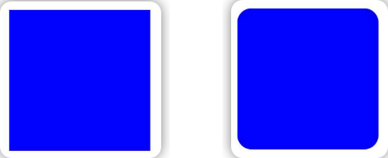

- 参数是相应组件类型

```ts
CircleAttribute | EllipseAttribute | PathAttribute | RectAttribute;
```

::: warning 温馨提示
下方图示中的虚线表示裁剪前的形状
:::

1. 圆形 CircleAttribute

```ts
Text()
  .width(100)
  .height(100)
  .backgroundColor(Color.Blue)
  .clip(new Circle({ width: 100, height: 100 }));
```

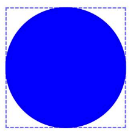

2. 椭圆形 EllipseAttribute

```ts
Text()
  .width(100)
  .height(100)
  .backgroundColor(Color.Blue)
  .clip(new Ellipse({ width: 100, height: 80 }));
```

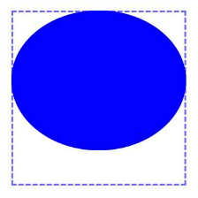

3. 路径 PathAttribute

```ts
Text()
  .width(100)
  .height(100)
  .backgroundColor(Color.Blue)
  .clip(
    new Path({
      width: 100,
      height: 100,
      commands: "M10 90 L10 10 L50 30 L90 10 L90 90 Z",
    })
  );
```

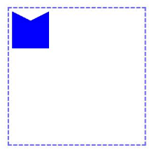

4. 矩形 RectAttribute

```ts
Text()
  .width(100)
  .height(100)
  .backgroundColor(Color.Blue)
  .clip(
    new Rect({ width: 100, height: 100, radiusWidth: 10, radiusHeight: 10 })
  );
```

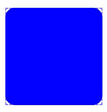

### 遮罩

为组件设置指定形状的遮罩。

1. 进度遮罩，设置当前进度、最大进度和遮罩颜色

```ts
Text()
  .width(100)
  .height(100)
  .backgroundColor(Color.Blue)
  .mask(new ProgressMask(40, 100, "#66e7e7e7"));
```

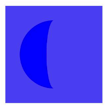

其它遮罩与 `clip` 使用方法一致。

## 颜色渐变

### 线性渐变

```ts
linearGradient(value: {
    angle?: number | string; // 起始角度
    direction?: GradientDirection; // 方向
    colors: Array<any>; // 渐变颜色
    repeating?: boolean; // 重复渲染
  }): T;
```

`colors` 参数指定的不仅仅是颜色，还有着色的位置，它是一个二维数组，每个数组的第一个值表示颜色值，第二个值表示渲染位置的百分比。

```ts
[
  [Color.Red, 0.3],
  [Color.Blue, 0.5],
];
```

上面的颜色值表示，`0 ~ 0.3` 的位置是`红色`， `0.3 ~ 0.5` 的位置是`红色到蓝色渐变`， `0.5 ~ 1` 的位置是`蓝色`。

```ts
Text()
  .width(100)
  .height(50)
  .linearGradient({
    colors: [
      [Color.Red, 0.3],
      [Color.Blue, 0.5],
    ],
  });
```

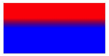

### 角度渐变

```ts
sweepGradient(value: {
  center: Array<any>; // 渐变的旋转中心
  start?: number | string; // 渐变起始角度，默认为0，在时钟3点钟方向
  end?: number | string; // 渐变终点角度，默认为0，最大为360度，在时钟12点钟方向
  rotation?: number | string; // 旋转角度，比如设置45，那么就相当于
  colors: Array<any>; // 颜色，也是二维数组，与线性渐变的colors含义一样
  repeating?: boolean; // 重复着色
}): T;
```

```ts
Text()
  .width(100)
  .height(50)
  .sweepGradient({
    center: [50, 25],
    colors: [
      [Color.Red, 0.5],
      [Color.Blue, 0.7],
    ],
    start: 0,
    end: 360,
    rotation: 45,
  });
```

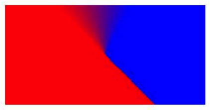

### 径向渐变

```ts
radialGradient(value: {
  center: Array<any>; // 渐变中心点
  radius: number | string; // 渐变半径，越大开始渐变的颜色越多
  colors: Array<any>; repeating?: boolean
}): T;
```

```ts
Text()
  .width(100)
  .height(100)
  .radialGradient({
    center: [50, 50],
    radius: 90,
    colors: [
      [Color.Red, 0.3],
      [Color.Blue, 0.7],
    ],
  });
```

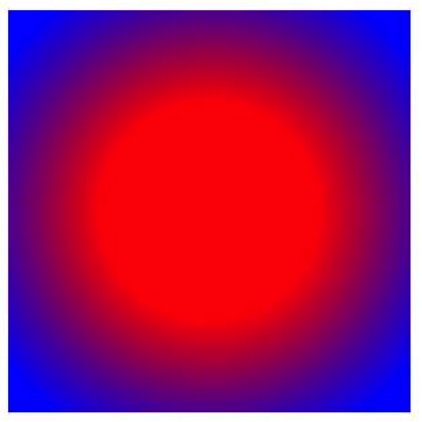

## Popup 弹窗

给组件设置 Popup 弹窗。

```ts
bindPopup(show: boolean, popup: PopupOptions | CustomPopupOptions): T;
```

第一个参数 show 表示是否显示弹窗，第二个参数表示弹窗的配置。配置有两种类型，PopupOptions 表示系统默认样式的弹窗，CustomPopupOptions 表示自定义弹窗。

```ts
Button("Popup").bindPopup(true, {
  message: "我是一个Popup弹窗",
  placement: Placement.BottomRight,
});
```


PopupOptions 参数说明

| 参数                | 类型                                  | 说明                                                                         |
| ------------------- | ------------------------------------- | ---------------------------------------------------------------------------- |
| message             | string                                | 弹窗上的文本信息                                                             |
| placement           | Placement                             | 弹窗的位置，可以设置显示在组件的上方、下方、左上、右下等一系列的位置         |
| primaryButton       | \{value:string,action:()=>void\}      | 第一个按钮，value 为按钮文本，action 为点击事件                              |
| secondaryButton     | \{value:string,action:()=>void\}      | 第二个按钮                                                                   |
| onStateChange       | (event: {isVisible: boolean}) => void | 弹窗显隐状态回调                                                             |
| arrowOffset         | Length                                | 箭头的偏移量                                                                 |
| showInSubWindow     | boolean                               | 是否在子窗口显示弹窗                                                         |
| mask                | boolean / { color: ResourceColor }    | 设置弹窗遮罩                                                                 |
| messageOptions      | MessageOptions                        | 设置 message 字段的文本颜色和字体                                            |
| targetSpace         | Length                                | 设置 Popup 与组件的间隙                                                      |
| enableArrow         | boolean                               | 是否显示箭头                                                                 |
| offset              | Length                                | 设置弹窗的偏移量                                                             |
| popupColor          | Color/string/Resource/number          | 设置弹窗颜色                                                                 |
| autoCancel          | boolean                               | 是否自动隐藏弹窗，比如点击空白处隐藏弹窗                                     |
| width               | Dimension                             | 设置弹窗宽度                                                                 |
| arrowPointPosition  | ArrowPointPosition                    | 箭头的位置，有 START,CENTER,END 三种，分别对应箭头在欺弹窗的左侧，中间和右侧 |
| arrowWidth          | Dimension                             | 箭头的宽度                                                                   |
| arrowHeight         | Dimension                             | 箭头的高度                                                                   |
| radius              | Dimension                             | 弹窗的圆角弧度                                                               |
| shadow              | ShadowOptions / ShadowStyle           | 弹窗的阴影                                                                   |
| backgroundBlurStyle | BlurStyle                             | 弹窗的背景模糊                                                               |

自定义弹窗 `CustomPopupOptions` 的参数除了提供一个自定义组件的 `CustomBuilder` 外，其它参数都大致一样。

## 菜单

### 普通菜单

弹出菜单，这是一个普通的菜单，通过第一个参数控制显示和隐藏，在不需要交互的情况下，只要设置为 true 就可以直接显示。

```ts
Button("Menu").bindMenu(
  true, // 显示弹窗
  [
    {
      value: "扫一扫", // 文字
      icon: $r("app.media.app_icon"), // 图标
      action: () => {}, // 点击触发事件
    },
    {
      value: "钱包",
      enabled: false, // 禁用
      action: () => {},
    },
  ],
  {
    title: "小工具", // 标题
  }
);
```

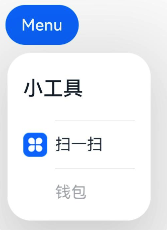

### 响应菜单

需要通过交互才弹出菜单（长按、右键点击），这种菜单必须要传入一个自定义组件，然后指定交互方式。

```ts
Button("Menu").bindContextMenu(this.buildCustomMenu(), ResponseType.LongPress);

@Builder
  buildCustomMenu() {
    Text('长按弹出的菜单').padding(10)
  }
```

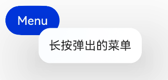

第二个参数 `reponseType` 有 `LongPress` 和 `RightClick` 两种。

## 焦点控制

### 是否可聚焦

控制组件是否可以获取到焦点。有交互的组件默认有可获取焦点，如 Button，展示型组件默认不可获取焦点，如 Text。

```ts
Button("focusable").focusable(false);
```

### Tab 键走焦

定义组件的走焦能力，也就是通过键盘的 tab 键来切换焦点聚焦在哪个组件上。如果组件设置的 tabIndex 大于 0，那么就会按照 tabIndex 从小到大依次走焦，如果 tabIndex 小于 0，虽然可以获取焦点，但是不能通过 tab 键来聚焦。

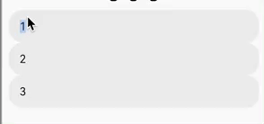

### 默认焦点

设置当前页面哪个组件默认聚焦，如果页面没有组件设置 defaultFocus，那么焦点就在根容器组件上；如果页面中多个组件都设置了 defaultFocus，那么就会按照组件数深度遍历找到的第一个组件获得焦点。

### 容器默认焦点

当组件的父组件获取到焦点时，设置当前组件为默认聚焦的组件。
::: warning 注意
需要注意的是，父组件需要设置 tabIndex，也就是说需要 Tab 键走焦时才会触发。
:::

```ts
Column() {
  Row() {
    TextInput({ text: '1' }).layoutWeight(1)
    TextInput({ text: '2' }).layoutWeight(1)
  }.tabIndex(1) // [!code highlight]

  Row() {
    TextInput({ text: '3' }).layoutWeight(1)
    TextInput({ text: '4' }).layoutWeight(1)
      .groupDefaultFocus(true) // [!code highlight]
  }.tabIndex(2) // [!code highlight]
}
```

上方代码中，给两个 Row 组件设置了 tabIndex，那么按 Tab 键时，焦点会在这 2 个 Row 组件之间切换。如果不设置 `groupDefaultFocus` 的话，当焦点在两个 Row 组件上切换时，其焦点都会默认转移到第一个 TextInput 上，也就是 1 和 3 上，而当给第二个 Row 组件的第二个 TextInput 设置 `groupDefaultFocus(true)` 时，那么在焦点落在第二个 Row 上时，焦点就会自动转移到 4 这个 TextInput 上，即焦点会在 TextInput 1 和 4 之间切换。
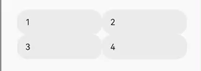

### 触摸获焦

设置组件在点击时可以获得焦点。设置为 true 以后，改组件只有才点击时才能获取到焦点。

### 请求焦点

给指定组件设置一个 `key`，然后调用 `focusControl.requestFocus(key)` 让组件强制获取到焦点。

```ts
Column() {
  Row() {
    TextInput({ text: '1' }).layoutWeight(1)
    TextInput({ text: '2' }).layoutWeight(1).key("input2") // 设置key
  }.tabIndex(1)

  Button('requestFocus')
    .onClick(() => {
      // focusControl是一个系统全局变量，可以直接使用
      focusControl.requestFocus('input2') // 让key = input2的组件获取焦点
    })
}
```

上面代码给点击 button，让设置了 `key = input2` 的组件获取到焦点。

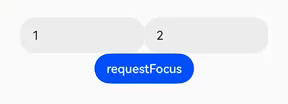

## 鼠标 hover

设置鼠标 hover 到组件的效果。

```ts
Button("hover").hoverEffect(HoverEffect.Highlight);
```

HoverEffect 有以下几种类型

```ts
declare enum HoverEffect {
  Auto, // 默认
  Scale,
  Highlight,
  None,
}
```

::: danger ？？？
经测试在模拟器上没有效果
:::

## 多态样式

设置组件不同状态的样式，比如一个组件默认状态下是什么样式，被点击时是什么样式等。在 API11 之上可以用 [attributeModifier](#动态属性) 设置。可以设置的状态有

```ts
declare interface StateStyles {
  normal?: any; // 默认
  pressed?: any; // 点击状态
  disabled?: any; // 禁用状态
  focused?: any; // 聚焦状态
  clicked?: any; // 点击状态
  selected?: object; // 选中状态，部分组件可用
}
```

```ts
// 默认样式
@Styles
normalStyle() {
  .border({
    color: Color.Gray,
    width: 1
  })
  .padding(10)
}

// 按下的样式
@Styles
pressedStyle() {
  .border({
    color: Color.Blue,
    width: 3
  })
  .padding(10)
}

build(){
  Column() {
    Text("normal").fontSize(50).stateStyles({
      normal: this.normalStyle, // 不要括号
      pressed: this.pressedStyle
    })
  }.margin(10)
}
```

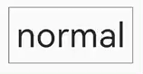

::: info 注意点

1. 样式使用 `@Styles` 装饰器
2. 引用样式时不要带括号
3. 如果只设置了 pressed 状态而没有设置 normal 状态，点击松开之后不会恢复样式，一直停留在 pressed 状态的样式

:::

## 前景色

```ts
Column({ space: 10 }) {
  Circle({ width: 150, height: 200 })
    .backgroundColor(Color.Gray)
    .foregroundColor(Color.Red)

  Text('前景色')
    .backgroundColor(Color.Gray)
    .foregroundColor(Color.Red)
}
```

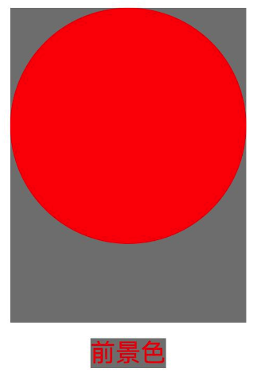

## 前景内容模糊

```ts
Row() {
  Image($r('app.media.img')).size({ width: 100, height: 50 })
  Image($r('app.media.img')).size({ width: 100, height: 50 })
    .foregroundBlurStyle(BlurStyle.Thin)
}
```

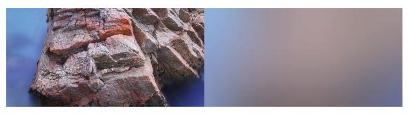

## 点击回弹

设置组件被点击的回弹效果。scale 参数设置小于 1。

```ts
Button("点击回弹").clickEffect({ level: ClickEffectLevel., scale: 0.2 });
```


## 动态属性

与 stateStyles 作用一致。但是使用略微复杂一点。

```ts
class TextModifier implements AttributeModifier<TextAttribute> {
  applyNormalAttribute(instance: TextAttribute): void {
    instance.border({
      width: 1,
      color: Color.Gray,
    });
  }

  applyPressedAttribute(instance: TextAttribute): void {
    instance.border({
      width: 3,
      color: Color.Blue,
    });
  }
}

export struct Index {
  modifier: TextModifier = new TextModifier()
  build(){
    Text("attributeModifier").fontSize(30).attributeModifier(this.modifier)
  }
}
```

上例中使用的是 Text，因此泛型使用 `TextAttribute` ，如果使用其它类型，就需要使用对象类型的 Attribute。

这种方式相对于 [stateStyles](#多态样式)，在不设置 normal 样式的情况下，点击再松开依旧会恢复默认样式。

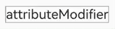

## 外描边

设置外描边，和 border 类似，使用方法也一样。

```ts
// 不指定宽高// [!code highlight]
Column({}) {
  // 原始的Text
  Text('Outline')
    .backgroundColor(Color.Orange)
  // 设置Border的Text
  Text('Outline')
    .border({
      width: 3,
      color: Color.Black
    })
    .backgroundColor(Color.Orange)
    .margin({ top: 10, bottom: 10 })
  // 设置outline的Text
  Text('Outline')
    .outline({
      color: Color.Red,
      width: 3
    })
    .backgroundColor(Color.Orange)
}

// 指定宽高 // [!code highlight]
Column({}) {
  // 原始的Text
  Text('Outline')
  .width(50).height(20) // [!code ++]
    .backgroundColor(Color.Orange)
  // 设置Border的Text
  Text('Outline')
  .width(50).height(20) // [!code ++]
    .border({
      width: 3,
      color: Color.Black
    })
    .backgroundColor(Color.Orange)
    .margin({ top: 10, bottom: 10 })
  // 设置outline的Text
  Text('Outline')
  .width(50).height(20) // [!code ++]
    .outline({
      color: Color.Red,
      width: 3
    })
    .backgroundColor(Color.Orange)
}
```

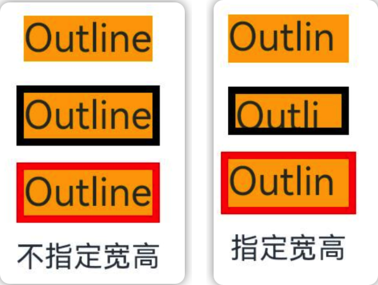

从上面的图中可以看到，如果不给组件指定宽高，outline 的效果与 border 一致，outline 和 border 的线条都是组件的外面。而当设置了宽高后，border 的线条在组件内侧，而 outline 的线条则在组件的外侧。

其它单独设置 outline 样式的 api 与 border 一致。

## 触摸交互

### 点击热区设置

可以设置组件的点击热区，比如将一个组件的左边一半设置可以响应点击而右边一半不响应点击。可以设置单个热区或多个热区。

```ts
Button("热区设置")
  .width(200)
  .height(100)
  .responseRegion({
    x: 0,
    y: 0,
    width: "50%",
    height: "100%",
  })
  .onClick(() => {
    console.log("点击了Button");
  });
```


可以看到点击按钮左侧的时候有点击效果，响应了点击事件，而按钮右边没有响应。

参数的 x 和 y 表示距离组件左上角的坐标，width 和 height 分别是距离 x，y 坐标的宽度和高度。

## 触摸测试

类似安卓中 view 的事件分发。通过 hitTestBehavior 设置触摸测试，参数类型是 HitTestMode，有`Defeault`、`Block`、`Transparent`、`None`四种类型。

- Default：默认，自己和子组件都会响应触摸，但是会阻塞兄弟组件。
- Block：只有自己响应触摸，阻塞子组件和兄弟组件。
- Transparent：自己和子组件都会响应触摸，不会阻塞兄弟组件。
- None：自己不响应触摸，不会阻塞子组件和兄弟组件

```ts
Stack() {
  // 最底层红色矩形
  Text('1')
    .size({ width: '100%', height: '100%' })
    .backgroundColor('#55ff0000')
    .onTouch(() => {
      console.log('clicked 1')
    })

  // 上层绿色矩形
  Stack({ alignContent: Alignment.Start }) {
    // 绿色矩形的子控件，与绿色矩形一样大
    Text('2')
      .size({ width: '100%', height: '100%' })
      .onTouch(() => {
        console.log('clicked child 2')
      })
  }
  .size({ width: '60%', height: '60%' })
  .backgroundColor('#5500ff00')
  .onTouch(() => {
    console.log('clicked 2')
  })
}.size({ width: 300, height: 300 })
```

::: info 概念
自己：被点击的组件

子组件：被点击组件的子组件

:::
