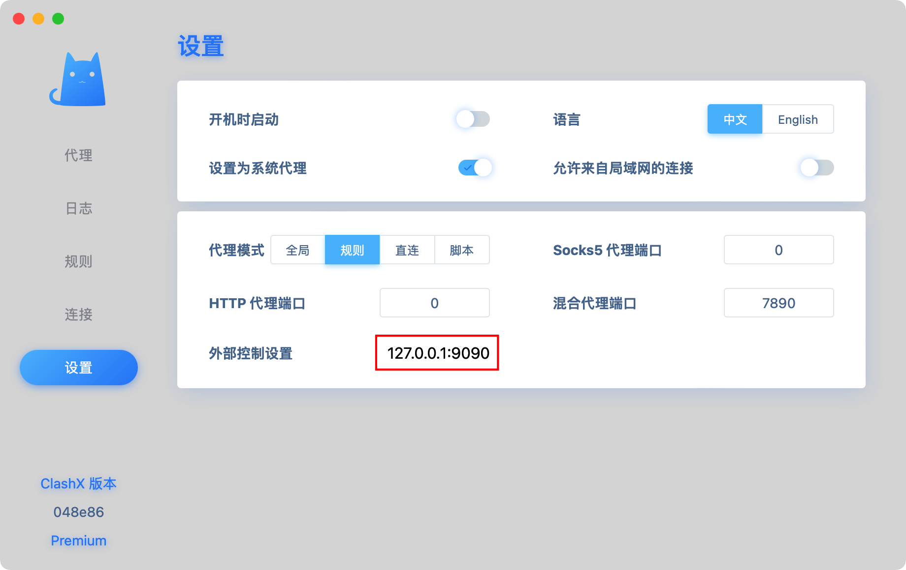

# 编译鸿蒙版本 WebRTC

## 编译坏境

1. macOS（使用 Ubuntu 也可以）
2. webrtc 版本（m120，commitid：b0cc68e6）
3. OpenHarmony SDK 版本(4.0.10)

## 源码准备

### 安装 depot_tools

1. 创建 webrtc 目录，并切换到目录中去
2. 下载 depot_tools

```bash
git clone https://chromium.googlesource.com/chromium/tools/depot_tools.git
```

:::warning 错误提示
如果在这一步报错 `fatal: unable to access 'https://chromium.googlesource.com/chromium/tools/depot_tools.git/': Failed to connect to chromium.googlesource.com port 443 after 75025 ms: Couldn't connect to server` ，因为开了代理，终端程序没有走代理的流程，需要给设置一个代理。

`git config http.proxy "localhost:9090"`

端口号根据代理软件不同可能不同，我这里用的是 ClashX，用的端口是 9090。


:::

工具下载成功后，将工具路径添加到环境变量中。我电脑上的环境变量文件是 `.zshrc`，你的可能是 `.bashrc`

1. 打开 .zshrc 文件，vim 打开后者自己找到这个文件用文本编辑器打开
2. 终端输入命令 `vi ~/.zshrc`，用 vim 打开后输入字母 i 进入编辑模式
3. 添加工具路径到文件中 `export PATH="$PATH:/xxx/webrtc/depot_tools"`，路径必须是绝对路径
4. 按 `ESC` 退出编辑模式，输入 `:wq` 保存并退出
5. `source ~/.zshrc` 使环境变量生效

## 获取代码

1. 场景文件夹 `code`，源码放在此文件夹中 `mkdir code`
2. 目录切换到 `code` 文件夹中 `cd code`
3. 拉取源码 `fetch --nohooks webrtc`
4. 如果拉取过程中报错导致终止，终端输入 `gclient sync` 继续拉取，而不是使用 `fetch --nohooks webrtc`
5. 拉取成功后，终端输入 `glicent sync`
