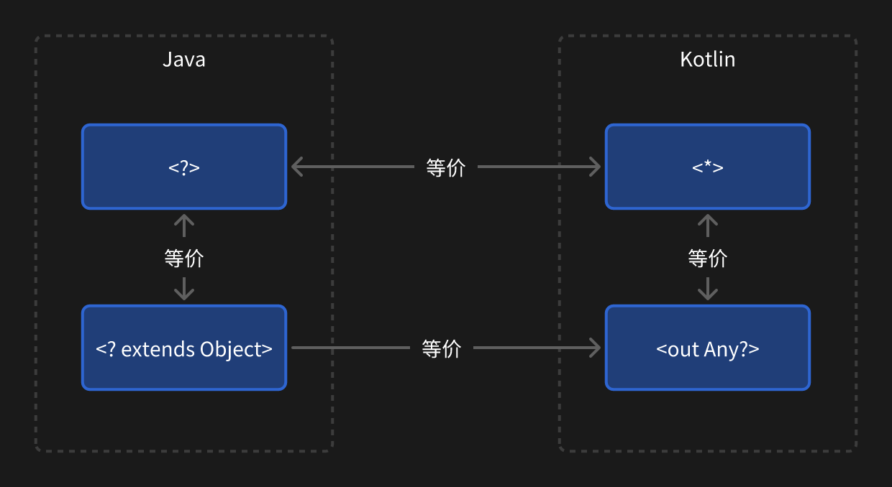
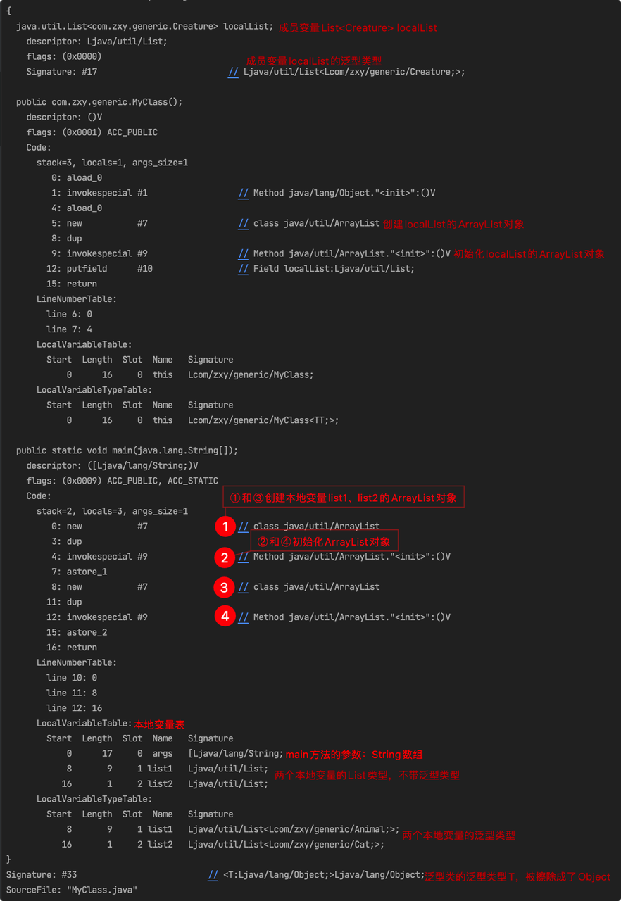
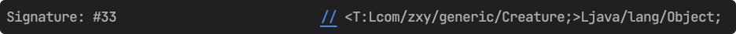

# 泛型

## 泛型的好处

1. 类型限制，避免运行时类型转换异常

   在泛型之前，往 List 中添加数据没有类型限制，被添加的数据可能是任何类型，不允许添加指定泛型类型之外的数据

   ```java
    // 没有泛型，可以添加任意类型的数据
    List list = new ArrayList();
    list.add("1");
    list.add(2);

    // 带有泛型
    List<String> stringList = new ArrayList<>();
    list.add("1");
    list.add(2); // 报错，只能添加String类型的数据
   ```

2. 编译期类型确定，类型不对编译不通过

   在编译期类型就已经确定，添加了不同的类型，会编译不通过

3. 对同一类型的模板代码可以使用泛型，代码复用

   ```java
    public int sum(int x, int y) {
        return x + y;
    }

    public float sum(float x, float y) {
        return x + y;
    }
   ```

## 泛型的声明

泛型分为泛型类、泛型接口和泛型方法。

```java
public interface GenericInterface<T> {} // 泛型接口

public class GenericClass<T> { // 泛型类
    public void genericMethod(T t) {} // 泛型方法
    public <S> static void genericStaticMethod(S s) {} // 静态泛型方法
    public static void genericErrorMethod(T t) {} // 静态泛型方法，错误写法 // [!code error]
    public static <P> void genericStaticMethod(P p) {}
}
```

静态方法不能使用类上声明的泛型类型，而是需要单独声明一个泛型方法。

## 泛型通配符

```java
public class Animal{}
public class Cat extends Animal{}

List<Animal> animal1 = new ArrayList<Animal>();
List<Animal> animal2 = new ArrayList<Cat>();  // 错误写法 // [!code error]
```

上面代码的 animal1 能正常编译，而 animal2 则不能编译。虽然 Cat 是 Animal 的子类，但是编译器认为 `ArrayList<Cat>`并不是 `ArrayList<Animal>`的子类，对于这种情况就需要使用协变了

### 泛型上边界

协变，用<? extends T>表示，也叫泛型上边界。表示泛型的类型是 T 本身或 T 的子类

```java
List<? extends Animal> animal2 = new ArrayList<Cat>();
```

经过上面的修改，使用<? extends Animal>之后，就可以正常编译了。表示给 List 指定泛型类型时，可以指定成 Aninal 以及 Animal 的所有子类类型。注意：这里只是能指定泛型的类型，如 `List<Animal>、List<Cat>、List<Dog>`，而不是往 animal2 这个集合中添加数据，如 animal2.add(new Cat())和 animal.add(new Dog())，这是不对的。

这种情况就相当于自定义一个以下情况，自定义 MyList，在声明类的时候就已经给泛型类型限制了范围，在声明 MyList 对象的时候就可以指定任何 Animal 的子类作为泛型类型。

```java
// List<? extends Animal> animal2 = new ArrayList<Cat>()等同于以下代码
class MyList<T extends Animal> implements List<T>{}

MyList<Animal> list1 = new MyList<>();
MyList<Cat> list2 = new MyList<>();
```

#### 协变的限制

正如上面所说，<? extends Animal>表示指定泛型类型的范围，而不是表示添加数据的范围。

```java
List<? extends Animal> animals = new ArrayList<>();
animals.add(new Animal()); // 错误写法 // [!code error]
animals.add(new Cat()); // 错误写法 // [!code error]
```

在 List 中使用协变后添加数据，编译不通过，为什么会这样呢？

先设想一下，如果能添加结果会怎样？?表示不确定性，泛型类型可能是 Animal，可能是 Cat 或者是其它继承 Animal 的类型，这并不确定。假设?表示的泛型类型是 Cat，而我们在添加的时候添加了一个 Animal 类型，也就是往 `List<Cat>`中添加一个 Animal，这肯定是不对的。于是干脆从语法上就禁止这种操作。

但是从 List 中获取值时，可以确定获取到的值肯定都是 Aniaml 或者是其子类。

```java
// 即使animals记录的是Animal、Cat、Dog等，它们都是Animal
Animal animal = animals.get(0);
```

::: tip 📌
协变用于获取而不是存储，以为存储类型不确定获取类型确定。
:::

#### `List<Animal> 和 List<? extends Animal>`

```java
List<Animal> animal1 = new ArrayList<>();
animal1.add(new Animal()); // ✅
animal1.add(new Cat()); // ✅

List<? extends Animal> animal2 = new ArrayList<>();
animal2.add(new Animal()); // 错误写法 // [!code error]
animal2.add(new Cat()); // 错误写法 // [!code error]
```

`List<Animal>`因为确定了泛型类型就是 Animal，因此可以直接添加 Animal 以及其子类，而 List<? extends Animal>的泛型类型是不确定的，可能是 Animal，可能是 Cat 等，因此无法添加数据。

如果想要上面的 animal2 也能添加数据，那就需要使用到逆变了（泛型下边界）。

### 泛型下边界

逆变，用<? super T>表示，也叫泛型下边界。表示泛型的类型是 T 本身或 T 的父类

```java
List<? super Animal> animals = new ArrayList<>();
animals.add(new Cat()); // ✅
animals.add(new Animal()); // ✅
```

上面的代码就可以正常编译运行，<? super Animal>表示泛型类型可以是 Animal 以及 Animal 的父类，最低也是个 Animal 类，因此只有往 List 中添加 Animal 及 Animal 的子类时，其类型才是明确的，肯定都是 Animal。

假设先有三个类生物类 Creature、动物类 Animal 及猫类 Cat

```java
class Creature{}
class Animal extends Creature{}
class Cat extends Animal{}
```

能往 List<? super Animal>中添加 Animal 和 Cat，但是不能添加 Creature。? super Animal 它有一个下界 Animal，这个是确定的类型，因此添加 Ainimal，Cat，Dog 等，它们都是属于 Animal，但是要添加一个 Creature，那就超出了 Animal 的范围了。

因此 List<? super Animal>只能添加 Animal 的子类，不能添加父类。

```java
List<? super Animal> animals = new ArrayList<>();
animals.add(new Cat()); // ✅
animals.add(new Animal()); // ✅
animals.add(new Creature()); // 错误写法 // [!code error]
```

当从<? super Animal>获取数据时，类型可能是 Cat，可能是 Animal，也可能是 Creature，甚至是 Object，因此获取数据时的类型是不确定的。基于这种不确定性，因此逆变适用于添加数据而不是获取数据。

既然 `List<? super Animal>`中只能通过 add 添加 Animal 的子类型，为什么获取的时候的类型可能是 Animal 的父类甚至是 Object 呢？
是无法通过 add 方法动态的添加，但是可以在声明 List 变量的时候，从构造函数中指定一个初始集合。

```java
List<Cat> cats = new ArrayList<>();
List<? super Animal> animals1 = new ArrayList<>(cats);

List<Animal> animals = new ArrayList<>();
List<? super Animal> animals2 = new ArrayList<>(animals);

List<Creature> cretures = new ArrayList<>();
List<? super Animal> animals3 = new ArrayList<>(cretures);

List<Object> objects = new ArrayList<>();
List<? super Animal> animals4 = new ArrayList<>(objects);
```

### 无边界<?>及星投影<\*>

Java 中的`<?>`相当于协变`<? extends Object>`，而 Kotlin 中的`<*>`相当于`<out Any?>`。而 Kotlin 中的`<\*>`相当于 Java 中的`<?>`。



## 泛型擦除

泛型是 JDK1.5 引入的特性，之前是没有的，为了兼容之前没有泛型的代码，特地引入泛型擦除的概念。

```java
public class MyClass<T> {
    List<Creature> localList = new ArrayList<>();

    public static void main(String[] args) {
        List<Animal> list1 = new ArrayList<>();
        List<Cat> list2 = new ArrayList<>();
    }
}
```

使用 javac 和 javap 查看编译后的代码指令。[javac 找不到类解决方法参考](https://www.coder.work/article/6172011)

```
javac -g Animal.java Cat.java MyClass.java // 一次性编译所有的类
javap -s -c -l -v MyClass.class
```



上面示例代码，类上有一个泛型 T，还有一个成员变量 `List<Creature> localList` 以及两个本地变量 `List<Animal>list1` 和 `List<Cat> list2`。

成员变量和本地变量的三个 List 最终编译成了 ArrayList，并没有携带其泛型类型，它们的泛型类型都保存到各自的 Signature 中。成员变量保存在成员变量的 Signature 中，而本地变量保存在 LocalVariableTypeTable 本地变量类型表中，它们都没有将泛型类型擦除为 Object，及 `ArrayList<Object>`，只有在声明的泛型中才会被擦除为 Object。

也就是 `MyClass<T>`这个类的泛型类型 T 会被擦除为 Object，从上图的倒数第二行也能看出



因此可以得出结论，只有声明的泛型类型才会在编译时被擦除为 Object，即：

```java
class MyClass<T> {
    public static void main(String[] args) {
        List<Animal> list1 = new ArrayList<>();
        List<Cat> list2 = new ArrayList<>();
    }
}

// 编译后
class MyClass<Object> {
    public static void main(String[] args) {
        List list1 = new ArrayList(); // 这里不会变成List<Object> list1 = new ArrayList<>();
        List list2 = new ArrayList();
    }
}
```

当给泛型类的泛型指定边界时，那么就不会被擦除为 Object 了，而是会变成指定的边界类型

```java
public class MyClass<T extends Creature> {}
```


## 获取泛型类型

```java
// 声明类
class Person<T> {}
class Male extends Person<Apple> {}

// MyClass.java中使用
public static void main(String[] args) {
    // 使用1 ❌不能获取到泛型类型
    Person<Apple> person = new Person<>(); // [!code error]
    Type type1 = person.getClass().getGenericSuperclass(); // [!code error]

    // 使用2 ✅能获取到泛型类型
    Person<Apple> person2 = new Person<>(){};
    Type type2 = person2.getClass().getGenericSuperclass();

    // 使用3 ✅能获取到泛型类型
    Male male = new Male();
    Type type3 = male.getClass().getGenericSuperclass();
}
```

getClass 方法获取的是类加载器加载的类信息，这个类信息在编译器就确定了。

1. 使用 1：在编译期会进行泛型擦除，因此只能获取到 Object。
2. 使用 2：在创建对象的结尾加了一个{}，这在编译期会生成一个内部类 `MyClass$1 extends Person<Apple>`，那么创建出来的 person2 对象是 MyClass$1，MyClass$1 的父类 Person 在编译期就已经确定了其泛型类型为 Apple，因此能获取到泛型类型
3. 使用 3：类似于使用 2，初始化的对象也是 Person 的子类，在编译期就能确定其泛型类型，因此也能获取到泛型类型

<font color='orange'>因此，如果要获取一个泛型类的泛型类型，就需要通过创建该泛型类的子类或者匿名内部类的子类来获取。</font>

声明一个泛型类，该泛型类的泛型可以用在成员变量上以及泛型方法上，而泛型方法又有泛型参数、泛型返回值以及泛型局部变量。获取泛型类型需要用到 ParameterizedType

```java
public class GenericClass<T> {
    private final List<Creature> localList = new ArrayList<>();

    private List<Creature> genericMethod(List<Apple> paramsList) {
        return new ArrayList<>();
    }

    private static List<Creature> genericStaticMethod(List<Apple> paramsList) {
        return new ArrayList<>();
    }
}

public class ChildGenericClass extends GenericClass<Creature> {}
```

### 获取泛型类的泛型类型

```java
ChildGenericClass childGenericClass = new ChildGenericClass();
Type genericSuperclass = childGenericClass.getClass().getGenericSuperclass();
// genericSuperclass:com.zxy.generic.GenericClass<com.zxy.generic.Creature>
ParameterizedType parameterType = ((ParameterizedType) genericSuperclass);
// parameterType:com.zxy.generic.GenericClass<com.zxy.generic.Creature>
for (Type actualTypeArgument : parameterType.getActualTypeArguments()) {
    // actualTypeArgument:class com.zxy.generic.Creature
}
```

先获取到 ChildGenericClass 对象的 Class 对象，再从 Class 对象中获取到 Type 对象，并强转成 ParameterizedType，从 ParameterType 的 getActualTypeArguments 方法中获取到类的实际泛型类型。

### 获取泛型成员变量的泛型类型

```java
ChildGenericClass childGenericClass = new ChildGenericClass();
// 从父类中获取localList的Field对象
Field field = childGenericClass.getClass().getSuperclass().getDeclaredField("localList");
field.setAccessible(true);
ParameterizedType parameterizedType = (ParameterizedType) field.getGenericType();
// parameterizedType:java.util.List<com.zxy.generic.Creature>
System.out.println("parameterizedType = " + parameterizedType);
for (Type actualTypeArgument : parameterizedType.getActualTypeArguments()) {
    // actualTypeArgument:class com.zxy.generic.Creature
    System.out.println("actualTypeArgument = " + actualTypeArgument);
}
```

localList 是父类中的私有成员变量，所以需要使用 getSuperclass 获取到父类的 Class，并且使用 getDeclaredField 获取到 Field 对象。Field 中也有对应地获取泛型相关的方法。

### 获取泛型方法的泛型类型（参数+返回值）

```java
ChildGenericClass childGenericClass = new ChildGenericClass();
// 从父类中获取私有方法genericMethod的Method对象
Method method = childGenericClass.getClass().getSuperclass().getDeclaredMethod("genericMethod", List.class);
// 获取方法返回值类型的Type
ParameterizedType genericReturnType = (ParameterizedType) method.getGenericReturnType();
for (Type returnActualTypeArgument : genericReturnType.getActualTypeArguments()) {
    System.out.println("returnActualTypeArgument = " + returnActualTypeArgument);
    // returnActualTypeArgument:class com.zxy.generic.Creature
}

// 方法参数的Type数组
Type[] genericParameterTypes = method.getGenericParameterTypes();
for (Type genericParameterType : genericParameterTypes) {
    for (Type actualTypeArgument : ((ParameterizedType) genericParameterType).getActualTypeArguments()) {
        System.out.println("parameterActualTypeArgument = " + actualTypeArgument);
        // parameterActualTypeArgument:class com.zxy.generic.Apple
    }
}
```

先从子类的 Class 对象中获取到父类的 Class，再从父类的 Class 中获取到私有方法 genericMethod 的 Method 对象。

- Method.getGenericReturnType()：获取泛型方法的返回值 Type
- Method.getGenericParameterTypes()：获取泛型方法参数的 Type 数组

不管是返回值获取到的 Type 还是参数的 Type 数组，最终都是将 Type 转成 ParameterizedType 并调用 getActualTypeArguments 方法获取到真实的泛型类型。

上面代码同样可以获取到静态方法`genericStaticMethod`的参数及返回值的泛型类型，虽然静态方法和对象无关，可以直接使用`ChildGenericClass.class.getSuperclass().getDeclaredMethod("genericStaticMethod", List.class)`来获取到 Method 对象，但是 Class 对象不管是使用对象.getClass()还是类.class 获取到的都是同一个 Class，因此获取普通方法的方式同样也能获取到静态方法的泛型类型。
