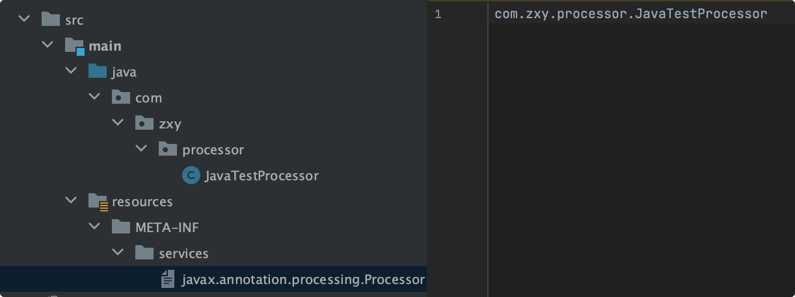
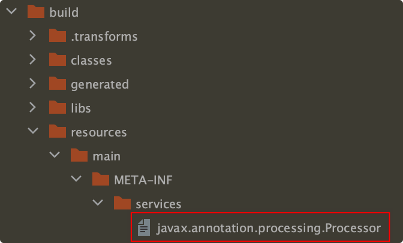
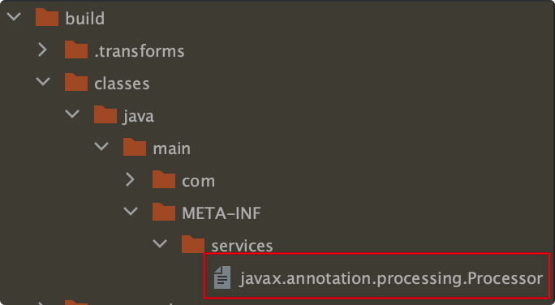

# 注解

## 简介

注解就好比是一个标签，比如给一个类打上了一个标签，但是仅仅是打标签是不起作用的，还需要使用反射等技术获取到打标签的类信息后进行不同的处理，这样才发挥了作用。

注解使用@interface 声明

```java
public @interface TestAnno {
}
```

这样就声明好了一个注解，此时它还可以在任何地方使用。

```java
@TestAnno // 在类上使用
public class Person {
    @TestAnno
    private String name; // 在属性上使用
    private int age;
}
```

如果要给注解加上一些限制的话，就需要使用元注解。

## 元注解

元注解是可以注解在注解上的注解，是一种特殊的注解，也就是一种特殊的标签。元注解有

- @Retention：注解的保留期，取值有 SOURCE、CLASS、RUNTIME
  - RetentionPolicy.SOURCE：只在源码阶段，在编译阶段被丢弃
  - RetentionPolicy.CLASS：保留到编译阶段，在运行阶段被丢弃
  - RetentionPolicy.RUNTIME：保留到运行阶段，生命周期最长
- @Target：指定注解可以作用在哪些地方

  - ElementType.TYPE：使注解作用在类、接口、枚举以及另一个注解上

  ```java
    @Target(ElementType.TYPE)
    public @interface TypeAnno {
    }

    @TypeAnno // 作用在类上
    public class A{}

    @TypeAnno // 作用在接口上
    public interface B{}

    @TypeAnno // 作用在枚举上
    public enum C{}

    @TypeAnno // 作用在另一个注解上
    public @interface D{}
  ```

  - ElementType.FIELD：使注解作用在属性上

  ```java
    @Target(ElementType.FIELD)
    public @interface FieldAnno {}

    public interface A {
        @FieldAnno // 作用在接口属性上
        String name = "";
    }

    public enum B {
        @FieldAnno // 作用在枚举属性上
        NAME,
    }

    public class C {
        @FieldAnno // 作用在类的属性上
        private String name;
    }

    public @interface D {
        @FieldAnno // 作用在注解的属性上
        String name = "";
    }
  ```

  - ElementType.METHOD：使注解作用在方法上

    ```java
    @Target(ElementType.METHOD)
    public @interface MethodAnno {}

    public interface A {
        @MethodAnno
        void a(); // 作用在接口方法上
    }

    public enum B {
        ; // 分号必须要有，属性和方法的分割作用
        @MethodAnno // 作用在枚举方法上
        public void b() {}
    }

    public class C {
        @MethodAnno // 作用在类方法上
        public void c() {}
    }

    public @interface D {
        @MethodAnno // 作用在注解方法上
        int d();
    }
    ```

  - ElementType.PARAMETER：使注解作用在参数上
  - ElementType.CONSTRUCTOR：使注解作用在构造函数上
  - ElementType.LOCAL_VARIABLE：使注解作用在本地变量上

    ```java
    @Target(ElementType.LOCAL_VARIABLE)
    public @interface LocalVariableAnno {}

    public class A {
        int a; // 不能作用在这个变量上
        public void a() {
            @LocalVariableAnno
            int a;
        }
    }
    ```

  - ElementType.ANNOTATION_TYPE：使注解作用在另一个注解上
  - ElementType.PACKAGE：使注解作用在包上，需要创建 package-info.java
  - ElementType.TYPE_PARAMETER：作用不明
  - ElementType.MODULE：作用不明

- @Inherited：注解继承，父类使用了注解，子类可以继承该注解

  ```java
  @Inherited
  @Target(ElementType.TYPE)
  public @Interface InheritedAnno{}

  @InheritedAnno
  public class A {}

  public class B extends A {} // B类也间接的被打上了标签
  ```

- @Documented：和 javadoc 相关

最常使用的元注解就是@Target 和@Retentaion 了。

## 注解的使用

自定义一个作用在类上的注解，获取使用该注解类的所有属性和方法。

::: details 查看代码

```java
@Retention(RetentionPolicy.RUNTIME)
@Target(ElementType.TYPE)
public @interface TestAnno {}

@TestAnno
public class Person {
    private String name;
    private int age;

    private String getName() {
        return name;
    }

    private int getAge() {
        return age;
    }
}

public static void main(String[] args) {
    // 检查Person类有没有使用TestAnno注解
    boolean hasAnnotation = Person.class.isAnnotationPresent(TestAnno.class);
    if (hasAnnotation) {
        Person person = new Person();
        // 获取person类的所有方法，包括私有方法
        Method[] methods = person.getClass().getDeclaredMethods();
        for (Method method : methods) {
            System.out.println("===> method = " + method.getName() + " - " + Modifier.toString(method.getModifiers()));
        }

        // 获取person类的所有属性，包括私有属性
        Field[] fields = person.getClass().getDeclaredFields();
        for (Field field : fields) {
            System.out.println("===> field = " + field.getName() + " - " + Modifier.toString(field.getModifiers()));
        }
    } else {
        System.out.println("===> 没有注解");
    }
}

// 输出
===> method = getName - private
===> method = getAge - private
===> field = name - private
===> field = age - private
```

:::

## 注解处理器

注解除了使用反射之外，还可以使用注解处理器（APT）。注解处理器在编译器处理而非在运行期。

注解处理器提供了一个接口 Processor，该接口里有几个方法：

1. `Set<String> getSupportedOptions()`：
   获取一些可选的信息，可以从注解@SupportedOptions 中指定值或者是从模块的 build.gradle 文件中指定

```java
// 从注解中指定值
@SupportedOptions({"value1", "value2"})
public class TestProcessor extends AbstractProcessor {}
```

```groovy
// 从build.gradle中指定值
android {
    defaultConfig {
        javaCompileOptions {
            annotationProcessorOptions {
                // 从这里传入值
                arguments = [ SUPPORT_OPTION_KEY : SUPPORT_OPTION_VALUE ]
            }
        }
    }
}
```

```java
// 然后在注解处理器中添加到Set集合中
public class TestProcessor extends AbstractProcessor {
    @Override
    public Set<String> getSupportedOptions() {
        return new HashSet<String>() {{
            this.add(SUPPORT_OPTION_KEY); // 这里添加上面build.gradle文件中的key
        }};
    }
}
```

添加的值可以在注解处理器的初始化方法 init(ProcessingEnvironment processingEnv)的参数中获取

```java
@Override
public synchronized void init(ProcessingEnvironment processingEnv) {
    Map<String, String> options = processingEnv.getOptions();
    String value = options.get(SUPPORT_OPTION_KEY)
}
```

该方法可以指定一些模块相关的配置的值保存起来，比如模块名，然后在注解处理器中使用。

2. `Set<String> getSupportedAnnotationTypes()`：
   表示当前注解处理器能处理的注解类型，可以从注解@SupportedAnnotationTypes 中指定，字符串数组类型，支持的注解类型必须是全限定类名，如`com.test.annotation.BindView`，使用通配符*号处理所有的注解类型`@SupportedAnnotationTypes("*")`。也可以直接重写该方法，把支持的注解类型添加到 Set 集合中返回。

3. SourceVersion getSupportedSourceVersion()：
   最大支持的 JDK 版本，可以从注解@SupportedSourceVersion 中指定或者是重写 getSupportedSourceVersion()方法指定。如果不指定默认是 SourceVersion.RELEASE_6，推荐使用最新支持的版本。

4. void init(ProcessingEnvironment env)：
   初始化方法，有一个参数 ProcessingEnvironment，可以从该参数中获取 getSupportedOptions()方法中指定的参数，也可以获取 javapoet 生成文件的一些必要的工具类 Filer env.getFiler()、Types env.getTypeUtils()、Elements env.getElementUtils()、TypeUtils new TypeUtils(types, elementUtils)等

5. `boolean process(Set<? extends TypeElement> annotations, RoundEnvironment env)`：
   注解处理器的处理方法，第一个参数是@SupportedAnnotationTypes 注解中指定的注解集合，第二个参数是上一轮处理的结果。

注解处理器类似 Retrofit 的拦截器的责任链模式，下一轮的输入是上一轮的输出。上一轮的 process 方法的结果会传递到下一轮 process 方法的参数。

同时 APT 创建文件辅助类等逻辑也是在 process 方法中做。自定义注解处理器一般会使用 AbstractProcessor。

## 注册注解处理器

新建 2 个 Java module，一个里面写自定义注解 annotations，另一个作为注解处理器的模块 processors，然后注解处理器的模块引入自定义注解的模块。

然后在注解处理器模块添加一个注解

```java
@Retention(AnnotationRetention.RUNTIME)
@Target(AnnotationTarget.CLASS)
annotation class BindView
```

- 手动注册
  新建文件 resources/META-INF/services/javax.annotation.processing.Processor，然后将自定义注解在该文件中注册
  
  点击 Build -> Rebuild Project 在 build 目录自动生成注册文件
  

- 自动注册
  使用谷歌的开源插件 auto-service 自动注册，需要先引入 auto-service
  ```groovy
    dependencies {
        annotationProcessor("com.google.auto.service:auto-service:1.0-rc7")
        compileOnly("com.google.auto.service:auto-service:1.0-rc7")
    }
  ```
  然后在自定义注解上使用@AutoService 注解
  ```java
    @AutoService(Processor.class)
    public class JavaTestProcessor extends AbstractProcessor {}
  ```
  点击 Build -> Rebuild Project 在 build 目录自动生成注册文件
  

## process 不执行的可能原因：

1. 没生成 javax.annotation.processing.Processor 文件
2. 添加了@SupportedAnnotationTypes 注解或者重写了 getSupportedAnnotationTypes()方法，添加了不存在的注解
3. @SupportedAnnotationTypes 或 getSupportedAnnotationTypes()方法添加的注解没有被使用过
4. 添加注解处理器模块的模块使用的是 annotationProcessor，但是注解使用在 kotlin 类上，应该使用 kapt 替换 annotationProcessor
