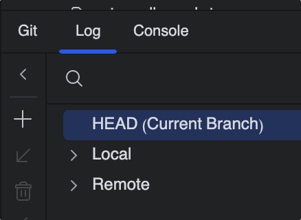
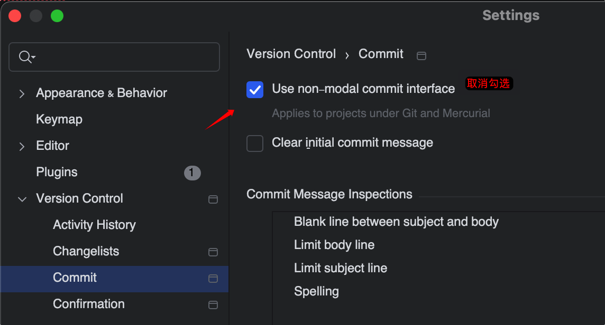
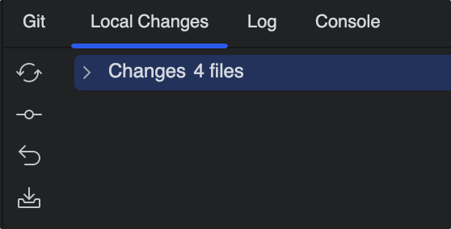

# AndroidStudio 不显示 Local Changes 面板

将 AS 版本升级到 Koala 考拉新版本时，发现 Git 的面板找不到了 Local Changes 面板，只有一个 Log 面板。

`设置` -> `Version Control` -> `Commit` -> `取消勾选 Use non-modal commit interface` -> `OK`

