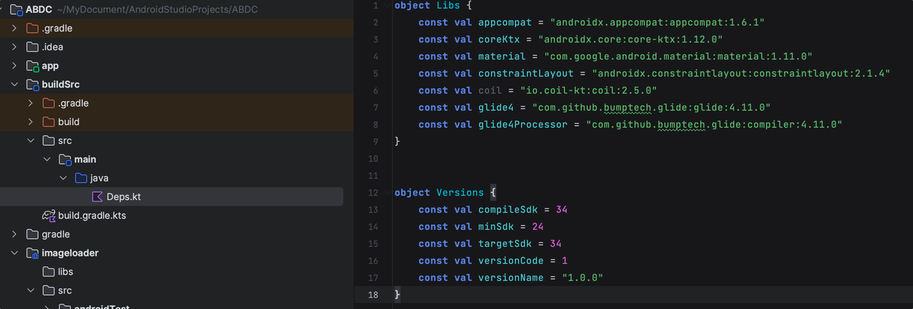

# Gradle buildSrc 进行库版本管理

## gradle 管理

在项目的根目录创建一个文件，如 deps.gradle

```kotlin
ext {
    libs = [
            "appcompat": "androidx.appcompat:appcompat:1.6.1"
    ]

    versions = [
            minSdk = 24
    ]
}
```

然后在使用的 module 的 build.gradle 文件中使用
implementation(ext.libs.appcompat)
不过这种方式没有 IDE 的智能提醒

## buildSrc

创建一个 module，名字智能是 buildSrc，在 buildSrc 下的 build.gradle.kts 文件中

```groovy
plugins {
    `kotlin-dsl`
}

repositories {
    google()
    mavenCentral()
    mavenLocal()
}
```

再创建一个 kt 类



使用

```kotlin
dependencies {
    implementation(Libs.glide4)
    ksp(Libs.glide4Processor)
}
```
